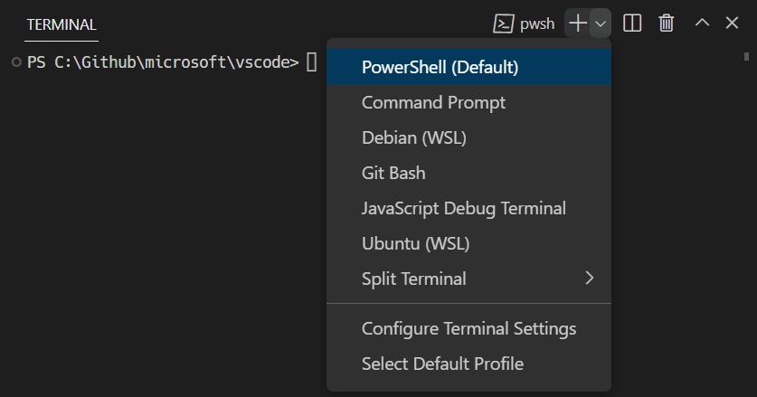
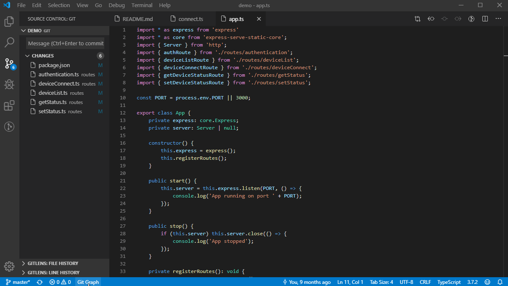

## Preparació de l'entorn
En aquesta secció s'explica com instal·lar i configurar les ferramentes necessàries
per a treballar amb :simple-git: Git i :material-microsoft-visual-studio-code: Visual Studio Code.

## Per què la terminal?
En aquest curs s'utilitza la terminal per a interactuar amb Git, però no és l'única manera de fer-ho.
De fet, pràcticament tots els entorns de desenvolupament moderns tenen integració amb Git,
que permet fer les mateixes operacions que la terminal de manera més visual i intuïtiva.

No obstant això, és important conéixer com funcionen les ordres de Git en la terminal per diferents raons:

- __Portabilitat__: la terminal és un entorn comú en tots els sistemes operatius i entorns de desenvolupament.
- __Flexibilitat__: la terminal permet fer operacions més avançades i personalitzades que les interfícies gràfiques.
- __Comprensió__: treballar amb les ordres ajuda a entendre com funciona Git i quins processos fa internament.


## Instal·lació de :simple-git: Git
Git està disponible en [la pàgina oficial][git] per a
:material-microsoft-windows: Windows, :simple-linux: Linux i :simple-apple: macOS.
La instal·lació depén del sistema operatiu:

[git]: https://git-scm.com/

=== ":simple-ubuntu: Ubuntu"
    Git s'instal·la des del gestor de paquets del sistema:

    ```bash
    sudo apt update
    sudo apt install git
    ```

=== ":material-microsoft-windows: Windows"
    [Descarrega][git] i executa l'instal·lador de Git.

    Una vegada instal·lat, es pot utilitzar la consola __Git Bash__, una terminal basada
    en l'intèrpret __Bash__ que permet executar les ordres de Git.

### Configuració inicial
Git utilitza un editor de text per a algunes operacions, com ara escriure els missatges dels _commits_.

Per defecte, Git utilitza l'editor [:simple-vim: ViM](https://www.vim.org/), un editor de text per terminal
molt potent, però difícil i poc intuïtiu si no s'hi està acostumat. Per això, és recomanable canviar
l'editor per defecte amb l'ordre següent:

```bash
git config --global core.editor <editor>
```

??? tip "Editors de text"
    === ":material-asterisk: Multiplataforma"
        - [:material-microsoft-visual-studio-code: Visual Studio Code](https://code.visualstudio.com/)
            ([:octicons-link-external-16: How to use Visual Studio Code as default editor for git?](https://stackoverflow.com/questions/30024353/how-to-use-visual-studio-code-as-default-editor-for-git)
            – :simple-stackoverflow: StackOverflow).

        ```bash
        git config --global core.editor "code --wait"
        ```

    === ":material-microsoft-windows: Windows"
        - __`notepad`__: editor instal·lat per defecte.
        - __[:simple-notepadplusplus: Notepad++](https://notepad-plus-plus.org/)__: editor de text lleuger amb més funcionalitats.

        ```bash
        git config --global core.editor notepad
        ```

    === ":simple-linux: Linux"
        - __`gedit`__: editor instal·lat per defecte en Ubuntu.
        - __`nano`__: editor de text bàsic per terminal.
        - __`vim`__: editor de text avançat per terminal. Per guardar s'utilitza `:w` i per eixir, `:q`.

        ```bash
        git config --global core.editor nano
        ```

!!! recommend "Com que en el curs s'utilitza :material-microsoft-visual-studio-code: Visual Studio Code com a editor, et recomane configurar-lo també com a editor de Git."
    ```bash
    git config --global core.editor "code --wait"
    ```


## Instal·lació de :material-microsoft-visual-studio-code: Visual Studio Code
[:material-microsoft-visual-studio-code: Visual Studio Code](https://code.visualstudio.com/)
és un editor de text gratuït i de codi obert desenvolupat per :material-microsoft: Microsoft.

És un editor molt popular en el món del desenvolupament per la seua lleugeresa, el seu rendiment
i la gran quantitat d'extensions disponibles, que permeten adaptar-lo a qualsevol llenguatge de programació.

Per a instal·lar-lo, descarrega'l des de la seua pàgina web i executa l'instal·lador.

### Configuració
A continuació, es configuren alguns aspectes bàsics per a treballar amb Git en Visual Studio Code.

#### Integració amb la terminal
:material-microsoft-visual-studio-code: Visual Studio Code permet obrir una terminal integrada
en la part inferior de la finestra. Així, es pot utilitzar la terminal sense haver de canviar de finestra.

La terminal s'obri des del menú __Terminal__ > __New Terminal__.

!!! tip "En :material-microsoft-windows: Windows, la terminal integrada utilitza :material-powershell: PowerShell per defecte."
    Es pot seleccionar Git Bash des del
    [:octicons-link-external-16: menú desplegable de la terminal](https://code.visualstudio.com/docs/terminal/basics#_terminal-shells),
    on també es pot configurar com a opció predeterminada.

    
    /// attribution: [Documentació oficial de :material-microsoft-visual-studio-code: Visual Studio Code](https://code.visualstudio.com/docs/terminal/basics#_terminal-shells)
    /// shadow-figure-caption | #figure-vscode-terminal : Menú desplegable de la terminal en :material-microsoft-visual-studio-code: Visual Studio Code.

#### Extensió Git Graph
Per a visualitzar la història dels _commits_ de manera gràfica, es pot instal·lar l'extensió
[__Git Graph__](https://marketplace.visualstudio.com/items?itemName=mhutchie.git-graph)
des de l'apartat d'extensions de Visual Studio Code.


/// attribution: [Extensió Git Graph](https://marketplace.visualstudio.com/items?itemName=mhutchie.git-graph)
/// shadow-figure-caption | #figure-git-graph-demo : Demostració de l'extensió Git Graph.

Una vegada instal·lada, la vista gràfica de la història de _commits_ s'obri des del botó __Git Graph__
de la barra inferior esquerra de l'editor.

!!! warning "El botó __Git Graph__ només és visible si s'ha obert un directori amb un __repositori de :simple-git: Git__."


/// shadow-figure-caption | #figure-git-graph : Botó Git Graph en :material-microsoft-visual-studio-code: Visual Studio Code.


## Configuració del _prompt_ de la terminal
La terminal __Git Bash__ defineix un _prompt_ que incorpora informació molt útil sobre l'estat
del repositori de Git, com ara la branca activa o l'estat del repositori durant alguns processos
(`MERGING`, `REBASING`, etc.).

No obstant això, la terminal del sistema no mostra aquesta informació, i això dificulta el treball amb Git.
A continuació, s'explica com configurar el _prompt_ en :simple-linux: Linux o en terminals basades en Bash:

1. Copia el fitxer [`git-prompt.sh`][git-prompt] en algun lloc del teu sistema.

    ```bash
    curl -o ~/.git-prompt.sh https://raw.githubusercontent.com/git/git/refs/heads/master/contrib/completion/git-prompt.sh
    ```

    > Revisa que el fitxer descarregat és l'adequat.

2. Afig la línia següent al fitxer `.bashrc`, `.zshrc` o `.profile` del teu usuari:

    ```bash
    source ~/.git-prompt.sh # source <ruta>/git-prompt.sh
    ```

3. Modifica la variable `PS1` perquè incloga la informació de Git, `$(__git_ps1)`:

    === ":simple-gnubash: Bash"
        ```bash
        # Exemple amb colors
        export PS1='\[\033[01;32m\]\u@\h\[\033[00m\]:\[\033[01;34m\]\w\[\033[33m\]$(__git_ps1) \[\033[00m\]$ '
        # Exemple sense colors
        export PS1='\u@\h:\w$(__git_ps1) $ '
        ```

    === ":simple-zsh: Zsh"
        ```bash
        setopt PROMPT_SUBST

        # Exemple amb colors
        PROMPT='%F{green}%n@%m%f:%F{blue}%~%f%F{yellow}$(__git_ps1 " (%s)")%f %# '
        # Exemple sense colors
        PROMPT='%n@%m:%~$(__git_ps1 " (%s)") %# '
        ```

    > Pots adaptar el _prompt_ al teu gust.

4. Reinicia la terminal o executa `source ~/.bashrc` (o el fitxer que hages modificat).

!!! docs "Codi font: [:octicons-link-external-16: `git-prompt.sh`][git-prompt] – :simple-git: Git"

[git-prompt]: https://github.com/git/git/blob/master/contrib/completion/git-prompt.sh

??? example "Exemple: _Prompt_ amb informació de Git"
    S'inicialitza un repositori amb el _prompt_ configurat.

    ```shellconsole
    jpuigcerver@fp:~ $ cd ~/git_introduccio
    jpuigcerver@fp:~/git_introduccio $ git init
    Initialized empty Git repository in /home/jpuigcerver/git_introduccio/.git/
    jpuigcerver@fp:~/git_introduccio (main) $
    ```

    S'observa que, després d'inicialitzar el repositori, el _prompt_ mostra la branca activa, `main`.


## Recursos addicionals
- [:octicons-link-external-16: Extensió Git Graph](https://marketplace.visualstudio.com/items?itemName=mhutchie.git-graph) – :material-microsoft-visual-studio: Visual Studio Marketplace
- [:octicons-link-external-16: What is the shortcut for displaying the GitGraph tab on VS Code?](https://stackoverflow.com/questions/57803207/what-is-the-shortcut-for-displaying-the-gitgraph-tab-on-vs-code) – :simple-stackoverflow: StackOverflow
- [:octicons-link-external-16: `git-prompt.sh`][git-prompt] – :simple-git: Git
