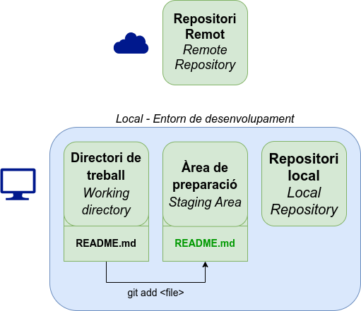
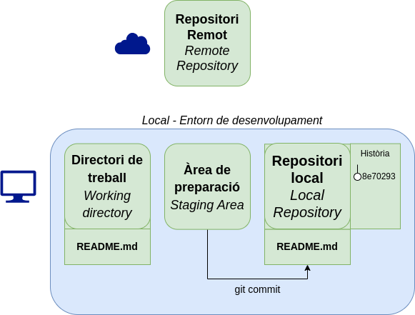
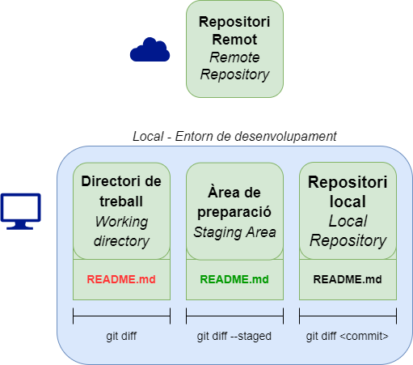
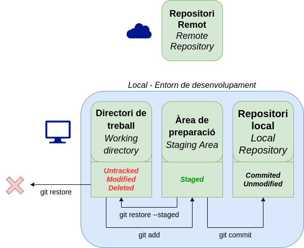

<div class="slide-header-logos">




</div>

<style>
.slide-header-logos {
    display: flex;
    justify-content: center;
    flex-wrap: wrap;
    gap: 1rem;
    margin-bottom: 2rem;
}

.slide-header-logos svg,
.slide-header-logos img {
    max-height: 2.5rem;
}
</style>

# Introducció a Git

### Introducció a Git i GitHub Actions

---

## Què és Git?

__Sistema de control de versions lliure i distribuït.__

https://git-scm.com/

- Control de versions
- Facilita la col·laboració
- Ramificació i gestió de conflictes

---

## Git vs GitHub
__Git__ és el sistema de control de versions.

__GitHub__, __GitLab__ o __Codeberg__ són serveis d'allotjament de repositoris de Git.


/// html | div.container
//// html | div.col
:simple-github:{ style="font-size: 4rem; color: #181717" }

https://github.com
////

//// html | div.col
:simple-gitlab:{ style="font-size: 4rem; color: #FC6D26" }

https://gitlab.com
////

//// html | div.col
:simple-codeberg:{ style="font-size: 4rem; color: #2185D0" }

https://codeberg.org
////
///

---

## Estructura d'un repositori


---

## Estructura d'un repositori

- __Directori de treball__: Directori del sistema on es troba el projecte i els fitxers.
- __Àrea de preparació (_Staging area_)__: Espai temporal on incloem els fitxers que volem afegir al commit.
- __Repositori local__: Directori ocult (`.git`) on es guarda tota la informació del repositori (_commits_, _branques_, _tags_, etc.).

---

## Inicialitzar un repositori

```bash
mkdir git_introduccio
cd git_introduccio
git init
```
Aquesta operació crea un directori ocult `.git` que conté tota la informació del __repositori local__.

---

## Àrea de preparació

```bash
git add <path>
```



---

## Confirmar canvis

```bash
git commit [-m <message>]
```



---

## Històric de canvis

```bash
git log
```

__Àlies:__
```bash
git config --global alias.lg "log --graph --abbrev-commit --decorate --format=format:'%C(bold blue)%h%C(reset) - %C(bold green)(%ar)%C(reset) %C(white)%s%C(reset) %C(dim white)- %an%C(reset)%C(bold yellow)%d%C(reset)'"
git config --global alias.lga "lg --all"
```

---

## Mostrar commit

```bash
git show [ref]
```

---

## Diferències

```bash
git diff [--staged]
```



---


## Descartar canvis

```bash
git restore <files>
```

{ height=450px }

---

## Configuració
```bash
git config [--global] <key> <value>
# Exemples
git config --global init.defaultBranch main
git config --global user.name "Joan Puigcerver Ibáñez"
git config --global user.email "jpuigcerver@edu.gva.es"
git config --global core.editor "code --wait"
```

---

## Exemple configuració
```cfg
[core]
    editor = code --wait # Editor per defecte

[init]
    defaultBranch = main # Nom de la branca principal per defecte

[user]
    name = Joan Puigcerver Ibáñez
    email = j.puigcerveribanez@edu.gva.es

[alias]
    lg = log --graph --abbrev-commit --decorate --format=format:'%C(bold blue)%h%C(reset) - %C(bold green)(%ar)%C(reset) %C(white)%s%C(reset) %C(dim white)- %an%C(reset)%C(bold yellow)%d%C(reset)'
    lga = lg --all
```

---

## `.gitignore`

```gitignore
# ignore ALL .log files
*.log

# ignore ALL files in ANY directory named temp
temp/
```
