<div class="slide-header-logos">




</div>

<style>
.slide-header-logos {
    display: flex;
    justify-content: center;
    flex-wrap: wrap;
    gap: 1rem;
    margin-bottom: 2rem;
}

.slide-header-logos svg,
.slide-header-logos img {
    max-height: 2.5rem;
}
</style>

# Branques

### Introducció a Git i GitHub Actions

---

## Branques

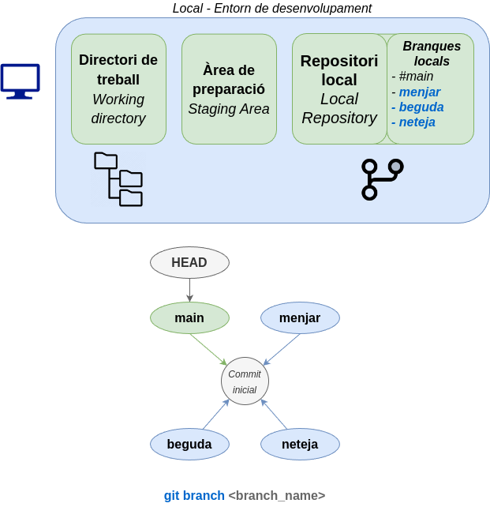{ .r-stretch }

---

## Canviar de branca

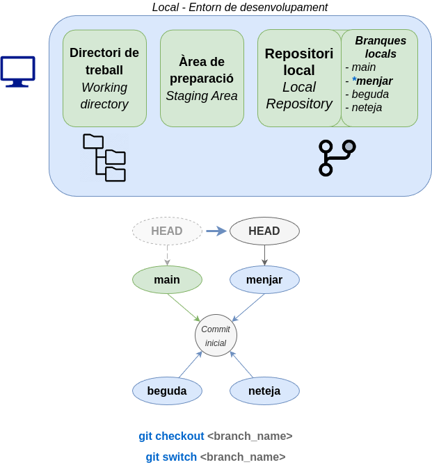{ .r-stretch }

---

<!-- .slide: data-transition="fade-out" -->
## Nous canvis en una branca

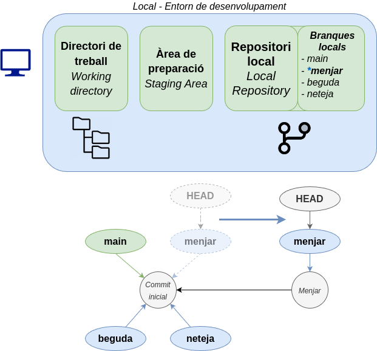{ .r-stretch }

--

<!-- .slide: data-transition="fade" -->
## Nous canvis en una branca

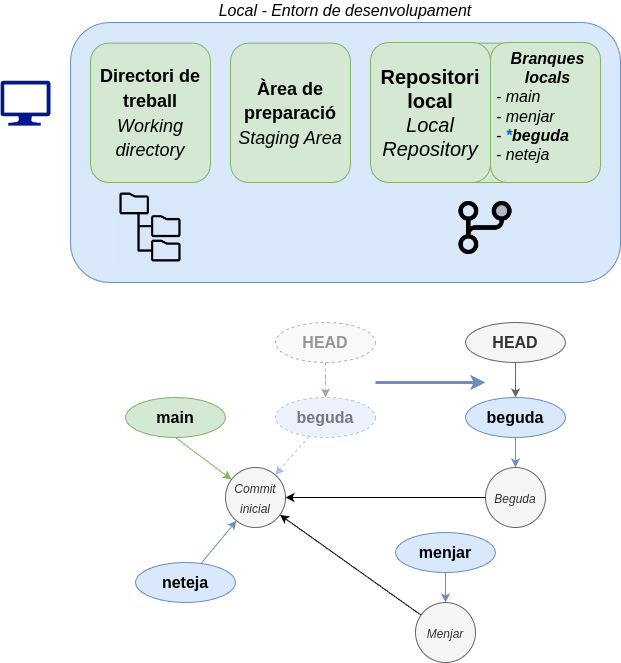{ .r-stretch }

--

<!-- .slide: data-transition="fade" -->
## Nous canvis en una branca

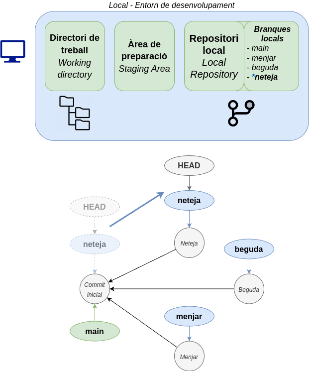{ .r-stretch }

---

## Eliminar una branca

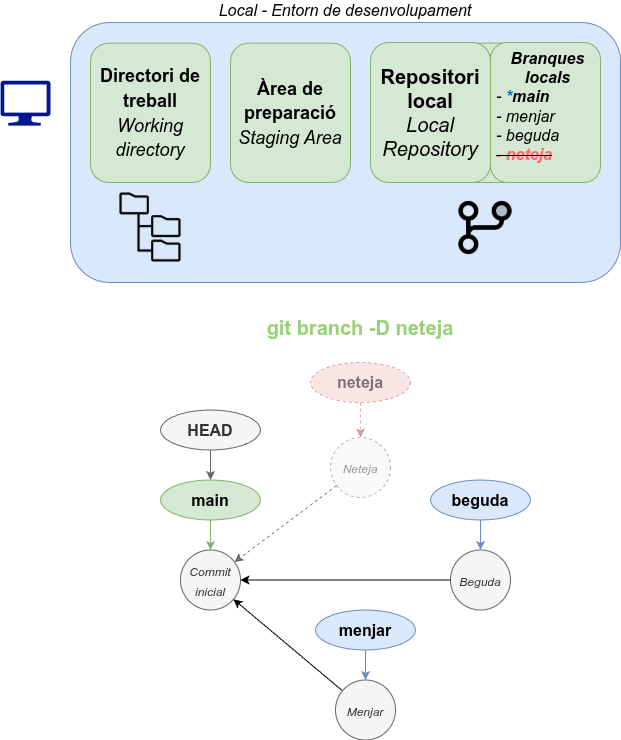{ .r-stretch }

---

<!-- .slide: data-transition="fade-out" -->
## Fusió directa de branques

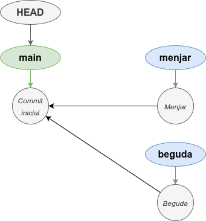{ .r-stretch }

Abans

--

<!-- .slide: data-transition="fade" -->
## Fusió directa de branques

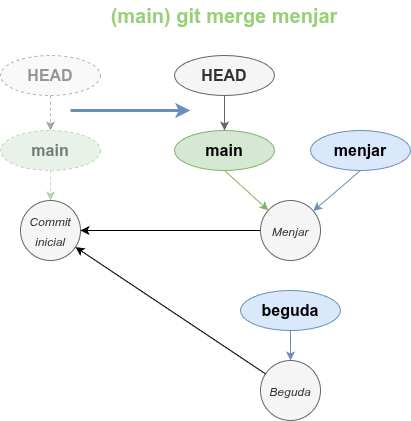{ .r-stretch }

Després

---

<!-- .slide: data-transition="fade-out" -->
## Fusió de branques divergents

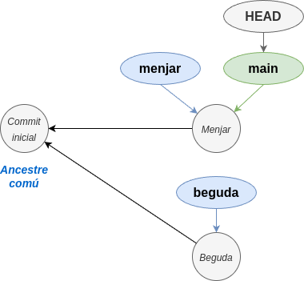{ .r-stretch }

Abans

--

<!-- .slide: data-transition="fade" -->
## Fusió de branques divergents

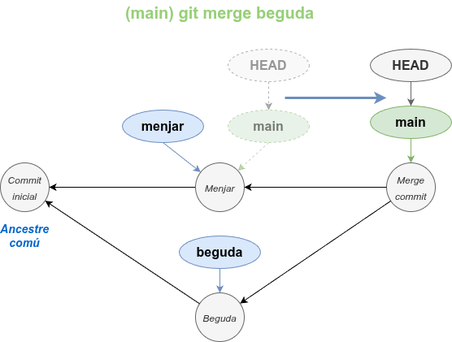{ .r-stretch }

Després

---

## Resolució de conflictes

```text
<<<<<<< HEAD
Contingut de la branca actual
=======
Contingut de la branca a fusionar
>>>>>>> branca_a_fusionar
```

---

<!-- .slide: data-transition="fade-out" -->
## Canvi de base

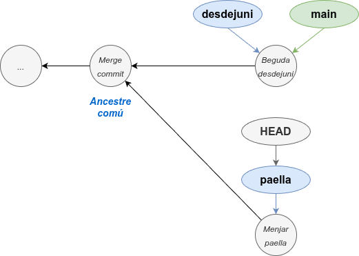{ .r-stretch }

Abans

--

<!-- .slide: data-transition="fade" -->
## Canvi de base

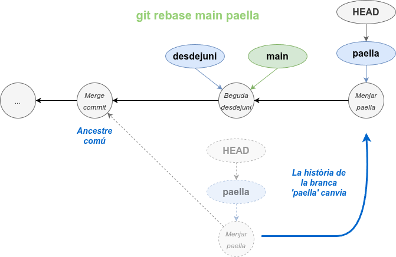{ .r-stretch }

Després
