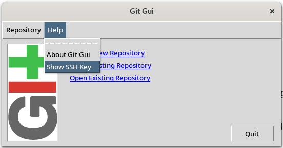
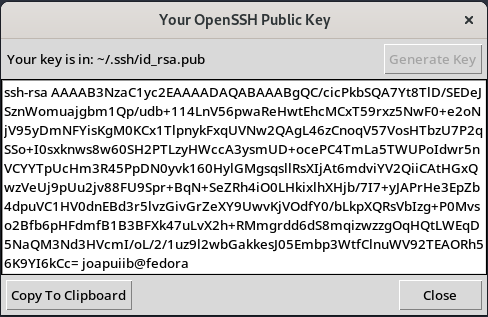

*[IDE]: Integrated Development Environment
*[SSH]: Secure Shell
*[HTTPS]: Hypertext Transfer Protocol Secure
*[PAT]: Personal Access Token
*[CLI]: Command Line Interface

## Introducció
En els blocs anteriors, s'ha presentat l'estructura d'un repositori de Git i les accions bàsiques
per a fer-hi canvis.

No obstant això, totes aquestes accions s'han fet sobre un repositori __local__, és a dir,
un repositori que es troba en el teu dispositiu i els canvis del qual no s'han publicat enlloc.

Aquest bloc se centra en els repositoris __remots__: repositoris __allotjats en un servidor__,
que permeten l'accés d'altres persones i la col·laboració en el desenvolupament de projectes.
En aquest curs s'utilitza __[:simple-github: GitHub][github]__ com a
__servidor d'allotjament de repositoris remots__.

[github]: https://github.com/

En concret, aquests apunts expliquen com configurar els __mètodes d'autenticació__
que permeten connectar-se al servidor de GitHub i gestionar els repositoris remots.


/// figure-caption | #figure-components : Estructura d'un repositori local i remot.


## Creació d'un compte a GitHub
Per a treballar amb repositoris remots, cal un compte a [:simple-github: GitHub][github].
Si encara no en tens, crea'n un.

!!! note "Hi ha persones que prefereixen tindre diferents comptes, per exemple, un de personal i un de professional."
    No obstant això, gestionar l'autenticació de diversos comptes afig complexitat.
    A més, cal parar atenció a la [[introduccio#configuracio-git-config|configuració]]
    local i global dels valors `user.name` i `user.email`.


## Mètodes d'autenticació
Per a enllaçar el teu repositori local amb el repositori remot i publicar-hi canvis,
cal autenticar-se en el servidor de GitHub.

!!! recommend "Per seguretat i comoditat, es recomana utilitzar el __mètode SSH__ per a autenticar-se en el servidor de GitHub."
    Pots anar directament a l'apartat [Autenticació mitjançant claus SSH](#autenticacio-mitjancant-claus-ssh)
    per a configurar aquest mètode d'autenticació.

GitHub ofereix diferents mètodes d'autenticació, basats en dos protocols de comunicació:

- __Protocol HTTPS__: cal configurar les teues credencials d'accés a GitHub en el sistema local.
    Aquesta autenticació es pot fer mitjançant:

    - __~~Nom d'usuari i contrasenya~~__: aquest mètode està deshabilitat a GitHub des del 13/08/2021.
    - __Token d'accés personal__ (_Personal Access Token_ o PAT): una clau d'accés que GitHub
        permet crear per a autenticar-se en el servidor.
    - __Extensions de l'IDE__: alguns entorns de desenvolupament integrats (IDE) inclouen
        extensions que gestionen directament l'autenticació amb GitHub.

- __Protocol SSH__: cal configurar una clau SSH en el sistema local i afegir-la al teu compte de GitHub.

A més, la ferramenta [:simple-github: GitHub CLI][github-cli] (`gh`) permet configurar l'autenticació
de manera interactiva amb qualsevol dels dos protocols, sense haver de crear manualment el token
ni la clau SSH. Vegeu [Autenticació mitjançant GitHub CLI](#autenticacio-mitjancant-github-cli).


### Token d'accés personal (PAT)
Un __token d'accés personal__ (_Personal Access Token_ o PAT) és una clau d'accés
que permet autenticar-se en el servidor de GitHub mitjançant el protocol HTTPS.
Funciona com una contrasenya, però es pot limitar a uns permisos concrets i revocar en qualsevol moment.

Per a crear un token d'accés personal, segueix aquests passos:

1. Inicia la sessió a [:simple-github: GitHub][github].
2. Fes clic en la teua foto de perfil i selecciona __:octicons-gear-16: Settings__.
3. En la barra lateral esquerra, fes clic en __:octicons-code-16: Developer settings__.
4. En la barra lateral esquerra, fes clic en [__:octicons-key-24: Personal access tokens__](https://github.com/settings/tokens).
5. Fes clic en __Generate new token__.

Hi ha dos tipus de tokens d'accés personal:

- __Access token (classic)__: permet especificar els permisos del _token_,
    que __són globals per a tot el compte__.
- __Fine-grained token__: permet especificar els permisos del _token_,
    que __són específics per a un repositori o organització__.

Una vegada creat el _token_, ja es pot utilitzar per a autenticar-se en el servidor de GitHub.

!!! important "Guarda el teu token d'accés personal en un lloc segur: no el podràs vore de nou després de tancar la pàgina."

El token d'accés personal es pot utilitzar de dues maneres:

- __Mitjançant la URL__: s'afig el token a la URL del repositori.

    ```bash
    git clone https://<token>@github.com/<usuari>/<repositori>
    ```

- __Mitjançant la contrasenya__: s'introdueix el token quan Git demana la contrasenya.

    ```shellconsole
    jpuigcerver@fp:~ $ git clone https://github.com/<usuari>/<repositori>
    Cloning into '<repositori>'...
    Username for 'https://github.com': <usuari>
    Password for 'https://<username>@github.com': <token>
    ```

    > Per seguretat, el camp de la contrasenya no mostra res mentre l'escrius.

!!! tip "Per no haver d'introduir el PAT cada vegada, es pot configurar Git perquè el recorde automàticament."
    ```bash
    git config --global credential.helper store
    ```

    Aquesta ordre guarda les credencials en un __fitxer de text pla__ en el sistema local,
    concretament en el fitxer `~/.git-credentials`.

!!! docs "Documentació"
    - [:octicons-link-external-16: Managing your personal access tokens](https://docs.github.com/en/github/authenticating-to-github/keeping-your-account-and-data-secure/creating-a-personal-access-token)
        – Documentació oficial de :simple-github: GitHub
    - [:octicons-link-external-16: Message "Support for password authentication was removed."](https://stackoverflow.com/questions/68775869/message-support-for-password-authentication-was-removed)
        – :simple-stackoverflow: StackOverflow


### Autenticació mitjançant claus SSH
Per a autenticar-se en el servidor de GitHub mitjançant el protocol SSH, cal generar una clau SSH
en el sistema local i afegir-la al teu compte de GitHub. Una __clau SSH__ és un parell de claus:
la __clau privada__ es queda en el teu dispositiu i la __clau pública__ es comparteix amb GitHub.

!!! important "Aquesta configuració s'ha de repetir en cada dispositiu on vulgues utilitzar aquest mètode d'autenticació."

!!! docs "Documentació oficial: [:octicons-link-external-16: Connecting to GitHub with SSH](https://docs.github.com/en/github/authenticating-to-github/connecting-to-github-with-ssh) – :simple-github: GitHub"

#### Generació de la clau SSH
La clau SSH es pot generar des d'una interfície gràfica o des de la terminal:

=== "Interfície gràfica"
    1. Obri el programa [__Git GUI__](https://git-scm.com/downloads/guis).

        > En :material-microsoft-windows: Windows, el programa s'inclou en la instal·lació de Git.

    2. Obri el diàleg __Help > Show SSH Key__.

        
        /// shadow-figure-caption | #figure-git-gui-help : Menú de diàleg SSH de Git GUI.

    3. Fes clic en __Generate Key__.

        > Opcionalment, indica una contrasenya (_passphrase_) per a protegir la clau,
        > o deixa el camp buit per no protegir-la.

    4. Fes clic en __Copy to Clipboard__ per a copiar la clau pública al porta-retalls.

        
        /// shadow-figure-caption | #figure-git-gui-key : Clau SSH generada amb Git GUI.


=== "Terminal"
    1. __Crea una clau SSH__ en el sistema local amb l'ordre __`ssh-keygen`__.

        ```shellconsole
        jpuigcerver@fp:~ $ ssh-keygen -t rsa -b 4096
        Generating public/private rsa key pair.
        Enter file in which to save the key (/home/jpuigcerver/.ssh/id_rsa):
        Enter passphrase (empty for no passphrase):
        Enter same passphrase again:
        Your identification has been saved in /home/jpuigcerver/.ssh/id_rsa
        ```

        - `-t rsa`: indica que la clau és de tipus RSA.
        - `-b 4096`: indica la longitud de la clau en bits.

        L'ordre demana la ruta on guardar la clau (per defecte, `/home/<usuari>/.ssh/id_rsa`)
        i una contrasenya per a protegir-la. Si no vols protegir-la, deixa el camp buit.

    2. Copia el contingut de la __clau pública__ (`id_rsa.pub`) al porta-retalls.

        ```shellconsole
        jpuigcerver@fp:~ $ cat ~/.ssh/id_rsa.pub
        ssh-rsa AAAAB3NzaC1yc2EAAAADAQABAAACAQC7GqFnEFQZK4+l3zvXF07hN/cMk5ZtJmMkHWAJyTYQ+pDwMXp9eQs
        +VASLlz9z+0Q3vnnXN4vBO/+2u29fKJ4YlrecDYtCDpEhMXCkaCv9/ggkru09j2rELFuAqER55lgEtRKTfLKAVFa3Ws
        2VV7zlTSAH2y8nVddzlJRE9Y1BAfH0+1hjpCe+vgGObBLyIGGsXwlmm3mwI7NKHuKCIVskIEX3F0jw668dBex+6VUtG
        ...
        ```

        > Copia sempre la clau __pública__ (`.pub`). La clau privada no s'ha de compartir mai.


#### Configuració de la clau SSH
Després, cal afegir la clau pública al teu compte de :simple-github: GitHub seguint aquests passos:

1. Inicia la sessió a [:simple-github: GitHub][github].
2. Fes clic en la teua foto de perfil i selecciona __:octicons-gear-16: Settings__.
3. En la barra lateral esquerra, fes clic en [:octicons-key-24: __SSH and GPG keys__](https://github.com/settings/keys).
4. Fes clic en __New SSH key__.
5. Indica un títol per a la clau SSH i enganxa el contingut de la clau pública en el camp __Key__.

#### Comprovació de l'autenticació
Per a comprovar que la clau SSH s'ha configurat correctament, executa l'ordre següent en la terminal:

```bash
ssh -T git@github.com
```

Si la clau SSH està ben configurada, la terminal mostra un missatge amb el teu nom d'usuari de GitHub.

```shellconsole
jpuigcerver@fp:~ $ ssh -T git@github.com
Hi joapuiib! You've successfully authenticated, but GitHub does not provide shell access.
```


### Autenticació mitjançant :simple-github: GitHub CLI
[:simple-github: GitHub CLI][github-cli] és una ferramenta de línia d'ordres per a interactuar amb GitHub
des de la terminal. Permet gestionar repositoris, incidències (_issues_), sol·licituds d'incorporació
de canvis (_pull requests_) i altres funcionalitats de GitHub.

[github-cli]: https://cli.github.com/

Una de les funcionalitats que ofereix és autenticar-se en el servidor de GitHub d'una manera senzilla.
Per fer-ho, s'utilitza l'ordre `gh auth login`, que guia de manera interactiva
en la configuració de l'autenticació.

```shellconsole
jpuigcerver@fp:~ $ gh auth login
? What account do you want to log into? GitHub.com
? What is your preferred protocol for Git operations on this host? HTTPS
? Authenticate Git with your GitHub credentials? Yes
? How would you like to authenticate GitHub CLI? Login with a web browser

! First copy your one-time code: ABCD-EFGH
Press Enter to open github.com in your browser...

✓ Authentication complete. You are now logged in as joapuiib
```

!!! docs "Documentació oficial de :simple-github: GitHub CLI"
    - [:octicons-link-external-16: Instal·lació](https://github.com/cli/cli#installation)
    - [:octicons-link-external-16: `gh auth login`](https://cli.github.com/manual/gh_auth_login)


## Bibliografia
- [:octicons-link-external-16: :simple-git: Pro Git Book](https://git-scm.com/book/en/v2)
- [:octicons-link-external-16: Message "Support for password authentication was removed."](https://stackoverflow.com/questions/68775869/message-support-for-password-authentication-was-removed) – :simple-stackoverflow: StackOverflow
- [:octicons-link-external-16: Managing your personal access tokens](https://docs.github.com/en/github/authenticating-to-github/keeping-your-account-and-data-secure/creating-a-personal-access-token) – :simple-github: GitHub Docs
- [:octicons-link-external-16: Connecting to GitHub with SSH](https://docs.github.com/en/github/authenticating-to-github/connecting-to-github-with-ssh) – :simple-github: GitHub Docs
