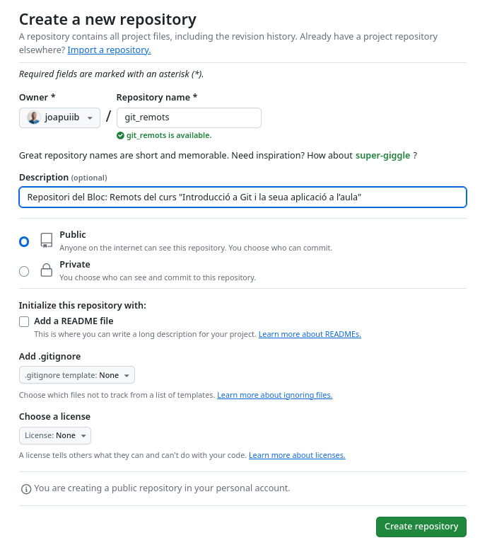
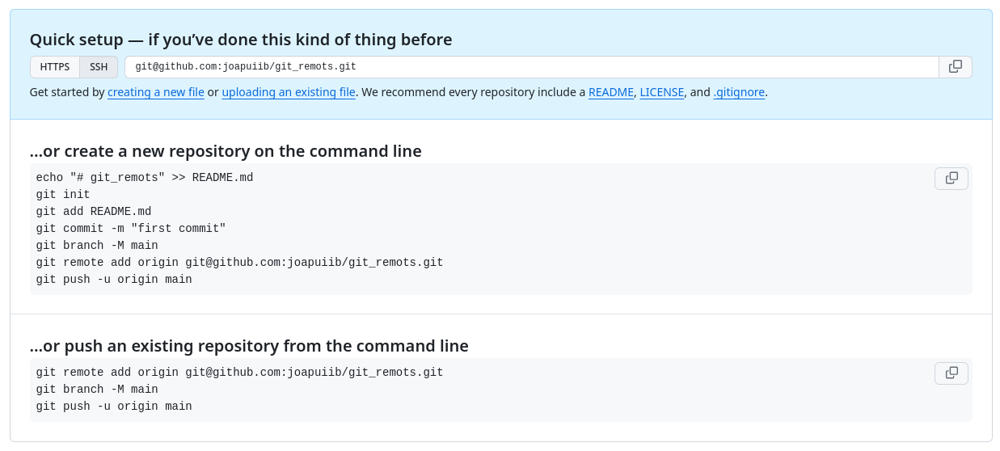
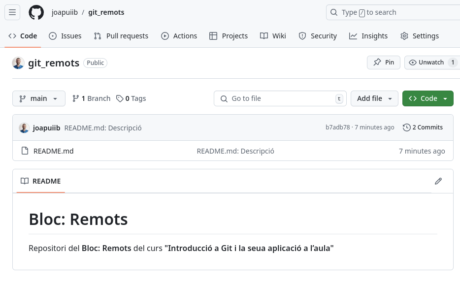
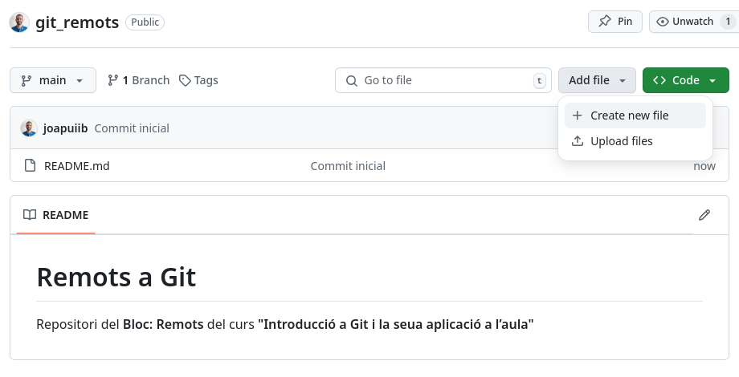
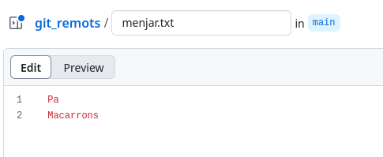
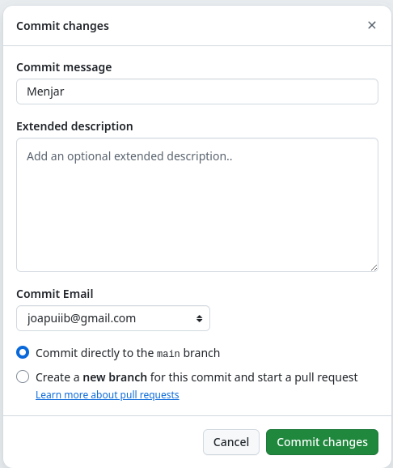
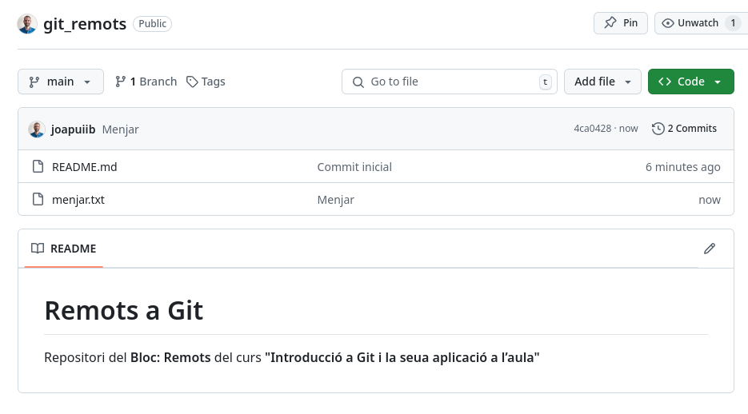

*[PAT]: Personal Access Token
*[CI/CD]: Integració contínua i desplegament continu

## Introducció
En els blocs anteriors, s'ha presentat l'estructura d'un repositori de Git i les accions bàsiques
per a fer-hi canvis. No obstant això, totes aquestes accions s'han fet sobre un repositori __local__,
és a dir, un repositori que es troba en el teu dispositiu i els canvis del qual no s'han publicat enlloc.

Aquest bloc se centra en els repositoris __remots__: repositoris __allotjats en un servidor__,
que permeten l'accés d'altres persones i la col·laboració en el desenvolupament de projectes.


/// figure-caption | #figure-components : Estructura d'un repositori local i remot.

??? prep "Preparació del repositori local"
    En aquests apunts es treballa sobre un nou repositori local, que s'inicialitza amb les ordres següents:

    ```bash
    --8<-- "docs/files/remots/stdout/remots/setup_remots.sh"
    ```

    1. Es canvia el nom de la branca principal a `main`.

    ```shellconsole
    --8<-- "docs/files/remots/stdout/remots/inicial.txt"
    ```

    1. Es canvia el nom de la branca principal a `main`.

    ```md title="README.md"
    --8<-- "docs/files/remots/stdout/remots/README.txt"
    ```

    !!! danger "Crea el nou repositori __en una carpeta independent__ per evitar problemes amb els exemples i exercicis anteriors."


## Repositori remot
Un __repositori remot__ és una còpia d'un repositori de Git allotjada en un servidor
o en un altre lloc fora del teu sistema local. Aquesta còpia conté una rèplica completa
de la història del repositori, incloses totes les revisions i les branques.

Els repositoris remots permeten col·laborar i fer el seguiment del desenvolupament del codi
entre diverses persones, o bé treballar tu mateix des de diferents dispositius.


/// figure-caption | #figure-multiple-local-repo : Repositori remot vinculat a diversos repositoris locals.

Les principals finalitats dels repositoris remots són:

- __Col·laboració__: permeten que diverses persones treballen juntes en un mateix projecte.
    Cada persona treballa en la seua còpia local del repositori i, una vegada fetes les modificacions,
    puja els canvis al repositori remot perquè la resta de l'equip els puga vore i incorporar.
- __Còpia de seguretat__: un repositori remot pot servir com a còpia de seguretat del projecte.
    Si el teu sistema local es danya o es perd, encara tens accés a la història completa
    i als fitxers del projecte mitjançant el repositori remot.
- __Distribució__: els repositoris remots permeten distribuir el codi a altres llocs,
    tant per a compartir-lo amb altres persones com per a desplegar el projecte en un servidor en línia.

Gràcies a aquestes característiques, Git s'ha convertit en una ferramenta clau en qualsevol desenvolupament,
i sobretot en els __projectes de codi obert__ (_open source_), ja que permet que persones de tot el món
col·laboren en un mateix projecte de manera senzilla i distribuïda.

## Allotjament de repositoris remots
Els repositoris remots es poden allotjar en qualsevol màquina o __servidor dedicat__.
No obstant això, hi ha serveis en línia que faciliten la creació i la gestió de repositoris remots.
Alguns dels més coneguts són:

- __[:simple-github: GitHub](https://github.com/)__: servei creat en 2008 i adquirit per Microsoft en 2018.
    És el servei d'allotjament de repositoris de Git més utilitzat.
    Ofereix una opció gratuïta, que permet crear projectes públics i privats amb algunes restriccions,
    i plans de pagament per a projectes empresarials.

- __[:simple-gitlab: GitLab](https://gitlab.com/)__: servei d'allotjament basat en una plataforma de codi obert.

- __[:simple-bitbucket: Bitbucket](https://bitbucket.org/)__: servei propietat de l'empresa Atlassian,
    que s'integra estretament amb altres ferramentes d'aquesta empresa, com Jira.

- __[:simple-codeberg: Codeberg](https://codeberg.org/)__: servei gestionat per Codeberg e.V.,
    una associació alemanya sense ànim de lucre. Està basat en el projecte de codi obert
    [Forgejo](https://forgejo.org/), de manera que la seua interfície i les seues funcionalitats
    d'automatització resulten molt familiars per a qui ja coneix GitHub.

    A diferència de GitHub o Bitbucket, Codeberg no és una empresa amb ànim de lucre:
    es manté amb donacions, tot el seu programari és lliure i totes les característiques
    (inclosos els repositoris privats i la CI/CD) són gratuïtes. Per aquest motiu, cada vegada més
    projectes de codi obert opten per allotjar-se a Codeberg com a alternativa a les plataformes propietàries.

!!! info "Més informació"
    - [:octicons-link-external-16: GitLab vs. GitHub: Which is Better in 2025?](https://prismic.io/blog/gitlab-vs-github#similarities-between-github-and-gitlab) – :simple-prismic: prismic Blog
      { .spell-ignore }
    - [:octicons-link-external-16: Give Up GitHub](https://sfconservancy.org/GiveUpGitHub/) – Software Freedom Conservancy
      { .spell-ignore }


## Creació d'un repositori remot a GitHub
Per a publicar un repositori local, primer cal crear el repositori remot.
A GitHub, es fa seguint aquests passos:

1. Crea un compte a [:simple-github: GitHub](https://github.com/), si encara no en tens.
2. Inicia la sessió amb el teu compte.
3. Fes clic en el botó __[:octicons-repo-24: New](https://github.com/new)__ per a crear un repositori nou.
4. Omple el formulari amb la informació del repositori:
    - __Nom__: nom del repositori, que ha de ser únic en el teu compte de GitHub.
    - __Descripció__: (opcional) descripció del repositori.
    - __Visibilitat__: indica qui pot vore el repositori.
        - __:octicons-repo-24: Públic__: qualsevol persona pot vore el repositori,
            però només les persones autoritzades poden fer-hi canvis.
        - __:octicons-lock-24: Privat__: només tu i les persones que autoritzes podeu vore el repositori
            i fer-hi canvis.
    - __README__: indica si vols afegir un fitxer `README` al repositori.
    - __.gitignore__: indica si vols afegir un fitxer `.gitignore` per a ignorar fitxers en el repositori.
    - __Llicència__: indica si vols afegir una llicència al repositori.

??? example "Exemple: Creació d'un repositori a GitHub"
    Es crea un repositori amb les característiques següents:

    - __Nom__: `git_remots`.
    - __Descripció__: _Repositori del Bloc: Remots del curs "Introducció a Git i GitHub Actions"_.
    - __Visibilitat__: públic.
    - __README__: no.
    - __.gitignore__: no.
    - __Llicència__: no.

    
    /// shadow-figure-caption | #figure-github-new-repo : Formulari de creació d'un repositori nou a GitHub.

    Una vegada omplert el formulari, es fa clic en __Create repository__ per a crear el repositori.
    El repositori es crea __buit__ i es mostra una pàgina com la següent:

    
    /// shadow-figure-caption | #figure-create-github-repo : Repositori buit creat a GitHub.

    La [Figura 4](#figure-create-github-repo) mostra els passos per a enllaçar el repositori local
    amb el repositori remot creat a GitHub. Els apartats següents expliquen aquestes ordres amb més detall.


## Configurar un repositori remot (`git remote`)
El primer pas és enllaçar el __Repositori local__ amb el __Repositori remot__ que s'acaba de crear.
Per fer-ho, s'utilitza l'ordre `git remote`, que permet gestionar els repositoris remots
associats al repositori local:

```bash
git remote [add | rename | remove | show] [<options>]
```

- __Sense subordre__: mostra els repositoris remots associats al repositori local.
- `[add]`: (opcional) afegeix un repositori remot nou.
- `[rename]`: (opcional) canvia el nom d'un repositori remot.
- `[remove]`: (opcional) elimina un repositori remot.
- `[show]`: (opcional) mostra informació detallada d'un repositori remot.
- `[<options>]`: (opcional) opcions i arguments propis de cada subordre.

!!! docs "Documentació oficial: [:octicons-link-external-16: `git remote`](https://git-scm.com/docs/git-remote) – :simple-git: Git"

### Afegir un repositori remot
Per a afegir un repositori remot, s'utilitza l'ordre `git remote add`:

```bash
git remote add <alies> <url>
```

- `<alies>`: nom o àlies amb què s'identifica el repositori remot en el repositori local.
    Normalment, s'utilitza el nom `origin` per a referir-se al repositori remot principal.
- `<url>`: URL del repositori remot.


/// figure-caption | #figure-add-remote : Repositori local vinculat amb un repositori remot.

!!! warning "Si intentes publicar els canvis amb `git push` abans d'enllaçar cap remot, Git mostra un missatge d'error."
    ```shellconsole
    --8<-- "docs/files/remots/stdout/remots/no_remote.txt"
    ```

??? example "Exemple: Afegir un repositori remot"
    S'enllaça el repositori local amb el repositori remot creat anteriorment a GitHub,
    la URL del qual és `git@github.com:joapuiib/git_remots.git`.

    > S'utilitza la URL __SSH__ perquè és el mètode d'autenticació configurat.

    ```shellconsole
    --8<-- "docs/files/remots/stdout/remots/add_remote.txt"
    ```

    S'observa que el remot `origin` apareix associat a la URL indicada.


### Reanomenar un repositori remot
L'ordre `git remote rename` permet canviar el nom d'un repositori remot associat al repositori local:

```bash
git remote rename <antic> <nou>
```

- `<antic>`: àlies actual del repositori remot.
- `<nou>`: nou àlies del repositori remot.

### Eliminar un repositori remot
L'ordre `git remote remove` permet eliminar un repositori remot associat al repositori local:

```bash
git remote remove <alies>
```

- `<alies>`: àlies del repositori remot que es vol eliminar.


## Publicació de canvis (`git push`)
De moment, les branques creades només existeixen en el repositori local, és a dir, en el teu dispositiu.
Per a publicar una branca i els seus canvis en el repositori remot, s'utilitza l'ordre `git push`:

```bash
git push [-u | --set-upstream] [<remot> [<branca>]]
```

- `[-u | --set-upstream]`: (opcional) associa la branca local amb la branca remota indicada
    (_upstream_), de manera que les operacions `git pull` i `git push` futures
    la utilitzen per defecte.
- `[<remot>]`: (opcional) àlies del repositori remot.
    Si no s'especifica, s'utilitza el remot associat prèviament amb `--set-upstream`.
- `[<branca>]`: (opcional) nom de la branca local que es vol publicar.
    Si no s'especifica, s'utilitza la branca actual (`HEAD`).

!!! docs "Documentació oficial: [:octicons-link-external-16: `git push`](https://git-scm.com/docs/git-push) – :simple-git: Git"


/// figure-caption | #figure-push : Publicació d'una branca local en una branca remota.

??? example "Exemple: Publicació i associació de la branca local i la remota"
    Inicialment, la branca `main` no està associada a cap branca remota.
    Es pot comprovar amb `git branch -vv`, que no mostra cap branca remota entre claudàtors.
    Per això, si s'executa `git push`, es mostra un missatge d'error que indica
    que cal associar-hi una branca remota.

    ```shellconsole
    --8<-- "docs/files/remots/stdout/remots/push_no_upstream.txt"
    ```

    A continuació, s'associen la branca `main` local i la remota amb l'ordre `git push --set-upstream`.

    ```shellconsole
    --8<-- "docs/files/remots/stdout/remots/push_upstream.txt"
    ```

    S'observa que localment s'ha creat la referència `origin/main`, que apunta a la branca remota `main`.
    A més, ara `git branch -vv` mostra `[origin/main]` al costat de la branca `main`,
    és a dir, la branca remota associada. Finalment, els canvis s'han publicat correctament en el repositori remot:

    
    /// figure-caption | ^1 .shadow : Canvis publicats a :simple-github: GitHub.


### Associació d'un remot per defecte
Cada branca local es pot associar amb una branca remota mitjançant l'opció `-u` o `--set-upstream`
de l'ordre `git push`. Aquesta branca remota s'anomena __upstream__ i inclou tant el remot
com el nom de la branca en aquest:

```bash
git push -u <remot> <branca>
```

Per exemple, `git push -u origin main` publica la branca `main` en el remot `origin`
i, a més, associa la branca local `main` amb `origin/main`. Aquesta associació és
__independent per a cada branca local__: no afecta la resta de branques.

Gràcies a l'associació, Git sap on ha de publicar i d'on ha de portar els canvis quan s'executen
les ordres `git push` o `git pull` sense arguments. A més, `git status` l'utilitza
per indicar si la branca local va per davant o per darrere de la remota.

Per consultar la branca remota associada a cada branca local, s'utilitza l'ordre `git branch -vv`.
Vegeu-ne el resultat en l'[exemple anterior](#publicacio-de-canvis-git-push).

!!! tip "L'opció `push.autoSetupRemote` fa que cada branca local s'associe automàticament amb la branca remota del mateix nom."
    ```bash
    git config --global push.autoSetupRemote true
    ```

L'associació d'una branca local es pot eliminar amb l'ordre `git branch --unset-upstream`:

```bash
git branch --unset-upstream [<branca>]
```

- `[<branca>]`: (opcional) branca de la qual es vol eliminar l'associació.
    Si no s'especifica, s'utilitza la branca actual.


## Clonació d'un repositori remot (`git clone`)
L'ordre `git clone` copia un repositori remot en un repositori local del teu sistema,
des del qual pots fer canvis.

Aquesta ordre copia els continguts del _Directori de treball_ i tota la informació del _Repositori local_,
inclosa la història de canvis. A més, configura automàticament el repositori remot amb l'àlies `origin`.

La sintaxi és la següent:

```bash
git clone <url> [<directori>]
```

- `<url>`: URL del repositori remot. Pot ser una URL HTTPS o SSH.
- `[<directori>]`: (opcional) nom del directori on es copia el repositori.
    Per defecte, es crea un directori amb el nom del repositori remot.

!!! docs "Documentació oficial: [:octicons-link-external-16: `git clone`](https://git-scm.com/docs/git-clone) – :simple-git: Git"


/// figure-caption | #figure-clone : Clonació d'un repositori remot.

??? example "Exemple: Clonació d'un repositori remot"
    Com que els canvis ja estan publicats en el repositori remot, es pot clonar en el sistema local.
    Per comprovar-ho, s'esborra el directori `git_remots` i es clona des del repositori remot.

    ```shellconsole
    --8<-- "docs/files/remots/stdout/remots/clone.txt"
    ```

    S'observa que s'ha clonat correctament el repositori `git_remots`,
    que conté els fitxers i la història de canvis del repositori remot.


## Sincronització entre repositoris (`git fetch`)
L'ordre `git fetch` actualitza en el repositori local la informació de les branques remotes
(`origin/<branca>`), però no aplica els canvis a les branques locals:

```bash
git fetch [<options>] [<remot>]
```

- `[<options>]`: (opcional) opcions de l'ordre.
- `[<remot>]`: (opcional) àlies del repositori remot. Per defecte, s'utilitza `origin`.

!!! docs "Documentació oficial: [:octicons-link-external-16: `git fetch`](https://git-scm.com/docs/git-fetch) – :simple-git: Git"


/// figure-caption | #figure-fetch : Sincronització entre repositoris amb `git fetch`.

Aquesta ordre és útil per a obtindre la informació dels canvis realitzats en el repositori remot
i decidir després si es volen incorporar al repositori local.

!!! info "L'opció `--prune` elimina les referències de les branques remotes que ja no existeixen en el repositori remot."
    Aquesta opció es pot activar per defecte amb l'ordre `git config`:

    ```bash
    git config --global fetch.prune true
    ```

    També es pot configurar perquè s'aplique en l'ordre `git pull`:

    ```bash
    git config --global remote.origin.prune true
    ```

??? prep "Preparació: Canvis en el repositori remot"
    Es fa un canvi en el repositori remot directament a :simple-github: GitHub.

    1. Es crea un fitxer `menjar.txt` amb el contingut següent:

        ```text title="menjar.txt"
        Pa
        Macarrons
        ```

        
        /// figure-caption | ^1 .shadow : Crear un fitxer nou a :simple-github: GitHub.

        
        /// figure-caption | ^1 .shadow : Afegir contingut a `menjar.txt` a :simple-github: GitHub.

    2. Es crea un _commit_ amb el missatge __Menjar__.

        
        /// figure-caption | ^1 .shadow : Crear un _commit_ a :simple-github: GitHub.

    3. Es comprova que el canvi s'ha fet correctament.

        
        /// figure-caption | ^1 .shadow : Canvi realitzat a :simple-github: GitHub.


??? example "Exemple: Sincronització entre repositoris (`fetch`)"
    En aquest moment, el repositori remot té un canvi que no figura en el repositori local.

    ```shellconsole
    --8<-- "docs/files/remots/stdout/remots/before_fetch.txt"
    ```

    Es sincronitza el repositori local amb el repositori remot, que conté els canvis nous.

    ```shellconsole
    --8<-- "docs/files/remots/stdout/remots/after_fetch.txt"
    ```

    S'observa que la branca `origin/main` s'ha actualitzat amb el canvi nou,
    però la branca local `main` no s'ha modificat.


## Incorporació de canvis (`git pull`)
Per a incorporar els canvis d'una branca remota en la branca local, s'utilitza l'ordre `git pull`,
que fa dues accions:

1. __`git fetch`__: actualitza en el repositori local la informació de les branques remotes.
2. __`git merge origin/<branca>`__: incorpora els canvis de la branca remota en la branca local.


/// figure-caption | #figure-pull : Incorporació de canvis amb `git pull`.

La sintaxi és:

```bash
git pull [<options>] [<remot> [<branca>]]
```

- `[<options>]`: (opcional) opcions de l'ordre.
- `[<remot>]`: (opcional) àlies del repositori remot.
    Per defecte, s'utilitza el [remot associat][associada] a la branca actual.
- `[<branca>]`: (opcional) nom de la branca remota.
    Per defecte, s'utilitza la branca remota [associada][associada] a la branca actual.

[associada]: #associacio-dun-remot-per-defecte

!!! docs "Documentació oficial: [:octicons-link-external-16: `git pull`](https://git-scm.com/docs/git-pull) – :simple-git: Git"

!!! warning "La fusió (`merge`) implícita de `git pull` pot ser una [[branques#fusio-directa]] o una [[branques#fusio-de-branques-divergents]], si la branca local i la remota han divergit."
    En el cas d'una fusió de branques divergents:

    - __Es poden produir conflictes__, que cal resoldre manualment.
    - Executar directament `git pull` __genera un _commit_ de fusió__,
        que potser no és desitjable si es vol mantindre __una història lineal__.

!!! tip "Per a evitar __la fusió de branques divergents__ en `git pull`, hi ha dues opcions:"
    - __`git pull --ff-only`__: incorpora els canvis de la branca remota
        __només si es pot fer una fusió directa (_fast-forward_)__.
        Si no és possible, es mostra un error i no s'incorporen els canvis en la branca local.

        Aquest comportament es pot configurar per defecte:

        ```bash
        git config --global pull.ff only
        ```

    - __`git pull --rebase`__: incorpora els canvis de la branca remota mitjançant un canvi de base (`rebase`),
        és a dir, aplica els canvis de la branca local després dels canvis de la branca remota.
        { #git-pull-rebase }

        Aquest comportament també es pot configurar per defecte:

        ```bash
        git config --global pull.rebase true
        ```

??? example "Exemple: Incorporació de canvis amb fusió directa (`pull --ff-only`)"
    El _commit_ `b460858` forma part de la branca remota `origin/main`, però no de la branca local `main`.

    ```shellconsole
    --8<-- "docs/files/remots/stdout/remots/before_pull_ff.txt"
    ```

    S'incorporen els canvis de la branca remota `origin/main` en la branca local `main`.

    ```shellconsole
    --8<-- "docs/files/remots/stdout/remots/after_pull_ff.txt"
    ```

    S'observa que la branca local `main` ha avançat fins al mateix _commit_ que `origin/main`.

??? prep "Preparació: Més canvis en el repositori remot"
    Fes els canvis següents en el repositori remot directament a :simple-github: GitHub.

    1. Modifica el fitxer `menjar.txt` amb el contingut següent:

        ```text title="menjar.txt"
        Pa
        Macarrons
        Pomes
        ```

    2. Crea un _commit_ amb el missatge __Més menjar__.

??? example "Exemple: Incorporació de canvis amb fusió de branques divergents (`pull --no-ff` i `pull --rebase`)"
    Una de les situacions més habituals en què la branca local divergeix de la remota és
    fer canvis en la branca local sense haver-la sincronitzat abans amb la branca remota associada.

    En aquest cas, s'ha fet un altre canvi en el repositori remot que encara no s'ha incorporat.
    Per a simular la situació anterior, es fa un canvi en la branca local `main`.

    ```shellconsole
    --8<-- "docs/files/remots/stdout/remots/prepare_local_pull_no_ff.txt"
    ```

    1. El canvi __Més menjar__ no apareix en la branca remota `origin/main`
        perquè no s'ha sincronitzat el repositori local amb el repositori remot.

    Si ara s'intenta publicar aquest canvi en el repositori remot, Git mostra un missatge d'error,
    perquè el repositori remot té canvis que no estan en el repositori local.

    ```shellconsole
    --8<-- "docs/files/remots/stdout/remots/pull_no_ff_push_error.txt"
    ```

    S'observa que `git push` recomana fer un `git pull` per a incorporar els canvis,
    ja que les dues branques __han divergit__.
    No obstant això, `git pull` faria una fusió de branques divergents, que crearia un _commit_ de fusió
    i donaria com a resultat una història no lineal.

    Tampoc no es poden incorporar els canvis amb una fusió directa (`git pull --ff-only`):

    ```shellconsole
    --8<-- "docs/files/remots/stdout/remots/pull_ff_only_error.txt"
    ```

    Per tant, els canvis s'han d'incorporar d'alguna de les dues maneres següents:

    !!! warning "Amb un _commit_ de fusió: `git pull --no-ff`."
        És el procés que segueix `git pull` si no s'indica cap opció addicional.
        Crea un _commit_ de fusió, que no és desitjable si es vol mantindre una història lineal.

        ```shellconsole
        --8<-- "docs/files/remots/stdout/remots/pull_no_ff.txt"
        ```

        1. L'opció `--no-edit` indica que no es vol editar el missatge del _commit_ de fusió
            i que es manté el missatge per defecte.

    !!! recommend "Amb un canvi de base: `git pull --rebase`."
        Aquesta opció aplica els canvis de la branca local després dels canvis de la branca remota,
        de manera que es manté una història lineal.

        ```shellconsole
        --8<-- "docs/files/remots/stdout/remots/pull_rebase.txt"
        ```


/// html | div.spell-ignore
## Recursos addicionals
- [:simple-youtube: Curs de Git des de zero](https://www.youtube.com/watch?v=3GymExBkKjE&ab_channel=MoureDevbyBraisMoure) per [Moure Dev](https://www.youtube.com/@mouredev)
- [:octicons-link-external-16: Learn `git` concepts, not commands](https://github.com/UnseenWizzard/git_training) per [@UnseenWizzard](https://github.com/UnseenWizzard)


## Bibliografia
- [:octicons-link-external-16: :simple-git: Pro Git Book](https://git-scm.com/book/en/v2)
- [:octicons-link-external-16: Learn `git` concepts, not commands](https://github.com/UnseenWizzard/git_training) per [@UnseenWizzard](https://github.com/UnseenWizzard)
///
