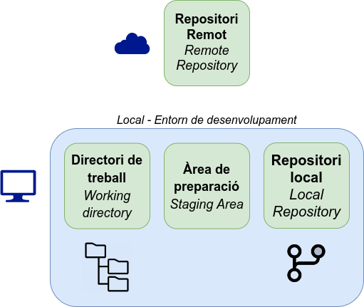
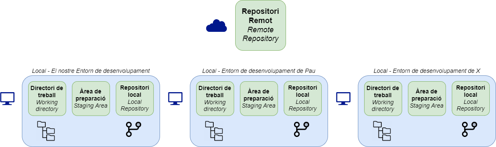

<div class="slide-header-logos">




</div>

<style>
.slide-header-logos {
    display: flex;
    justify-content: center;
    flex-wrap: wrap;
    gap: 1rem;
    margin-bottom: 2rem;
}

.slide-header-logos svg,
.slide-header-logos img {
    max-height: 2.5rem;
}
</style>

# Mètodes d'autenticació a GitHub

#### Introducció a Git i GitHub Actions

---

## Repositori remot

{ .r-stretch }

---

## Desenvolupament distribuït

{ .r-stretch }

---

## Mètodes d'autenticació a GitHub

- ~~Nom d'usuari i contrasenya (2021)~~
- (_HTTPS_) Personal Access Token (PAT)
- (_SSH_) Clau SSH
- :simple-github: GitHub CLI

---

## Token d'accés personal (PAT)

Generat desde Settings > Developer settings > Personal access tokens

- Classic
- Fine-grained

```bash
git config --global credential.helper store
```

---

## Clau SSH

1. Generar clau SSH localment

    ```bash
    ssh-keygen -t rsa -b 4096
    ```

2. Afegir clau a GitHub

3. Comprovar l'autenticació

    ```bash
    ssh -T git@github.com
    ```

---

## :simple-github: GitHub CLI

```bash
gh auth login
```

```shellconsole
jpuigcerver@fp:~ $ gh auth login
? What account do you want to log into? GitHub.com
? What is your preferred protocol for Git operations on this host? HTTPS
? Authenticate Git with your GitHub credentials? Yes
? How would you like to authenticate GitHub CLI? Login with a web browser

! First copy your one-time code: ABCD-EFGH
Press Enter to open github.com in your browser... 

✓ Authentication complete. You are now logged in as joapuiib
```
