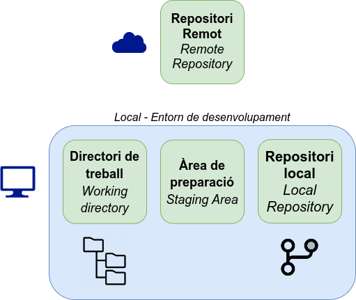
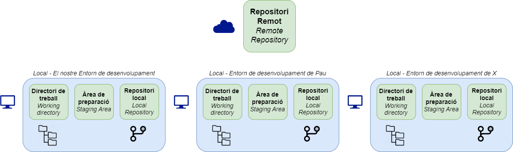
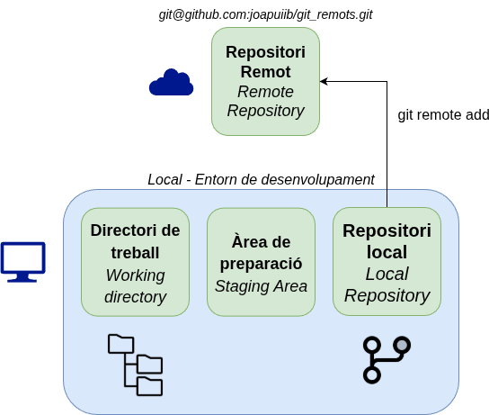
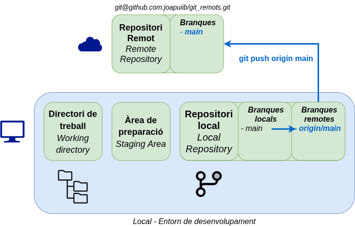
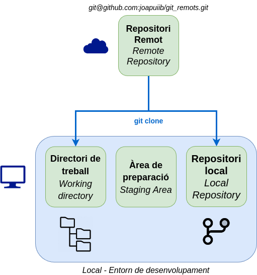
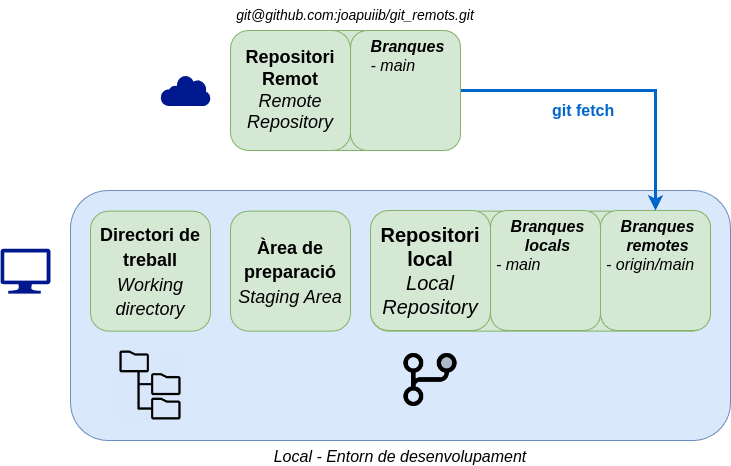
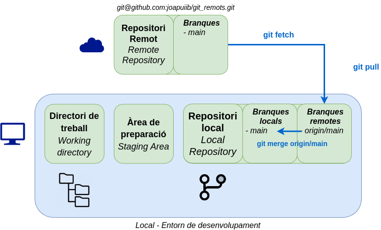

<div class="slide-header-logos">




</div>

<style>
.slide-header-logos {
    display: flex;
    justify-content: center;
    flex-wrap: wrap;
    gap: 1rem;
    margin-bottom: 2rem;
}

.slide-header-logos svg,
.slide-header-logos img {
    max-height: 2.5rem;
}
</style>

# Remots

#### Introducció a Git i GitHub Actions

---

## Repositori remot

{ .r-stretch }

---

## Desenvolupament distribuït

{ .r-stretch }

---

## Afegir un repositori remot

```bash
git remote add origin <url>
```

- (_HTTPS_) Personal Access Token (PAT)
- (_SSH_) Clau SSH

{ .r-stretch }

---

## Associació de branques locals i remotes

```bash
git push [-u | --set-upstream] origin <branca>
```

- _Upstream_ = remot + branca remota, per a cada branca local
- `git push` i `git pull` sense arguments
- `git branch -vv` mostra l'_upstream_ de cada branca

{ .r-stretch }

---

## Clonar un repositori

```bash
git clone <url> [<directori>]
```

{ .r-stretch }

---

## Sincronització

```bash
git fetch
```
{ .r-stretch }

---

## Integració de canvis

```bash
git pull [--rebase]
```

{ .r-stretch }
