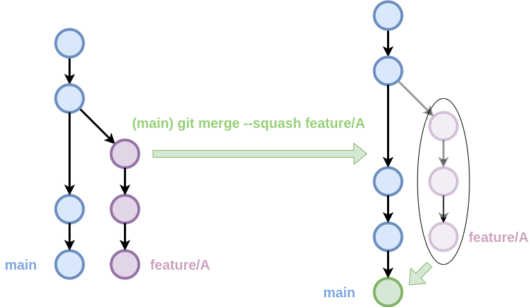

@TODO: exemples

## `merge --squash`
L'opció `--squash` de la comanda `git merge` permet fusionar els canvis d'una branca en una altra
en un únic commit.

De vegades, el treball en una branca pot generar molts commits (_microcommits_) que no aporten informació rellevant.
Amb aquesta opció, és possible fusionar tots aquests commits en un de sol, evitant la sobrecàrrega d'informació
i contaminació de l'historial.

Aquesta opció és especialment útil en la __fusió de branques de funcionalitat__,
que veurem en el següent bloc [[estrategies]].

El funcionament de `git merge --squash` consiteix en aplicar tots els canvis de la branca especificada
a l'__Àrea de Preparació__ (_Staging Area_), però sense realitzar el commit, que caldrà fer manualment.

La sintaxi és la següent:
```bash
git merge --squash <branca>
```


/// figure-caption
Funcionament de `git merge --squash`.
///

??? prep "Preparació repositori"
    @TODO

??? example "Exemple: git merge --squash"
    @TODO
