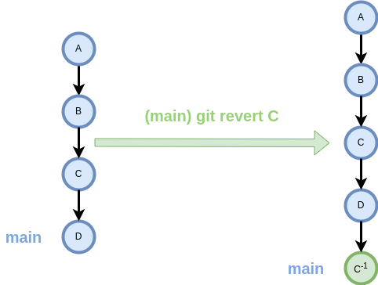
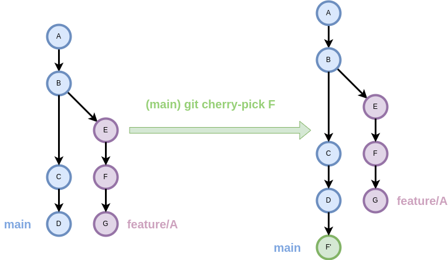

@TODO: exemples

## Introducció
Les accions `revert` i `cherry-pick` són eines poc comuns, però poden ser útils en situacions específiques.

## Revert
La comanda `revert` és útil per desfer els canvis d'un commit concret,
sense alterar la història del repositori.

El seu funcionament consiteix en crear un nou commit que inverteix els canvis del commit que desitgem desfer.

!!! docs
    Documentació oficial de [`git revert`](https://git-scm.com/docs/git-revert){target=_blank}

La sintaxi és la següent:
```bash
git revert <ref>
```

- `<ref>`: Referència del commit que es vol desfer.


/// figure-caption
Funcionament de `git revert`.
///

??? example "Exemple: git revert"
    @TODO

### Revertir múltiples commits
L'acció `revert` sols permet desfer un commit a la vegada.

En cas de voler desfer múltiples commits,
es pot aplicar la comanda `revert` de forma successiva
a cada commit que es vol desfer amb la opció `--no-commit`.

D'aquesta manera, es poden desfer múltiples commits en un sol commit.

```bash
git revert --no-commit <ref>
```

!!! docs
    Discussió [StackOverflow: How can I revert multiple Git commits?](https://stackoverflow.com/questions/1463340/how-can-i-revert-multiple-git-commits){target=_blank}

??? example "Exemple: git revert múltiples commits"
    @TODO

### Resolució de conflictes
Aquesta acció pot generar conflictes si els canvis que es volen desfer
han estat modificats en commits posteriors.

En aquest cas, passarem a l'estat `REVERTING` i caldrà resoldre els conflictes
manualment, de la mateixa manera que es fa en una [[branques#resolucio-de-conflictes|fusió de branques (`merge`)]].

??? example "Exemple: Resolució de conflictes en git revert"
    @TODO

## Cherry-pick
La comanda `cherry-pick` permet aplicar els canvis d'un commit concret
sobre la branca actual.

!!! docs
    Documentació oficial de [`git cherry-pick`](https://git-scm.com/docs/git-cherry-pick){target=_blank}

La sintaxi és la següent:
```bash
git cherry-pick <ref>
```

- `<ref>`: Referència del commit que es vol aplicar.


/// figure-caption
Funcionament de `git cherry-pick`.
///

??? example "Exemple: git cherry-pick"
    @TODO

### Resolució de conflictes
Aquesta acció pot generar conflictes si els canvis que es volen aplicar
es produeixen en llocs que han segut modificats.

En aquest cas, passarem a l'estat `CHERRY-PICKING` i caldrà resoldre els conflictes
manualment, de la mateixa manera que es fa en una [[branques#resolucio-de-conflictes|fusió de branques (`merge`)]].

??? example "Exemple: Resolució de conflictes en git cherry-pick"
    @TODO
