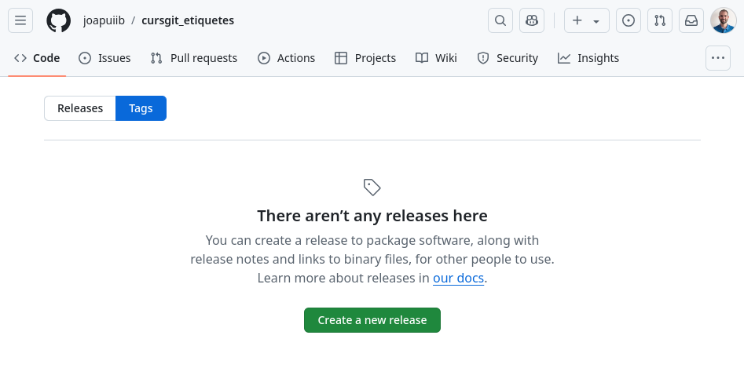
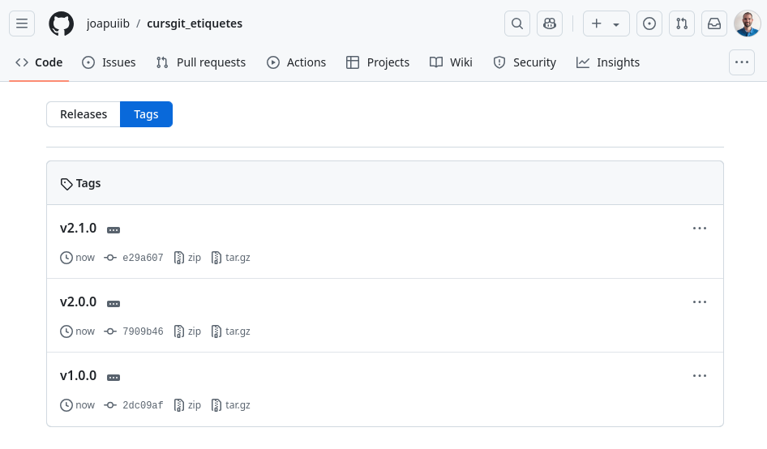

## Etiquetes
En Git, cada _commit_ s'identifica mitjançant un _hash_, un identificador alfanumèric que es genera
quan es crea el _commit_. No obstant això, de vegades és útil identificar punts concrets de la història
del repositori amb un nom, que és més fàcil de recordar i més significatiu que un _hash_.

Per aquesta raó, Git permet crear __etiquetes__ (_tags_): noms que marquen punts concrets
en la història del repositori. En projectes de desenvolupament, les etiquetes s'utilitzen normalment
per a identificar les noves publicacions (_releases_), com ara `v1.0` o `v2.0`,
però es poden utilitzar per a qualsevol propòsit.


/// figure-caption | #figure-etiquetes : Etiqueta en un _commit_.

Hi ha dos tipus d'etiquetes:

- __Etiqueta lleugera__: referència amb nom que apunta a un _commit_.
- __Etiqueta anotada__: objecte de Git que, a més, conté qui ha creat l'etiqueta,
    la data de creació i un missatge.

!!! docs "Documentació oficial de :simple-git: Git"
    - [:octicons-link-external-16: `git tag`](https://git-scm.com/docs/git-tag)
    - [:octicons-link-external-16: Capítol 2.6 Git Basics - Tagging](https://git-scm.com/book/en/v2/Git-Basics-Tagging)
        – [:simple-git: Pro Git Book](https://git-scm.com/book/en/v2)

??? prep "Preparació del repositori"
    El repositori dels exemples es prepara amb les ordres següents:

    !load_file "avancat/stdout/etiquetes/setup_tags.sh"

    ```shellconsole
    --8<-- "docs/files/avancat/stdout/etiquetes/setup_tags.txt"
    ```

    !!! danger "Crea el nou repositori __en una carpeta independent__ per evitar problemes amb els exemples i exercicis anteriors."


### Numeració de versions
En projectes de desenvolupament, és habitual utilitzar un sistema de numeració
per a identificar les diferents versions del programari.

Una bona pràctica és utilitzar la numeració semàntica, que permet saber de manera clara
quin tipus de canvis s'han fet en cada versió. El sistema de numeració semàntica
__[:octicons-link-external-16: SemVer](https://semver.org/lang/ca/)__ especifica el format següent:

```text
MAJOR.MINOR.PATCH
```

- __`MAJOR`__: s'incrementa quan es fan canvis incompatibles amb les versions anteriors.
- __`MINOR`__: s'incrementa quan s'afigen funcionalitats compatibles amb les versions anteriors.
- __`PATCH`__: s'incrementa quan es corregeixen errors de manera compatible amb les versions anteriors.

??? example "Exemple: Numeració de versions"
    La versió `1.2.0` indica:

    - __`1`__: versió major.
    - __`2`__: versió menor.
    - __`0`__: versió de correcció d'errors.

    Si en aquest punt s'afigen funcionalitats compatibles amb les versions anteriors,
    la versió següent és la `1.3.0`. Després, si es corregeixen errors de manera compatible,
    la versió següent és la `1.3.1`. En canvi, si es fan canvis incompatibles amb les versions anteriors,
    la versió següent és la `2.0.0`.

### Creació d'etiquetes
L'ordre `git tag` permet crear etiquetes lleugeres o anotades:

```bash
git tag [-a] <nom_etiqueta> [-m "<missatge>"] [<ref>]
```

- `[-a]`: (opcional) crea una etiqueta anotada. Si no s'especifica, es crea una etiqueta lleugera.
- `<nom_etiqueta>`: nom de l'etiqueta.
- `[-m "<missatge>"]`: (opcional) missatge de l'etiqueta anotada.
    Si no s'especifica, s'obri un editor per a escriure'l.
- `[<ref>]`: (opcional) referència del _commit_ al qual s'associa l'etiqueta.
    Si no s'especifica, s'associa al _commit_ actual (`HEAD`).

??? example "Exemple: Creació d'etiquetes anotades"
    Es creen les etiquetes anotades següents:

    - `v1.0.0`, en el primer _commit_, amb el missatge `Primera versió: v1.0.0`.
    - `v2.0.0`, en el _commit_ __README: Apartat tipus etiquetes__, amb el missatge `Versió: v2.0.0`.

    ```shellconsole
    --8<-- "docs/files/avancat/stdout/etiquetes/etiqueta_anotada.txt"
    ```

??? example "Exemple: Creació d'etiquetes lleugeres"
    Es creen les etiquetes lleugeres següents:

    - `v1.1.0`, en el _commit_ __README: Descripció__.
    - `v2.1.0`, en el _commit_ actual.

    ```shellconsole
    --8<-- "docs/files/avancat/stdout/etiquetes/etiqueta_lleugera.txt"
    ```

### Llistar etiquetes
L'ordre `git tag` sense arguments, o amb l'opció `--list`, mostra les etiquetes del repositori:

```bash
git tag [-l | --list] [<patró>]
```

- `[-l | --list]`: (opcional) llista les etiquetes.
- `[<patró>]`: (opcional) patró per a filtrar les etiquetes, que admet
    [caràcters comodí](https://en.wikipedia.org/wiki/Wildcard_character) (_wildcards_).

??? example "Exemple: Llistar etiquetes"
    Es mostren les etiquetes del repositori.

    ```shellconsole
    --8<-- "docs/files/avancat/stdout/etiquetes/llista.txt"
    ```

??? example "Exemple: Llistar etiquetes amb un patró"
    Es mostren les etiquetes del repositori que comencen per `v2.`.

    ```shellconsole
    --8<-- "docs/files/avancat/stdout/etiquetes/llista_patro.txt"
    ```

### Consultar la informació d'una etiqueta
L'ordre `git show` permet consultar la informació d'una etiqueta:

```bash
git show <nom_etiqueta>
```

- `<nom_etiqueta>`: nom de l'etiqueta que es vol consultar.

La informació que es mostra depén del tipus d'etiqueta. En les __etiquetes lleugeres__, es mostra
la informació del _commit_ associat. En les __etiquetes anotades__, a més, es mostra la persona
que ha creat l'etiqueta, la data de creació i el missatge associat.

!!! docs "Documentació oficial: [:octicons-link-external-16: `git show`](https://git-scm.com/docs/git-show) – :simple-git: Git"

??? example "Exemple: Consultar la informació d'una etiqueta anotada"
    Es mostra la informació de l'etiqueta anotada `v1.0.0`.

    ```shellconsole
    --8<-- "docs/files/avancat/stdout/etiquetes/info_etiqueta_anotada.txt"
    ```

    S'observa la persona que ha creat l'etiqueta, la data de creació, el missatge i el _commit_ associat.

??? example "Exemple: Consultar la informació d'una etiqueta lleugera"
    Es mostra la informació de l'etiqueta lleugera `v1.1.0`.

    ```shellconsole
    --8<-- "docs/files/avancat/stdout/etiquetes/info_etiqueta_lleugera.txt"
    ```

    S'observa que, en aquest cas, només es mostra el _commit_ associat.


### Eliminar etiquetes
L'ordre `git tag` amb l'opció `-d` permet eliminar etiquetes:

```bash
git tag -d <nom_etiqueta>
```

- `<nom_etiqueta>`: nom de l'etiqueta que es vol eliminar.

??? example "Exemple: Eliminar etiquetes"
    S'elimina l'etiqueta lleugera `v1.1.0`.

    ```shellconsole
    --8<-- "docs/files/avancat/stdout/etiquetes/eliminar_etiqueta.txt"
    ```


### Etiquetes en el repositori remot
Les etiquetes no es publiquen automàticament amb `git push`. Per a publicar una etiqueta
en el repositori remot, cal indicar-la explícitament:

```bash
git push origin <nom_etiqueta>
```

Per a publicar totes les etiquetes, s'utilitza l'opció `--tags`:

```bash
git push origin --tags
```

Per a eliminar una etiqueta del repositori remot, s'utilitza l'opció `-d` o `--delete`:

```bash
git push -d origin <nom_etiqueta>
```

??? prep "Enllaç amb el repositori remot"
    S'enllaça el repositori local amb un repositori remot.

    ```shellconsole
    --8<-- "docs/files/avancat/stdout/etiquetes/preparacio_remot.txt"
    ```

    S'observa que les etiquetes creades en el repositori local no apareixen en el repositori remot.

    
    /// shadow-figure-caption | #figure-github-no-etiquetes : Repositori remot sense etiquetes.

    !!! warning "Per a fer aquesta secció, cal que crees i configures el teu propi repositori remot."

??? example "Exemple: Etiquetes en el repositori remot"
    Es publiquen totes les etiquetes en el repositori remot.

    ```shellconsole
    --8<-- "docs/files/avancat/stdout/etiquetes/push_etiquetes.txt"
    ```

    S'observa que les etiquetes creades en el repositori local s'han publicat en el
    [repositori remot](https://github.com/joapuiib/cursgit_etiquetes/tags).

    
    /// shadow-figure-caption | #figure-github-etiquetes : Repositori remot amb etiquetes.
