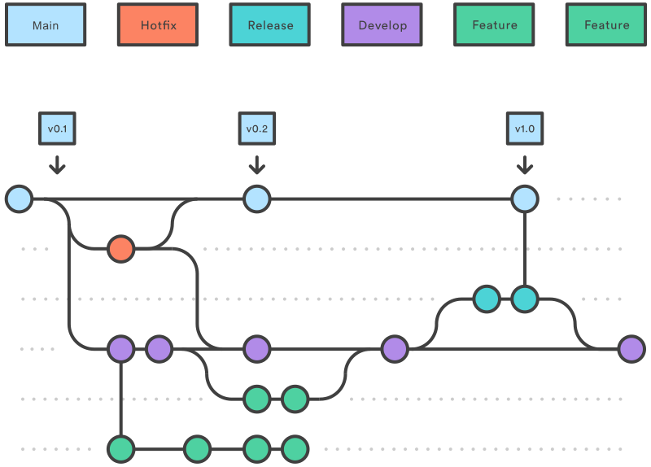

## Estratègies de ramificació
Quan es treballa en un projecte, sobretot si hi participen moltes persones, és imprescindible adoptar
una metodologia de treball que facilite la gestió i el desenvolupament del projecte.

Si, a més, s'utilitza __:simple-git: Git__ com a sistema de control de versions, cal una
__estratègia de ramificació__: un conjunt de regles i pautes que defineixen
__el flux de treball mitjançant branques__. Els objectius d'una estratègia de ramificació són:

- __Claredat__: proporciona un flux de treball clar i coherent per a gestionar els canvis del codi.
- __Desenvolupament paral·lel__: permet treballar en diverses funcionalitats alhora.
- __Col·laboració__: facilita la col·laboració entre les persones de l'equip.
- __Estabilitat__: ajuda a mantindre un codi estable i preparat per a posar-lo en producció.
- __Ordre__: manté una història del projecte ordenada i coherent.

A més, les estratègies de ramificació es poden combinar amb altres ferramentes,
com ara les [[pull-requests]], que es presenten en el [[projectes-index]].

No obstant això, utilitzar una estratègia de ramificació pot suposar una sobrecàrrega
en projectes xicotets o amb poques persones. És important adaptar la metodologia a les necessitats
del projecte i no seguir-la de manera estricta si no aporta valor afegit.

!!! note "No cal utilitzar tots els tipus de branques."
    Per exemple, en projectes xicotets, potser no cal una branca de desenvolupament `develop`
    ni branques de llançament `release/*`.


## Branques amb un propòsit únic
Les estratègies de ramificació més habituals es basen a crear diferents _tipologies_ de branques,
cadascuna amb un __propòsit concret__ i una sèrie de regles per a crear-les, incorporar-les i eliminar-les:

- __[Branca principal](#branca-principal-i-de-desenvolupament) (`main`)__: branca on es troba
    la __versió estable__ del projecte.

- __[Branca de desenvolupament](#branca-principal-i-de-desenvolupament) (`development`, `develop`, `dev`)__:
    branca on es troba l'estat actual del projecte, on s'incorporen les funcionalitats acabades i provades.

    - En un primer moment, es crea a partir de la branca `main`.
    - S'utilitza per a integrar les branques de funcionalitat `feature/*`, de manera que va avançant
        respecte de la branca `main`.
    - Es fusiona amb la branca `main` quan es prepara una nova versió del projecte.

- __[Branques de funcionalitat](#branques-de-funcionalitat) (`feature/*`, `feat/*`, `fix/*`...)__:
    per a cada funcionalitat nova es crea una branca independent, on es programa i es prova.

    - Es creen a partir de la branca `develop`.
    - Es fusionen amb la branca `develop` una vegada acabades.
    - Es poden eliminar després d'integrar-les.
    - El prefix de les branques es pot adaptar per a indicar el tipus de funcionalitat.

- __[Branques de llançament](#branques-de-llancament) (`release/*`)__: branques on es preparen
    els canvis per a publicar una nova versió del projecte.

    - Es creen a partir de la branca `develop`.
    - Es fusionen amb les branques `develop` i `main` una vegada acabades.
    - Es poden eliminar una vegada fusionades.
    - Normalment, es crea una __:octicons-tag-16: etiqueta__ amb la versió publicada.

- __[Branques de correcció](#branques-de-correccio) (`hotfix/*`)__: branques per a corregir errors
    crítics en la versió publicada del projecte.

    - Es creen a partir de la branca `main`.
    - Es fusionen amb les branques `develop` i `main` una vegada acabades.


## Branca principal i de desenvolupament
La __branca principal__ és la branca on es troba la versió publicada i estable del projecte.
Normalment s'anomena `main`.

La __branca de desenvolupament__ és la branca on es troba l'estat actual del projecte,
on s'incorporen les funcionalitats noves que ja estan implementades i provades, però que encara
no s'han publicat. Normalment s'anomena `dev`, `develop` o `development`.


/// figure-caption | #figure-main-develop : Branca principal i de desenvolupament.


## Branques de funcionalitat
Les __branques de funcionalitat__ són les branques on cada persona de l'equip fa les seues contribucions,
de manera __paral·lela i independent__ de la resta.

Normalment, s'utilitza un prefix comú per a identificar aquestes branques. El més habitual és `feature/`,
seguit del nom de la funcionalitat. No obstant això, el prefix pot variar, fins i tot per a indicar
el tipus de funcionalitat o la naturalesa dels canvis: `feat/`, `feature/`, `fix/`, `bugfix/`, `enhancement/`...


/// figure-caption | #figure-feature : Branques de funcionalitat.

El flux de treball amb aquestes branques és el següent:

1. Es creen a partir de la branca `develop`.

    > En la [Figura 2](#figure-feature) s'observa que totes les branques `feature/`
    > s'han creat a partir de la branca `develop`, però no necessàriament en el mateix punt.

2. [S'integren](#integracio) en la branca `develop` una vegada s'han implementat i provat els canvis.
3. Es poden eliminar després d'integrar-les.


!!! recommend "Recomanacions i bones pràctiques"
    - Utilitza noms descriptius i coherents, que indiquen clarament el propòsit i el contingut de les branques,
        i evita els noms genèrics o massa concrets.

    - Incorpora els canvis de `develop` de manera regular.

        > És preferible mantindre les branques de funcionalitat actualitzades amb els canvis del projecte
        > per a evitar resolucions de conflictes enormes en el moment d'integrar-les.


### Integració
Per a integrar les funcionalitats en la branca de desenvolupament `develop`, se segueix aquest procés:

1. Sincronitza l'estat del repositori local amb el remot.

    ```bash
    git fetch
    ```

2. Actualitza la branca local `develop` amb els canvis del remot amb `git pull`.

    ```bash
    git checkout develop
    git pull --ff-only # (1)!
    ```

    1. Per a evitar possibles conflictes i errors, es recomana configurar `git pull`
        perquè només puga incorporar els canvis de manera __directa (_fast-forward_)__.

        ```bash
        git config [--global] pull.ff only
        ```

3. Actualitza la branca `feature/*` amb els canvis nous de `develop`.
    Aquest pas varia segons la tècnica triada per a la integració,
    que s'explica en els apartats dedicats a cada tècnica.

    === ":octicons-thumbsup-16:{ .text-success title="Opció recomanada" } `merge --squash --ff-only`"
        ```bash
        git checkout feature/nom-funcionalitat
        git merge --no-ff develop
        ```

    === "`merge --no-ff`"
        No és necessari, però es recomana per a mantindre la branca de funcionalitat actualitzada.

        ```bash
        git checkout feature/nom-funcionalitat
        git merge --no-ff develop
        ```

    === "`rebase` + `merge --ff-only`"
        ```bash
        git checkout feature/nom-funcionalitat
        git rebase develop
        ```

    === "`rebase` + `merge --no-ff`"
        ```bash
        git checkout feature/nom-funcionalitat
        git rebase develop
        ```


4. Incorpora els canvis de la branca `feature/*` en la branca `develop` amb la tècnica triada.

    === ":octicons-thumbsup-16:{ .text-success title="Opció recomanada" } `merge --squash --ff-only`"
        ```bash
        git checkout develop
        git merge --squash --ff-only feature/nom-funcionalitat
        git commit
        ```

    === "`merge --no-ff`"
        ```bash
        git checkout develop
        git merge --no-ff feature/nom-funcionalitat
        ```

    === "`rebase` + `merge --ff-only`"
        ```bash
        git checkout develop
        git merge --ff-only feature/nom-funcionalitat
        ```

    === "`rebase` + `merge --no-ff`"
        ```bash
        git checkout develop
        git merge --no-ff feature/nom-funcionalitat
        ```


5. Publica els canvis de la branca `develop` en el repositori remot amb `git push`.

    !!! danger "És possible que, mentre feies aquest procés, altres persones hagen publicat canvis nous en la branca `develop`."
        En aquest cas, la teua branca `develop` no està actualitzada i no es pot publicar.
        Cal tornar la branca `develop` a l'estat del repositori remot i repetir el procés d'integració.

        ```bash
        git checkout develop
        git reset --hard origin/develop
        ```


6. Elimina la branca `feature/*` del repositori local i del remot.

    ```bash
    git branch -D feature/nom-funcionalitat
    git push -d origin feature/nom-funcionalitat
    ```


### `merge --no-ff`
__Gitflow__ és una de les estratègies de ramificació més conegudes i utilitzades en projectes
de desenvolupament de programari. Es basa en la creació de les branques `main`, `develop`,
`feature/*`, `release/*` i `hotfix/*`.

{: style="min-height: 400px;"}
/// figure-caption | #figure-gitflow : Esquema de branques amb Gitflow.

La particularitat d'aquesta estratègia és que les branques de funcionalitat `feature/*` es fusionen
amb la branca de desenvolupament `develop` mitjançant `merge --no-ff`. D'aquesta manera, es conserva
la història de les branques de funcionalitat, que s'incorporen amb un __commit de fusió__.

```bash
git checkout develop
git merge --no-ff feature/A
```


/// figure-caption | #figure-merge-no-ff : Fusió de branques mitjançant `merge --no-ff`.

Les característiques d'aquesta opció són:

- __Històric complet__: manté tot l'històric de canvis[^1].
- __Història no lineal__: els _commits_ de fusió fan que la història no siga lineal.
- __Fàcil de revertir__: per a revertir una funcionalitat, només cal revertir un únic _commit_.
- __Difícil de seguir__: en projectes amb moltes funcionalitats, la història pot ser difícil de seguir.


### `rebase` + `merge --ff-only`
Aquesta tècnica es basa a fer un canvi de base (`rebase`) de la branca de funcionalitat
per a després fusionar-la de manera lineal amb `merge --ff-only`.

```bash
git checkout feature/A
git rebase develop
git checkout develop
git merge --ff-only feature/A
```


/// figure-caption | #figure-rebase-merge-ff : Fusió de branques mitjançant `rebase` + `merge --ff-only`.

Les característiques d'aquesta opció són:

- __Històric complet__: manté tot l'històric de canvis[^1].
- __Història lineal__: els _commits_ s'apliquen un darrere de l'altre.
- __Conflictes complicats__: el canvi de base de funcionalitats amb molts _commits_ pot ser complicat
    quan hi ha conflictes.
- __Difícil de revertir__: revertir una funcionalitat no és trivial, ja que cal revertir diversos _commits_.


### `rebase` + `merge --no-ff`
Aquesta tècnica combina les dues anteriors per a aprofitar els avantatges de cadascuna
i, alhora, minimitzar-ne els inconvenients. Consisteix a fer un canvi de base (`rebase`) i, després,
fusionar la branca de funcionalitat mitjançant un __commit de fusió__ amb `merge --no-ff`.

```bash
git checkout feature/A
git rebase develop
git checkout develop
git merge --no-ff feature/A
```


/// figure-caption | #figure-rebase-merge-no-ff : Fusió de branques mitjançant `rebase` + `merge --no-ff`.

Les característiques d'aquesta opció són:

- __Històric complet__: manté tot l'històric de canvis[^1].
- __Història semilineal__: la història queda neta i les funcionalitats s'integren una després de l'altra.
- __Fàcil de revertir__: per a revertir una funcionalitat, només cal revertir un únic _commit_.
- __Conflictes complicats__: el canvi de base de funcionalitats amb molts _commits_ pot ser complicat.


### `merge --squash --ff-only`
Aquesta tècnica consisteix a fusionar les branques de funcionalitat amb la branca de desenvolupament `develop`
mitjançant `merge --squash --ff-only`, de manera que tots els _commits_ de la branca de funcionalitat
es fusionen en un __únic _commit___.

!!! recommend "Aquesta és la tècnica d'integració recomanada."

```bash
git checkout develop
git merge --squash --ff-only feature/A
git commit -m <missatge>
```


/// figure-caption | #figure-merge-squash : Fusió de branques mitjançant `merge --squash --ff-only`.

Si la branca de funcionalitat no està actualitzada respecte de la branca de desenvolupament,
es considera una bona pràctica integrar primer els canvis de `develop` en la branca de funcionalitat.
A més, en aquest procés es poden resoldre els conflictes, si n'hi ha.
Per a fer aquesta integració, es recomana utilitzar `git merge --no-ff`:

```bash
git checkout feature/A
git merge --no-ff develop
git checkout develop
git merge --squash --ff-only feature/A
git commit -m <missatge>
```


/// figure-caption | #figure-merge-no-ff-squash : Fusió de branques mitjançant `merge --no-ff` + `merge --squash --ff-only`.

Com que la branca de funcionalitat s'elimina després de la fusió,
no importa si la seua història queda neta o no.

Les característiques d'aquesta opció són:

- __Històric parcial__: no manté tot l'històric de canvis[^1].
- __Història lineal__: cada funcionalitat ocupa un únic _commit_ en la branca `develop`.
- __Fàcil de revertir__: per a revertir una funcionalitat, només cal revertir un únic _commit_.
- __Revisió senzilla__: facilita la revisió de codi, ja que tots els canvis es troben en un únic _commit_.
- __Menys soroll__: evita la sobrecàrrega de _commits_ en la branca de desenvolupament `develop`.
- __Llibertat en la branca de funcionalitat__: l'equip de desenvolupament no s'ha de preocupar
    de com queda la història de la branca de funcionalitat i pot fer _micro-commits_,
    ja que desapareixen quan la branca s'esborra després d'integrar-la.

## Branques de llançament
Les __branques de llançament__ són branques temporals que s'utilitzen per a preparar el llançament d'una versió.
Normalment, el seu prefix és `release/`.

Aquestes branques s'utilitzen per a fer tasques específiques de preparació del llançament, com ara:

- __Versió__: actualitzar la versió del projecte.
- __Configuració__: preparar paràmetres de configuració específics per al llançament.

!!! tip "Si el teu projecte no necessita tasques específiques per a preparar el llançament, pots prescindir d'aquestes branques i fusionar directament la branca de desenvolupament `develop` amb la branca principal `main`."

En aquestes branques es treballa de la mateixa manera que en qualsevol branca de funcionalitat.
L'única diferència és que també cal integrar els canvis en la __branca principal__.
El flux de treball amb aquestes branques és el següent:

1. Es creen a partir de la branca de desenvolupament `develop`.
2. Es fan les tasques de preparació del llançament.
3. S'integren els canvis en la branca de desenvolupament `develop`.
4. S'integren els canvis en la branca principal `main`.

!!! info "La integració de la branca `release/*` en `main` i `develop` depén de la tècnica d'integració triada."


/// figure-caption | #figure-release : Branques de llançament.


## Branques de correcció
Les __branques de correcció__ són branques temporals que s'utilitzen per a corregir errors crítics
en el codi estable del projecte, quan la correcció no pot esperar a la versió següent.
Normalment, el seu prefix és `hotfix/`.

!!! danger "Aquestes branques només s'han d'utilitzar per a corregir errors crítics que afecten la versió publicada del projecte i que s'han de corregir immediatament."
    Aquestes branques poden dificultar el flux de treball, sobretot si es vol mantindre
    una __història lineal__ del projecte.

El flux de treball amb aquestes branques és el següent:

1. Es creen a partir de la branca principal `main`.
2. Es fan les correccions necessàries.
3. S'integren els canvis en la branca de desenvolupament `develop`.
4. S'integren els canvis en la branca principal `main`.


/// figure-caption | #figure-hotfix : Branques de correcció.

[^1]: Segons el punt de vista, mantindre l'històric de tots els _commits_ pot ser un avantatge o un inconvenient.


## Bibliografia
/// html | div.spell-ignore
- [:octicons-link-external-16: 6. Control de Versiones Avanzado](https://logongas.es/doku.php?id=clase:daw:daw:2eval:tema06) per Lorenzo González Gascón
- [:octicons-link-external-16: War of the Git Flows](https://dev.to/scottshipp/war-of-the-git-flows-3ec2) – Dev.to
- [:octicons-link-external-16: Gitflow: A successful Git branching model](https://nvie.com/posts/a-successful-git-branching-model/) per Vincent Driessen
- [:octicons-link-external-16: OneFlow](https://www.endoflineblog.com/oneflow-a-git-branching-model-and-workflow) per Adam Ruka
- [:octicons-link-external-16: Trunk Based Development](https://trunkbaseddevelopment.com/)
///
