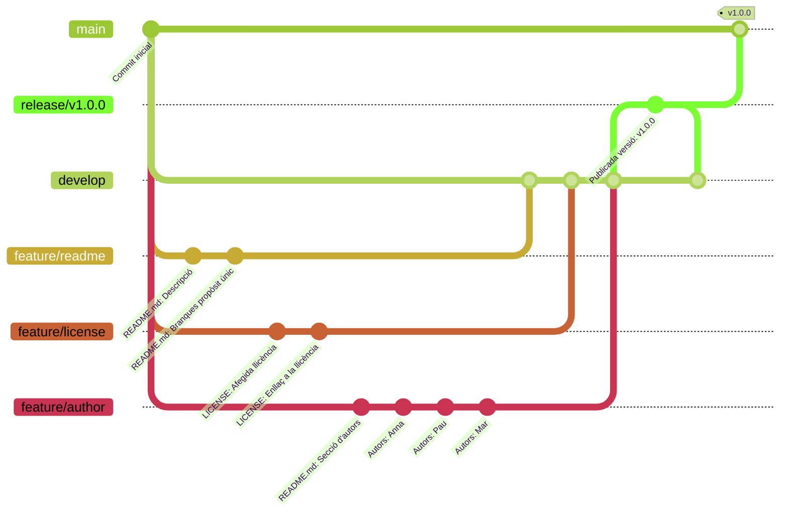

## Exemple: Estratègia de ramificació
Aquests apunts mostren com s'aplica una estratègia de ramificació en un projecte de desenvolupament
de programari. El projecte utilitza la tècnica d'integració [[estrategies#merge-squash-ff-only]].

### Repositori remot
L'exemple simula un projecte de desenvolupament de programari en què tres persones treballen
en diferents funcionalitats de manera independent.

Per no haver de crear un repositori a [:simple-github: GitHub](https://github.com),
es crea un repositori remot en la màquina local.

!!! warning "Segueix la mateixa estructura de directoris per a reproduir l'exemple correctament."

```shellconsole
--8<-- "docs/files/estrategies/stdout/remot.txt"
```

1. Aquesta ordre és necessària perquè el repositori es configure com a __bare__ (sense directori de treball)
    i es puga utilitzar com a repositori remot.

### Branca de desenvolupament
El primer pas per a establir el flux de treball és crear la branca de desenvolupament `develop`.

```shellconsole
--8<-- "docs/files/estrategies/stdout/development.txt"
```

### Desenvolupament de funcionalitats
En aquest punt, ja es poden desenvolupar les diferents funcionalitats del projecte en branques independents.
Es crea un repositori local per a cada persona, per a simular que cadascuna treballa en el seu dispositiu.

```shellconsole
--8<-- "docs/files/estrategies/stdout/clone.txt"
```

Cada persona comença a treballar en una funcionalitat nova:

- __Anna__: treballa en la funcionalitat `feature/readme`, que consisteix a afegir una descripció
    del projecte al fitxer `README.md`.
- __Pau__: treballa en la funcionalitat `feature/license`, que consisteix a afegir una llicència al projecte.
- __Mar__: treballa en la funcionalitat `feature/author`, que consisteix a afegir el nom de les persones
    autores del projecte al fitxer `README.md`.

A partir d'aquest moment, cada persona treballa en el seu repositori i en la seua branca de funcionalitat,
de manera independent i paral·lela.

!!! important "Cada persona ha de treballar en una única branca per funcionalitat per a evitar conflictes i facilitar la integració posterior."
    Si cal compartir una branca, segurament és perquè la tasca no està ben definida
    i es pot dividir en diverses tasques més xicotetes.

#### Branca `feature/readme`
Anna comença a treballar en la funcionalitat `feature/readme` en el seu repositori local.

!!! note "En cada repositori local es configuren el nom i el correu electrònic per a simular que cada persona treballa en el seu dispositiu. A més, el nom es mostra en el _prompt_."


```shellconsole
--8<-- "docs/files/estrategies/stdout/feature_readme.txt"
```

Els passos que ha seguit Anna són:

1. Crear la branca `feature/readme` a partir de `develop`.
2. Fer els canvis pertinents.
3. Publicar la branca `feature/readme` en el repositori remot.

#### Branca `feature/license`
Pau comença a treballar en la funcionalitat `feature/license` en el seu repositori local.

```shellconsole
--8<-- "docs/files/estrategies/stdout/feature_license.txt"
```

Els passos que ha seguit Pau són:

1. Crear la branca `feature/license` a partir de `develop`.
2. Fer els canvis pertinents.
3. Publicar la branca `feature/license` en el repositori remot.


#### Branca `feature/author`
Mar comença a treballar en la funcionalitat `feature/author` en el seu repositori local.

```shellconsole
--8<-- "docs/files/estrategies/stdout/feature_author.txt"
```

Els passos que ha seguit Mar són:

1. Crear la branca `feature/author` a partir de `develop`.
2. Fer els canvis pertinents.
3. Publicar la branca `feature/author` en el repositori remot.


### Integració de les funcionalitats
En aquest punt, les tres funcionalitats s'han desenvolupat de manera independent
i encara no s'han integrat en la branca de desenvolupament `develop`.

```shellconsole
--8<-- "docs/files/estrategies/stdout/branques.txt"
```

??? prep "Preparació del repositori"
    Pots crear un repositori amb l'estat anterior executant l'_script_ següent:

    ```bash {title="Script de Bash amb el desenvolupament de les funcionalitats" data-fold="10"}
    --8<-- "docs/files/estrategies/stdout/estrategies_development.sh"
    ```

    1. Aquesta ordre és necessària perquè el repositori es configure com a __bare__ (sense directori de treball)
        i es puga utilitzar com a repositori remot.


A continuació, s'integren les funcionalitats amb la tècnica __`merge --no-ff` + `merge --squash --ff-only`__,
seguint el procés indicat en [[estrategies#integracio]].


#### Integració de `feature/readme`
Anna ja ha acabat la funcionalitat `feature/readme` i vol integrar-la en la branca `develop`.
Els passos que ha de seguir són:

1. Sincronitzar l'estat del repositori local amb el remot amb `git fetch`.

    ```shellconsole
    --8<-- "docs/files/estrategies/stdout/feature_readme_fetch.txt"
    ```

1. Actualitzar la branca `develop` amb els canvis del remot.

    En aquest cas, ja està actualitzada.

    ```shellconsole
    --8<-- "docs/files/estrategies/stdout/feature_readme_pull.txt"
    ```

1. Actualitzar la branca `feature/readme` amb els canvis de `develop`.

    En aquest cas, ja està actualitzada.

    ```shellconsole
    --8<-- "docs/files/estrategies/stdout/feature_readme_merge.txt"
    ```

    1. L'opció `--no-edit` evita obrir l'editor de text i manté el missatge del _commit_ per defecte.

1. Fusionar la branca `feature/readme` en `develop`.

    ```shellconsole
    --8<-- "docs/files/estrategies/stdout/feature_readme_merge_squash.txt"
    ```

1. Publicar els canvis de la branca `develop` en el repositori remot.

    ```shellconsole
    --8<-- "docs/files/estrategies/stdout/feature_readme_push.txt"
    ```

1. Eliminar la branca `feature/readme` del repositori local i del remot.

    ```shellconsole
    --8<-- "docs/files/estrategies/stdout/feature_readme_delete.txt"
    ```


En aquest punt, la funcionalitat desenvolupada per Anna ja s'ha integrat en la branca de desenvolupament `develop`,
i Anna pot continuar treballant en altres funcionalitats.

#### Integració de `feature/license`
Pau ja ha acabat la funcionalitat `feature/license` i vol integrar-la en la branca `develop`.
Els passos que ha de seguir són:

1. Sincronitzar l'estat del repositori local amb el remot amb `git fetch`.

    ```shellconsole
    --8<-- "docs/files/estrategies/stdout/feature_license_fetch.txt"
    ```

1. Actualitzar la branca `develop` amb els canvis del remot.

    ```shellconsole
    --8<-- "docs/files/estrategies/stdout/feature_license_pull.txt"
    ```

1. Actualitzar la branca `feature/license` amb els canvis de `develop`.

    ```shellconsole
    --8<-- "docs/files/estrategies/stdout/feature_license_merge.txt"
    ```

    1. L'opció `--no-edit` evita obrir l'editor de text i manté el missatge del _commit_ per defecte.

1. Fusionar la branca `feature/license` en `develop`.

    ```shellconsole
    --8<-- "docs/files/estrategies/stdout/feature_license_merge_squash.txt"
    ```

1. Publicar els canvis de la branca `develop` en el repositori remot.

    ```shellconsole
    --8<-- "docs/files/estrategies/stdout/feature_license_push.txt"
    ```

1. Eliminar la branca `feature/license` del repositori local i del remot.

    ```shellconsole
    --8<-- "docs/files/estrategies/stdout/feature_license_delete.txt"
    ```

#### Integració de `feature/author`
Mar ja ha acabat la funcionalitat `feature/author` i vol integrar-la en la branca `develop`.
Els passos que ha de seguir són:

1. Sincronitzar l'estat del repositori local amb el remot amb `git fetch`.

    ```shellconsole
    --8<-- "docs/files/estrategies/stdout/feature_author_fetch.txt"
    ```

1. Actualitzar la branca `develop` amb els canvis del remot.

    ```shellconsole
    --8<-- "docs/files/estrategies/stdout/feature_author_pull.txt"
    ```

1. Actualitzar la branca `feature/author` amb els canvis de `develop`.

    !!! info "En aquest cas, han sorgit conflictes que s'han hagut de resoldre manualment."

    ```shellconsole
    --8<-- "docs/files/estrategies/stdout/feature_author_merge.txt"
    ```

    1. L'opció `--no-edit` evita obrir l'editor de text i manté el missatge del _commit_ per defecte.
    2. S'han esborrat les marques de conflicte manualment.
    3. L'opció `--no-edit` evita obrir l'editor de text i manté el missatge del _commit_ per defecte.

1. Fusionar la branca `feature/author` en `develop`.

    ```shellconsole
    --8<-- "docs/files/estrategies/stdout/feature_author_merge_squash.txt"
    ```

1. Publicar els canvis de la branca `develop` en el repositori remot.

    ```shellconsole
    --8<-- "docs/files/estrategies/stdout/feature_author_push.txt"
    ```

1. Eliminar la branca `feature/author` del repositori local i del remot.

    ```shellconsole
    --8<-- "docs/files/estrategies/stdout/feature_author_delete.txt"
    ```

### Llançament de la versió 1.0.0
Anna s'encarrega de preparar el llançament de la versió 1.0.0.

Els passos que ha de seguir són:

1. Actualitzar la branca `develop` amb els canvis del remot.

    ```shellconsole
    --8<-- "docs/files/estrategies/stdout/release_pull.txt"
    ```

1. Crear la branca de llançament `release/v1.0.0` a partir de la branca `develop`.
    
    ```shellconsole
    --8<-- "docs/files/estrategies/stdout/release_create.txt"
    ```

1. Fer les tasques necessàries per a preparar el llançament de la versió 1.0.0.

    ```shellconsole
    --8<-- "docs/files/estrategies/stdout/release.txt"
    ```

1. Integrar aquesta branca en la branca de desenvolupament `develop` i publicar-la.

    ```shellconsole
    --8<-- "docs/files/estrategies/stdout/release_merge_develop.txt"
    ```

1. Integrar aquesta branca en la branca principal `main` i publicar els canvis.

    ```shellconsole
    --8<-- "docs/files/estrategies/stdout/release_merge_main.txt"
    ```

1. Crear i publicar una etiqueta amb la versió 1.0.0.

    ```shellconsole
    --8<-- "docs/files/estrategies/stdout/release_tag.txt"
    ```

1. Eliminar la branca de llançament.

    ```shellconsole
    --8<-- "docs/files/estrategies/stdout/release_delete.txt"
    ```

### Estat final
L'estat final del repositori depén de la tècnica d'integració utilitzada.
A continuació, es mostra el resultat de cadascuna.

#### [`merge --no-ff` + `merge --squash --ff-only`][merge-squash]
```shellconsole
--8<-- "docs/files/estrategies/stdout/squash_final.txt"
```

#### [`merge --no-ff`][merge-no-ff] (_Gitflow_)
```shellconsole
--8<-- "docs/files/estrategies/stdout/merge_no_ff_final.txt"
```


#### [`rebase` + `merge --ff-only`][rebase-merge-ff-only]
```shellconsole
--8<-- "docs/files/estrategies/stdout/rebase_final.txt"
```

#### [`rebase` + `merge --no-ff`][rebase-merge-no-ff]
```shellconsole
--8<-- "docs/files/estrategies/stdout/rebase_merge_no_ff_final.txt"
```

[merge-squash]: estrategies.md#merge-squash-ff-only
[merge-no-ff]: estrategies.md#merge-no-ff
[rebase-merge-ff-only]: estrategies.md#rebase-merge-ff-only
[rebase-merge-no-ff]: estrategies.md#rebase-merge-no-ff
