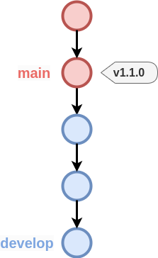
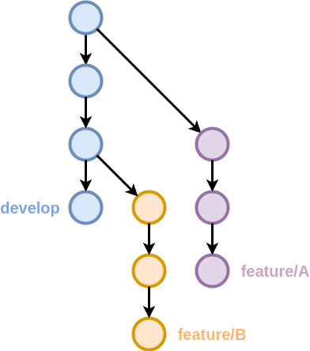
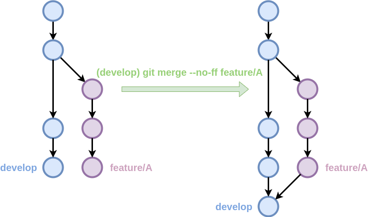
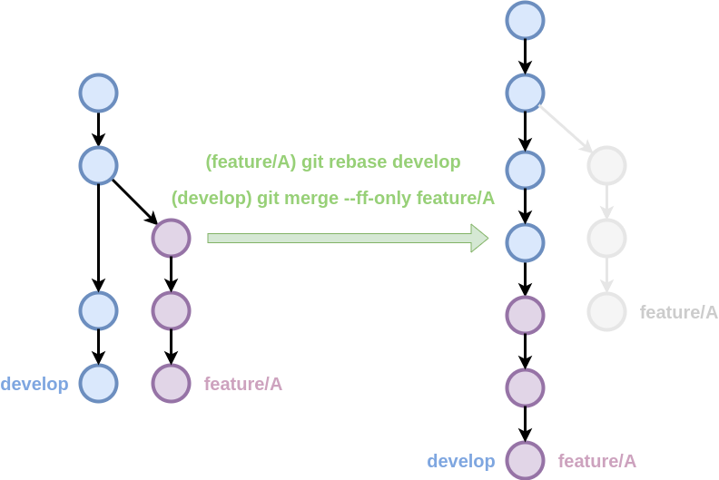
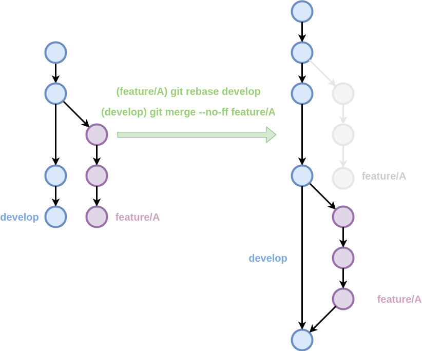
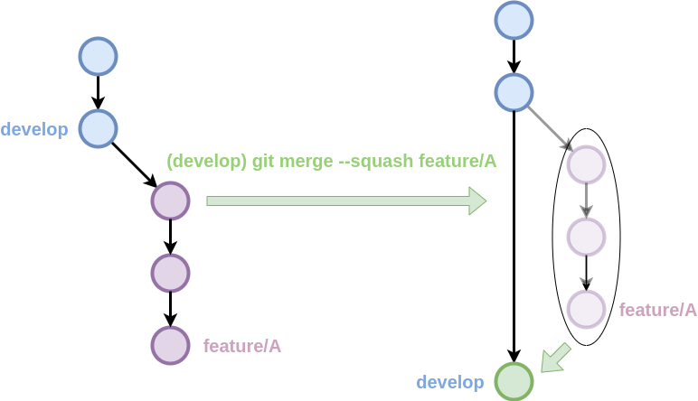
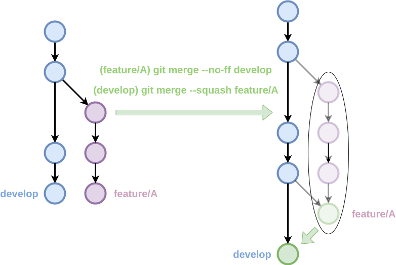
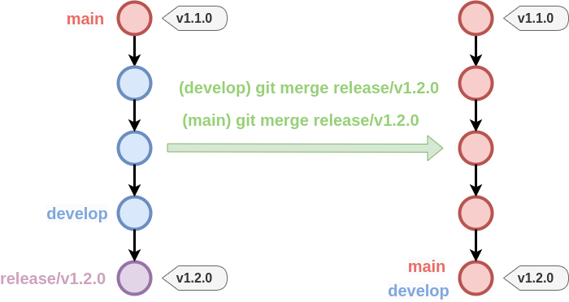
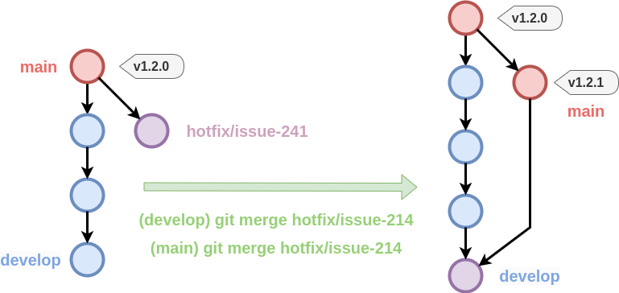






# Estratègies de ramificació

#### Introducció a Git i GitHub Actions

---

## Objectius

- Proporcionar un flux de treball clar i coherent.
- Facilitar la col·laboració entre membres de l'equip.
- Facilitar la revisió i integració de canvis.

---

## Branques amb propòsit

- Branca principal: `main`
- Branca de desenvolupament: `develop`
- Branques de funcionalitat: `feature/...`, `fix/...`
- Branques de llançament: `release/...`
- Branques de correcció: `hotfix/...`

---

## Branca principal i desenvolupament

{ .r-stretch }

---

## Branques de funcionalitat

{ .r-stretch }

---

## `merge --no-ff`

{ .r-stretch }

---

## `rebase + merge --ff-only`

{ .r-stretch }

---

## `rebase + merge --no-ff`

{ .r-stretch }

---

<!-- .slide: data-transition="fade-out" -->
## `merge --squash`

{ .r-stretch }

--

<!-- .slide: data-transition="fade" -->
## `merge --no-ff + merge --squash`

{ .r-stretch }

---

## Branques de llançament

{ .r-stretch }

---

## Branques de correcció

{ .r-stretch }
