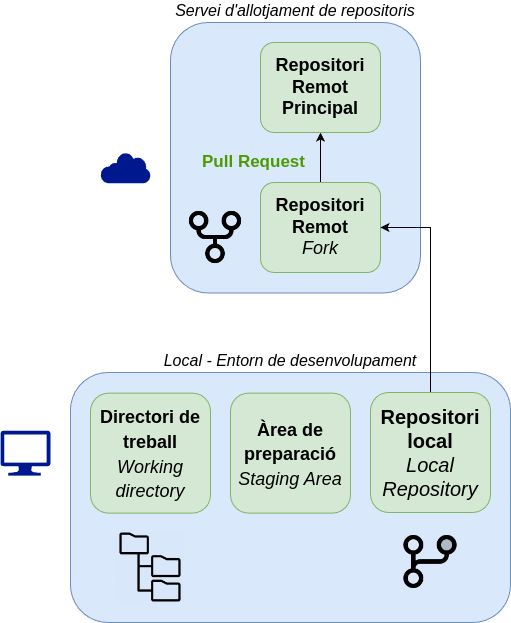
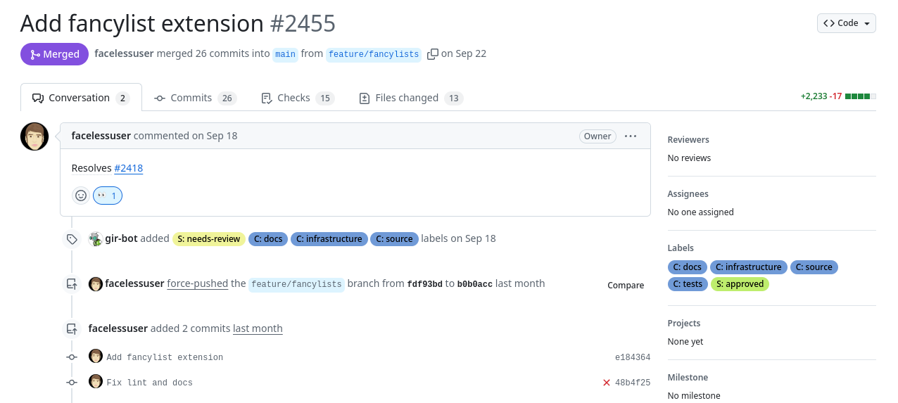

*[PR]: Pull Request

## Forks i Pull Requests
Dins de les eines de col·laboració que ofereixen els serveis d'allotjament de repositoris en línia
com :simple-github: GitHub o :simple-gitlab: GitLab, hi ha dues funcionalitats clau:

- __:material-source-fork: Forks__: permeten copiar un repositori d'un altre usuari o organització com a propi.

    En aquesta còpia, l'usuari pot realitzar canvis, afegir funcionalitats o corregir errors
    sense afectar el repositori original.

    El _fork_ queda enllaçat amb el repositori original, de manera que es pot mantindre sincronitzat
    si el repositori original es modifica.

- __:material-source-pull: Pull Requests__: permeten sol·licitar la incorporació de canvis d'un repositori a un altre.

    Si un usuari ha realitzat canvis en un _fork_ i vol que aquests canvis es incorporin
    al repositori original, pot enviar una sol·licitud de __pull request__. Aquesta sol·licitud
    serà revisada pels propietaris del repositori original, que podran acceptar-la o rebutjar-la.

Aquestes dues funcionalitats són essencials per a la col·laboració en projectes
de desenvolupament de programari de manera distribuïda i col·laborativa, sobretot
en projectes de __:material-open-source-initiative: codi obert__.

## :material-source-fork: Forks
Una [__bifurcació o *fork*__](https://docs.github.com/es/pull-requests/collaborating-with-pull-requests/working-with-forks/fork-a-repo){:target="_blank"}
és una còpia d'un repositori que pertany a un usuari o organització
com a propi.

En el teu _fork_ pots realitzar qualsevol canvi com:

- Corregir errors.
- Afegir funcionalitats.
- Millorar la documentació.
- Adaptar el codi a les teves necessitats.

Un _fork_ sempre està enllaçat amb el repositori original,
de manera que es si es realitzen canvis en el repositori original,
pots decidir incorporar-lo al teu _fork_.

/// shadow-figure-caption
    attrs: { class: "no-shadow" }
Estructura de treball amb Forks i Pull Requests
///

??? example "Exemple de bifurcació de :simple-materialformkdocs: Material for MkDocs"

    
    /// shadow-figure-caption
    [Repositori :simple-materialformkdocs: Material for MkDocs](https://github.com/squidfunk/mkdocs-material){:target="_blank"} principal
    ///

    Per a poder realitzar contribucions,
    s'ha creat un _fork_ del repositori original.

    
    /// shadow-figure-caption
    [Repositori :simple-materialformkdocs: Material for MkDocs](https://github.com/joapuiib/mkdocs-material){:target="_blank"} bifurcat
    ///

### Creació d'un Fork
Per crear un _fork_ d'un repositori, cal accedir a la pàgina del repositori
i fer clic al botó __:material-source-fork: Fork__ que apareix a la part superior dreta.

??? example "Creació d'un fork de :simple-materialformkdocs: Material for MkDocs"
    Vegem el menú de creació d'un _fork_ en el repositori :simple-materialformkdocs: Material for MkDocs.

    
    /// shadow-figure-caption
    Creació d'un fork en el repositori :simple-materialformkdocs: Material for MkDocs
    ///

## :material-source-pull: Pull Requests
Una [__Sol·licitud de Incorporació o *Pull Request (PR)*__](https://docs.github.com/es/pull-requests/collaborating-with-pull-requests){:target="_blank"}
és una sol·licitud per a incorporar canvis a un repositori.

Els PR poden ser utilitzats per a:

- Incorporar canvis d'un _fork_ a un repositori original.
- Incorporar canvis d'una branca a una altra branca.

Aquesta funcionalitat es essencial per a la col·laboració en projectes, especialment els de :material-open-source-initiative: codi obert.
A més, aquesta funcionalitat pot ser implementada dins d'una __[[estrategies|estratègia de ramificació]]{:target="_blank"}__.

A un PR es pot afegir informació com:

- Títol i descripció dels canvis.
- Comentaris per als revisors.
- Referències a tasques o [[projectes#incidencies]]{:target="_blank"}.

A més, es pot consultar:

- Els canvis realitzats.
- Els fitxers modificats.
- Les [[actions|comprovacions automàtiques]]{:target="_blank"} realitzades.

Les PR poden estar en quatre estats diferents:

- __:octicons-git-pull-request-draft-24: Esborrany o *Draft*__: En procés de creació.
- __:octicons-git-pull-request-24: Obert__: En procés de revisió i llest per a ser fusionat.
- __:material-source-merge: Fusionat__: acceptat i incorporat al repositori.
- __:octicons-git-pull-request-closed-24: Tancat__: rebutjat o tancat sense incorporar.

??? example "Exemple de Pull Request a :simple-materialformkdocs: Material for MkDocs"
    En el repositori :simple-materialformkdocs: Material for MkDocs
    existeixen múltiples PR on s'han realitzat canvis per a millorar el tema
    o actualitzar la documentació.

    
    /// shadow-figure-caption
    Exemple de [Pull Request en el repositori :simple-materialformkdocs: Material for MkDocs](https://github.com/squidfunk/mkdocs-material/pulls){:target="_blank"}
    ///

### Creació d'un Pull Request
Per crear un PR, cal accedir al teu _fork_ o branca i fer clic al botó __:material-source-pull: Pull Request__.

En el procés de creació d'un PR, es mostrarà una pantalla on es compararan els canvis realitzats
amb la branca de destí i es podrà afegir informació addicional com el títol i la descripció.

??? example "Creació d'un Pull Request"
    A la branca `feature/time-range` del meu _fork_ podem crear un PR per a incorporar els canvis al repositori original.

    
    /// shadow-figure-caption
    Creació d'un Pull Request
    ///

    En la pantalla de creació d'un PR es poden veure els canvis realitzats en la branca `feature/time-range`
    respecte a la branca de destí `verion3`.

    
    /// shadow-figure-caption
    Comparació de canvis en un Pull Request
    ///

Una vegada creat la PR, es pot sol·licitar la revisió dels canvis a altres usuaris
i realitzar els canvis necessaris fins a la seva acceptació.

### Incorporació de la Pull Request
Quan un PR és acceptat, els canvis es fusionen amb la branca de destí i es tanca la PR.

La fusió del PR pot ser de diferents tipus:

- __Crear un _commit_ de fusió__: es crea un nou _commit_ que incorpora els canvis de la PR, com en una [[branques#fusio-de-branques-divergents]]{:target="_blank"}.
- __Fusió en un sol _commit_ (`squash`)__: es fusionen tots els canvis de la PR en un sol _commit_ mitjançant [[squash]]{:target="_blank"}.
- __Canvi de base (`rebase`)__: es realitza un [[branques#canvi-de-base-rebase]]{:target="_blank"} de la branca de la PR respecte a la branca de destí
    i es fusiona amb una [[branques#fusio-directa]]{:target="_blank"}.

{: style="max-height: 300px;"}
/// shadow-figure-caption
Tipus de fusió d'una Pull Request
///

### Configuració de les Pull Requests
El repositori pot ser configurat per habilitar els diferents tipus de fusió,
entre altres configuracions a l'apartat __:octicons-gear-16: Settings__

/// shadow-figure-caption
Configuració de les opcions de les Pull Requests
///

## Flux de treball
Amb aquestes dues funcionalitats, es pot establir un flux de treball per a la col·laboració
en projectes de desenvolupament de programari.

Aquest flux de treball pot ser el següent:

1. Realitzar un _fork_ del repositori original.
2. Clonar el _fork_ en el teu entorn de desenvolupament.
3. Crear una branca per a realitzar els canvis.
4. Realitzar els canvis en la branca.
5. Publicar la branca en el _fork_.
6. Crear un PR per a incorporar els canvis al repositori original.
7. Revisar i debatre els canvis amb els revisors.
8. Incorporar els canvis al repositori original.
9. Actualitzar el _fork_ amb els canvis del repositori original.

## Protecció de branques
Per a evitar canvis no desitjats en les branques principals
i evitar problemes deguts a una mala aplicació de les [[estrategies]],
les branques importants `main` i `develop` poden ser protegides
mitjançant [__conjunts de regles (_Rulesets_)__](https://docs.github.com/es/github/administering-a-repository/defining-the-mergeability-of-pull-requests){:target="_blank"}.

Per configurar les regles de protecció de branques, cal accedir a la configuració del repositori __:octicons-gear-16: Settings__
i buscar l'apartat __:material-book-arrow-up-outline: Rules__.

/// shadow-figure-caption
Protecció de branques
///

Aquestes regles permeten definir les condicions per modificar la branca especificada,
com ara:

- Protegir-les contra creació, modificació o eliminació.
- Obligar a mantindre una història lineal.
- No permetre publicacions forçades (`push --force`).
- Requerir que les [[actions|comprovacions automàtiques]]{:target="_blank"} s'hagen realitzat correctament.
- Requerir que la fusió es realitze mitjançant un PR.
    
    En aquest cas, es poden configurar altres opcions com:

    - Requerir revisió d'un nombre mínim de revisors.
    - Requerir una resolució dels conflictes abans de la fusió.
