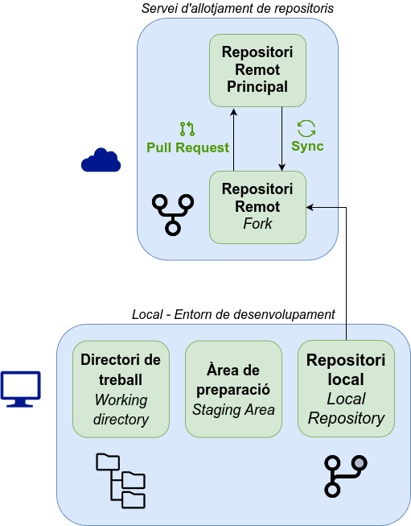

*[PR]: Pull Request

## Forks i Pull Requests
Dins de les eines de col·laboració que ofereixen els serveis d'allotjament de repositoris en línia
com :simple-github: GitHub o :simple-gitlab: GitLab, hi ha dues funcionalitats clau:

- __:material-source-fork: Forks__: permeten copiar un repositori d'un altre usuari o organització com a propi.

    En aquesta còpia, l'usuari pot realitzar canvis, afegir funcionalitats o corregir errors
    sense afectar el repositori original.

    El _fork_ queda enllaçat amb el repositori original, de manera que es pot mantindre sincronitzat
    si el repositori original es modifica.

- __:material-source-pull: Pull Requests__: permeten sol·licitar la incorporació de canvis d'un repositori a un altre.

    Si un usuari ha realitzat canvis en un _fork_ i vol que aquests canvis es incorporin
    al repositori original, pot enviar una sol·licitud de __pull request__. Aquesta sol·licitud
    serà revisada pels propietaris del repositori original, que podran acceptar-la o rebutjar-la.

Aquestes dues funcionalitats són essencials per a la col·laboració en projectes
de desenvolupament de programari de manera distribuïda i col·laborativa, sobretot
en projectes de __:material-open-source-initiative: codi obert__.

## :material-source-fork: Forks
Una [__bifurcació o *fork*__](https://docs.github.com/es/pull-requests/collaborating-with-pull-requests/working-with-forks/fork-a-repo){:target="_blank"}
és una còpia d'un repositori que pertany a un usuari o organització
com a propi.

En el teu _fork_ pots realitzar qualsevol canvi com:

- Corregir errors.
- Afegir funcionalitats.
- Millorar la documentació.
- Adaptar el codi a les teves necessitats.

Un _fork_ sempre està enllaçat amb el repositori original,
de manera que es si es realitzen canvis en el repositori original,
pots decidir incorporar-lo al teu _fork_.

!!! example "Exemple de fork"
    El repositori `pymdownx` és una col·lecció d'extensions per a Python Markdown,
    que ve inclosa en aquest lloc web.

    {:target="_blank"}
    /// figure-caption
    Repositori `pymdownx` original
    ///

    Per a poder realitzar canvis en aquesta col·lecció d'extensions,
    s'ha realitzat un _fork_ del repositori original.

    {:target="_blank"}
    /// figure-caption
    Repositori `pymdownx` bifurcat
    ///

Per realitzar un _fork_ d'un repositori, cal accedir a la pàgina del repositori
i fer clic al botó __:material-source-fork: Fork__ que apareix a la part superior dreta.

!!! example "Creació d'un fork"
    Vegem el menú de creació d'un _fork_ en el repositori `MkDocs`.

    
    /// figure-caption
    Creació d'un fork en el repositori `MkDocs`
    ///

## :material-source-pull: Pull Requests
Una [__Sol·licitud de Incorporació o *Pull Request (PR)*__](https://docs.github.com/es/pull-requests/collaborating-with-pull-requests){:target="_blank"}
és una sol·licitud per a incorporar canvis a un repositori.

Els PR poden ser utilitzats per a:

- Incorporar canvis d'un _fork_ a un repositori original.
- Incorporar canvis d'una branca a una altra branca.

Aquesta funcionalitat es essencial per a la col·laboració en projectes, especialment els de :material-open-source-initiative: codi obert.
A més, aquesta funcionalitat pot ser implementada dins d'una __[[estrategies|estratègia de ramificació]]{:target="_blank"}__.

A un PR es pot afegir informació com:

- Títol i descripció dels canvis.
- Comentaris per als revisors.
- Referències a tasques o [[projectes#incidencies]]{:target="_blank"}.

A més, es pot consultar:

- Els canvis realitzats.
- Els fitxers modificats.
- Les [[actions|comprovacions automàtiques]]{:target="_blank"} realitzades.

!!! example "Exemple de Pull Request"
    En el repositori `pymdownx` s'ha creat i fusionat un PR per a afegir una nova extensió.

    {:target="_blank"}
    /// figure-caption
    Pull Request per a afegir una nova extensió a `pymdownx`
    ///

Per crear un PR, cal accedir al teu _fork_ o branca i fer clic al botó __:material-source-pull: Pull Request__.

En el procés de creació d'un PR, es mostrarà una pantalla on es compararan els canvis realitzats
amb la branca de destí i es podrà afegir informació addicional com el títol i la descripció.

!!! example "Creació d'un Pull Request"
    A la branca `feature/time-range` del meu _fork_ podem crear un PR per a incorporar els canvis al repositori original.

    
    /// figure-caption
    Creació d'un Pull Request
    ///

    En la pantalla de creació d'un PR es poden veure els canvis realitzats en la branca `feature/time-range`
    respecte a la branca de destí `verion3`.

    
    /// figure-caption
    Comparació de canvis en un Pull Request
    ///

## Flux de treball
Amb aquestes dues funcionalitats, es pot establir un flux de treball per a la col·laboració
en projectes de desenvolupament de programari.

/// figure-caption
Estructura de treball amb Forks i Pull Requests
///

Aquest flux de treball pot ser el següent:

1. Realitzar un _fork_ del repositori original.
2. Clonar el _fork_ en el teu entorn de desenvolupament.
3. Crear una branca per a realitzar els canvis.
4. Realitzar els canvis en la branca.
5. Publicar la branca en el _fork_.
6. Crear un PR per a incorporar els canvis al repositori original.
7. Revisar i debatre els canvis amb els revisors.
8. Incorporar els canvis al repositori original.
9. Actualitzar el _fork_ amb els canvis del repositori original.
