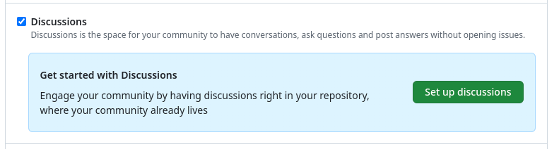
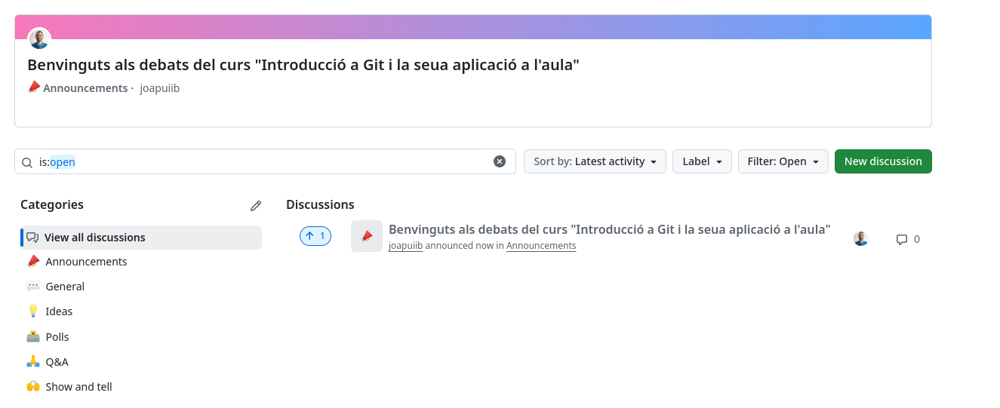
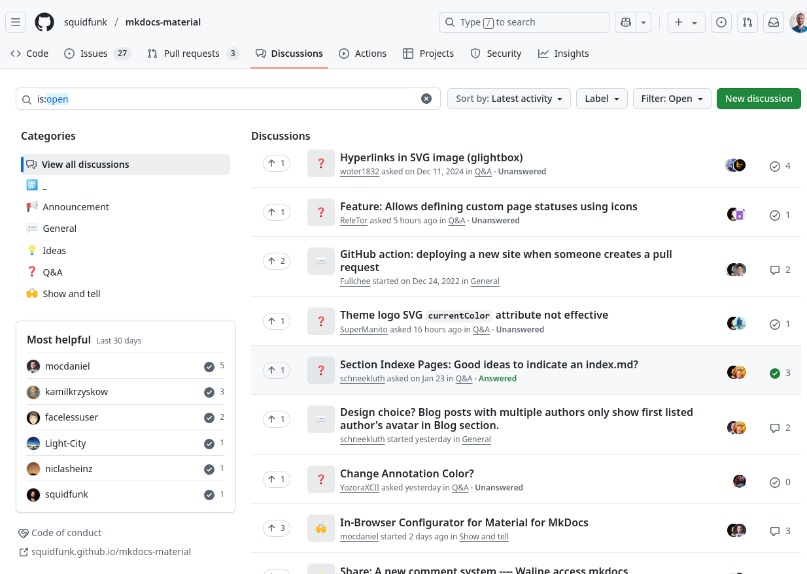
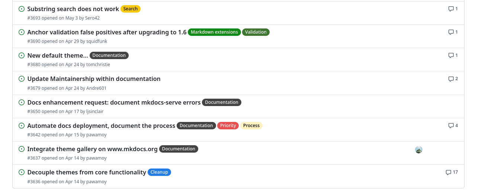
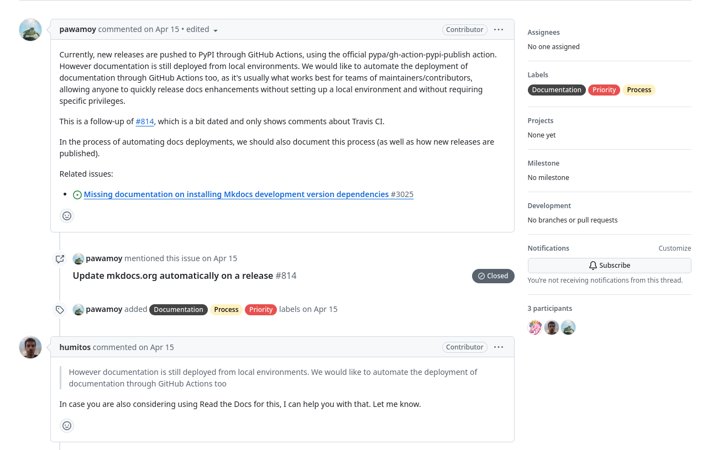
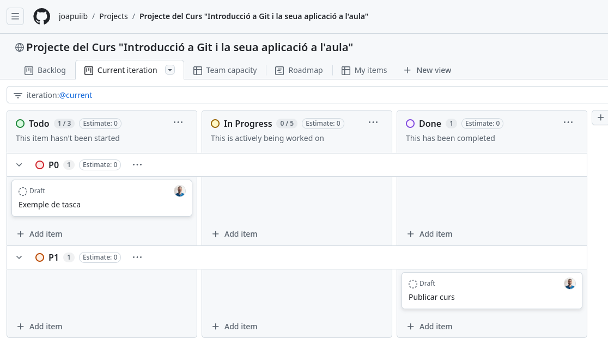
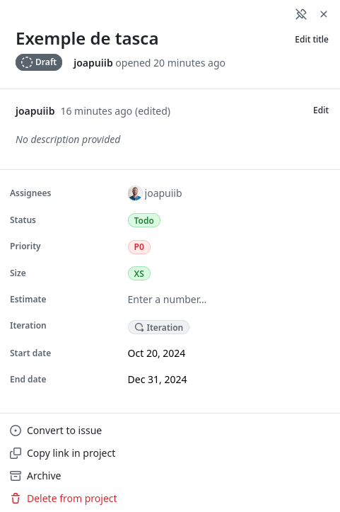
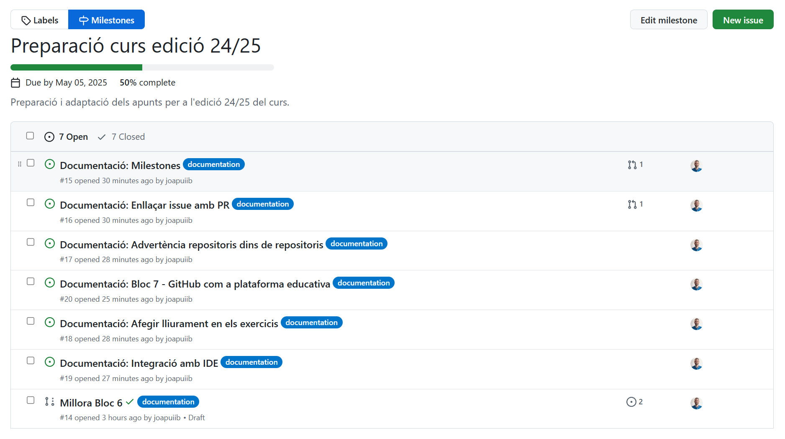
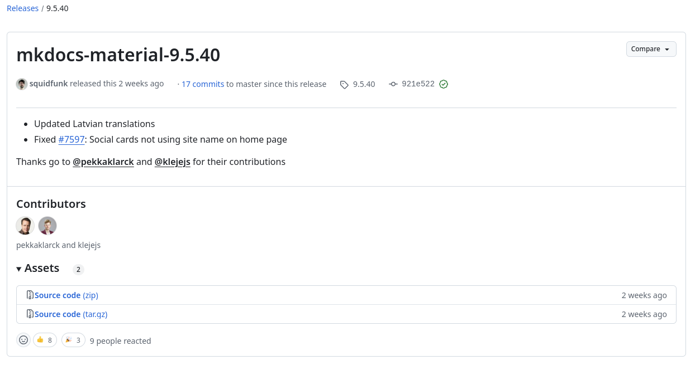
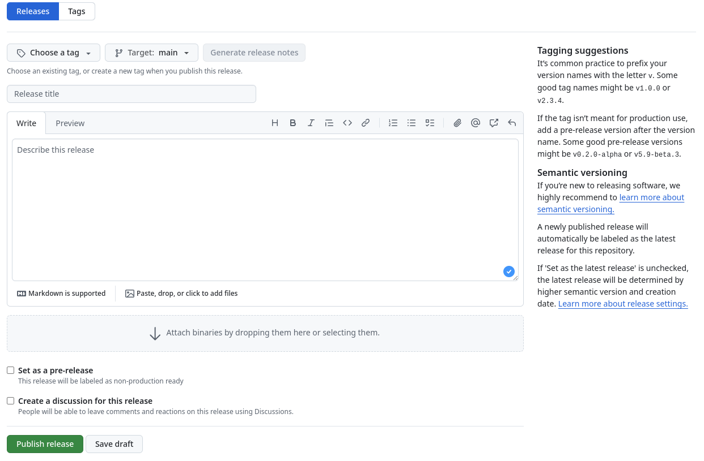

## Ferramentes de gestió de projectes a GitHub
Els serveis d'allotjament de repositoris en línia, com [:simple-github: GitHub][github],
[:simple-gitlab: GitLab][gitlab] o [:simple-codeberg: Codeberg][codeberg], ofereixen una sèrie de ferramentes
i funcionalitats que permeten gestionar de manera fàcil i eficaç projectes col·laboratius
de desenvolupament de programari.

[github]: https://github.com/
[gitlab]: https://about.gitlab.com/
[codeberg]: https://codeberg.org/

Aquests apunts se centren en la part de gestió de projectes: crear debats, comunicar incidències
i organitzar tasques.

### :octicons-comment-discussion-16: Debats
Els [__debats__](https://github.com/features/discussions) (_Discussions_) són un espai de comunicació
on les persones que formen part d'un projecte o d'una comunitat poden intercanviar idees i opinions,
fer suggeriments o debatre sobre temes concrets.

Aquesta funcionalitat no està habilitada per defecte. Per activar-la, cal anar al menú de configuració
del repositori, __:octicons-gear-16: Settings__, i habilitar-la.


/// shadow-figure-caption | #figure-habilitar-debats : Configuració dels debats (_Discussions_) en un repositori de GitHub.

??? example "Exemple: Debats en aquest repositori"
    Aquest lloc web està allotjat a :simple-github: GitHub i té habilitada la funcionalitat de debats.
    S'hi pot accedir mitjançant la secció __:octicons-comment-discussion-16: Discussions__ del menú superior
    o en [aquest enllaç](https://github.com/joapuiib/curs-git/discussions).

    
    /// shadow-figure-caption | #figure-exemple-debats : Debats en el [repositori d'aquest curs a :simple-github: GitHub](https://github.com/joapuiib/curs-git/discussions).

??? example "Exemple: Debats a :simple-materialformkdocs: Material for MkDocs"
    [:simple-materialformkdocs: Material for MkDocs][mkdocs-material] és el tema per al generador
    de llocs web estàtics [MkDocs][mkdocs] que s'utilitza per a generar aquest lloc web.

    El codi font d'aquest tema està allotjat en el seu [repositori a :simple-github: GitHub][mkdocs-material],
    on s'han habilitat els debats perquè la comunitat puga intercanviar idees i suggeriments o plantejar dubtes.

    
    /// shadow-figure-caption | #figure-debats-mkdocs : Debats en el [repositori `mkdocs-material` a :simple-github: GitHub][mkdocs-material-discussions].

[mkdocs]: https://www.mkdocs.org/
[mkdocs-material]: https://github.com/squidfunk/mkdocs-material
[mkdocs-material-discussions]: https://github.com/squidfunk/mkdocs-material/discussions

Els debats s'organitzen en categories, que permeten classificar-los per temes i facilitar-ne la cerca.
A més de les categories per defecte, se'n poden afegir de noves o eliminar les existents.
Les categories per defecte són les següents:

- __:mega: Announcements__: anuncis oficials. Només les persones propietàries del repositori
    poden crear debats en aquesta categoria.
- __:speech_balloon: General__: debats generals.
- __:bulb: Ideas__: suggeriments i propostes.
- __:ballot_box: Polls__: enquestes.
- __:pray_tone1: Q&A__: preguntes i respostes.
- __:raised_hands_tone1: Show and Tell__: projectes i treballs relacionats amb el repositori.

### :octicons-issue-opened-16: Incidències
Les [__incidències__](https://guides.github.com/features/issues/) (_Issues_) són una ferramenta
per a crear i fer el seguiment de les incidències relacionades amb un projecte.
A més, permeten que les persones del projecte es comuniquen i col·laboren per a aportar informació
sobre la incidència i debatre'n la resolució.

??? example "Exemple: Incidències a :simple-materialformkdocs: Material for MkDocs"
    [:simple-materialformkdocs: Material for MkDocs][mkdocs-material] també utilitza les incidències
    per a informar de problemes, suggeriments o millores del tema.
    S'hi pot accedir mitjançant la secció [__:octicons-issue-opened-16: Issues__][mkdocs-material-issues]
    del menú superior.

    
    /// shadow-figure-caption | #figure-exemple-issues : Llista d'incidències en el [repositori `mkdocs-material` a :simple-github: GitHub][mkdocs-material-issues].

[mkdocs-material-issues]: https://github.com/squidfunk/mkdocs-material/issues

Les incidències contenen la informació següent:

- __Títol__: descripció breu de la incidència.
- __Descripció__: informació detallada de la incidència. En aquesta secció és important proporcionar
    tota la informació necessària per a entendre la incidència i poder resoldre-la.
    A més, les persones propietàries del repositori poden configurar
    [plantilles](https://docs.github.com/en/communities/using-templates-to-encourage-useful-issues-and-pull-requests/configuring-issue-templates-for-your-repository)
    per a la creació d'incidències, que faciliten la recopilació d'aquesta informació.
- __:fontawesome-solid-circle-user: Assignació__: permet assignar la incidència a una o més persones del projecte.
- __:octicons-tag-24: Etiquetes__: permeten classificar les incidències per a facilitar-ne la gestió.
- __[:octicons-milestone-24: Fites](#fites)__: permeten agrupar les incidències per a complir un objectiu específic.
- __:octicons-link-external-16: Referències__: permeten relacionar la incidència amb altres incidències
    o consultar si altres incidències l'han referenciada.
- __[:material-source-pull: Pull Requests][pr]__: indiquen si la incidència està relacionada amb alguna
    __sol·licitud d'incorporació de canvis__.

[pr]: pull_requests.md

Les incidències es creen amb l'estat __:octicons-issue-opened-16:{ .issue-open } Oberta__,
que es pot canviar a __:octicons-issue-closed-16:{ .issue-closed } Tancada__ una vegada resolta la incidència.


??? example "Exemple: Incidència a :simple-materialformkdocs: Material for MkDocs"
    La imatge següent mostra una incidència en el repositori
    [:simple-materialformkdocs: Material for MkDocs][mkdocs-material],
    on s'informa d'un problema per a deshabilitar la barra de cerca.

    
    /// shadow-figure-caption | #figure-exemple-issue : [Incidència][mkdocs-material-issue] en el repositori `mkdocs-material` a :simple-github: GitHub.

[mkdocs-material-issue]: https://github.com/squidfunk/mkdocs-material/issues/8128

??? example "Exemple: Plantilla per a incidències"
    En aquest repositori s'ha configurat una plantilla per a informar d'una correcció en la documentació.
    Se'n pot vore el funcionament triant la plantilla __Correcció__ en la
    [creació d'una incidència nova][new-issue].

    Les plantilles es defineixen en fitxers :simple-markdown: Markdown, que s'han de guardar
    en la carpeta `.github/ISSUE_TEMPLATE`.

    ```markdown title=".github/ISSUE_TEMPLATE/correccio.md"
    --8<-- ".github/ISSUE_TEMPLATE/correccio.md"
    ```

[new-issue]: https://github.com/joapuiib/curs-git/issues

### :octicons-table-16: GitHub Projects
Els [__projectes de GitHub__](https://docs.github.com/es/issues/planning-and-tracking-with-projects/learning-about-projects/about-projects)
(_GitHub Projects_) són una ferramenta de gestió de tasques que permet organitzar, classificar
i prioritzar les tasques d'un projecte.

??? example "Exemple: Projecte d'exemple"
    He creat un [__:octicons-table-16: projecte d'exemple__][projecte-exemple] dins de l'organització del curs.
    Aquest projecte està buit, però és útil perquè pugues entrar-hi i vore les diferents vistes i opcions
    que ofereix.

    [projecte-exemple]: https://github.com/orgs/cursgit/projects/1

    [](https://github.com/joapuiib/curs-git/projects)
    /// shadow-figure-caption | #figure-exemple-projecte : Exemple de projecte en un repositori de GitHub.

??? example "Exemple: Projecte utilitzat a l'aula"
    La imatge següent mostra l'estat d'un projecte utilitzat a l'aula per a organitzar les tasques
    de l'alumnat en un projecte col·laboratiu de desenvolupament de programari.

    
    /// shadow-figure-caption | #figure-exemple-projecte-aula : Exemple de projecte en un repositori de GitHub utilitzat a l'aula.

Els projectes s'organitzen en diferents pestanyes, cadascuna amb una vista i una organització
diferents de les tasques:

- __Backlog__: tauler Kanban amb les tasques pendents organitzades per columnes.
- __Current iteration__: tasques planificades per a la iteració o _sprint_ actual.
- __Roadmap__: diagrama de Gantt amb les tasques planificades al llarg del temps.
- __Team planning__: vista més detallada de cada tasca, organitzades per estat, prioritat i assignació.
- __My items__: vista semblant a _Team planning_, però que només mostra les tasques assignades a la persona usuària.

Cada tasca es crea com un __:material-dots-circle: esborrany__ (_draft_), que es pot convertir
en una __[:octicons-issue-opened-16: incidència](#incidencies)__ del repositori.
Cada tasca conté la mateixa informació que una incidència, però a més es pot especificar:

- __Persona assignada__: qui s'encarrega de la tasca.
- __Prioritat__: importància de la tasca respecte de la resta.
- __Mida__: magnitud de la tasca.
- __Estimació de temps__: temps previst per a completar la tasca.
- __Data d'inici__: data en què comença la tasca.
- __Data de finalització__: data en què ha d'acabar la tasca.
- __Iteració__: iteració a la qual pertany la tasca.

??? example "Exemple: Tasca"
    La imatge següent mostra una tasca creada com a __:material-dots-circle: esborrany__ (_draft_)
    en un projecte de GitHub.

    
    /// shadow-figure-caption | #figure-exemple-tasca : Exemple de tasca en un projecte de GitHub.


### :octicons-milestone-24: Fites
Les [__fites__][milestones] (_Milestones_) són un mecanisme per a agrupar
[:octicons-issue-opened-16: incidències](#incidencies) i [:material-source-pull: _pull requests_][pr]
dins d'un repositori. S'utilitzen per a __definir objectius específics__ en el desenvolupament del projecte.

[milestones]: https://docs.github.com/es/issues/using-labels-and-milestones-to-track-work/about-milestones

Cada __fita__ conté la informació següent:

- __Títol__: nom de la fita.
- __Descripció__: objectiu de la fita.
- __Data de venciment__: (opcional) data límit per a assolir la fita.
- __Percentatge de progrés__: es calcula a partir de les incidències obertes i tancades.

Les fites són accessibles amb el botó __:octicons-milestone-24: Milestones__, des de la vista
__:octicons-issue-opened-16: Issues__ o __:material-source-pull: Pull Requests__ del repositori.

??? example "Exemple: Fites en aquest repositori"
    En [aquest repositori][curs-git] s'ha creat [una fita][curs-git-milestone] per a agrupar
    les incidències relacionades amb la preparació de la documentació del curs.

    
    /// shadow-figure-caption | #figure-milestones : [Fita en aquest repositori][curs-git-milestone].

[curs-git]: https://github.com/joapuiib/curs-git/
[curs-git-milestone]: https://github.com/joapuiib/curs-git/milestone/1

### :material-tray-arrow-up: Llançaments
Els [__llançaments__](https://docs.github.com/es/github/administering-a-repository/releasing-projects-on-github/about-releases)
(_Releases_) són una funcionalitat de GitHub que permet indicar que s'ha publicat una versió del projecte,
amb informació rellevant sobre els canvis realitzats i les persones que hi han contribuït.

Els llançaments __sempre estan associats__ a una __[[etiquetes|:octicons-tag-16: etiqueta]]__,
que pot existir prèviament o es pot crear en el moment. Encara que són semblants, no s'han de confondre:
els llançaments són elements de GitHub, mentre que les etiquetes són objectes de Git.

??? example "Exemple: Llançaments a :simple-materialformkdocs: Material for MkDocs"
    [:simple-materialformkdocs: Material for MkDocs][mkdocs-material] també utilitza els llançaments
    per a indicar que s'ha publicat una versió nova del tema.
    S'hi pot accedir mitjançant la secció [__Releases__][mkdocs-material-releases]
    del lateral de la pàgina principal del repositori.

    
    /// shadow-figure-caption | #figure-release : Exemple de llançament en el [repositori `mkdocs-material` a :simple-github: GitHub][mkdocs-material-releases].

[mkdocs-material-releases]: https://github.com/squidfunk/mkdocs-material/releases

Des de la secció de llançaments es pot crear un llançament nou, que ha d'incloure la informació següent:

- __Títol__: descripció breu del llançament o número de versió.
- __Descripció__: informació detallada dels canvis realitzats.
- __Etiqueta__: etiqueta associada al llançament.
- __Fitxers binaris__: fitxers binaris associats al llançament.

!!! info "GitHub permet [__generar automàticament les notes de llançament__](https://docs.github.com/en/repositories/releasing-projects-on-github/automatically-generated-release-notes), amb informació sobre les __[:material-source-pull: pull requests][pr]__ i les persones que hi han contribuït."

??? example "Exemple: Creació d'un llançament"
    La imatge següent mostra la creació d'un llançament nou en un repositori de GitHub.

    
    /// shadow-figure-caption | #figure-release-create : Creació d'un llançament en un repositori de GitHub.
