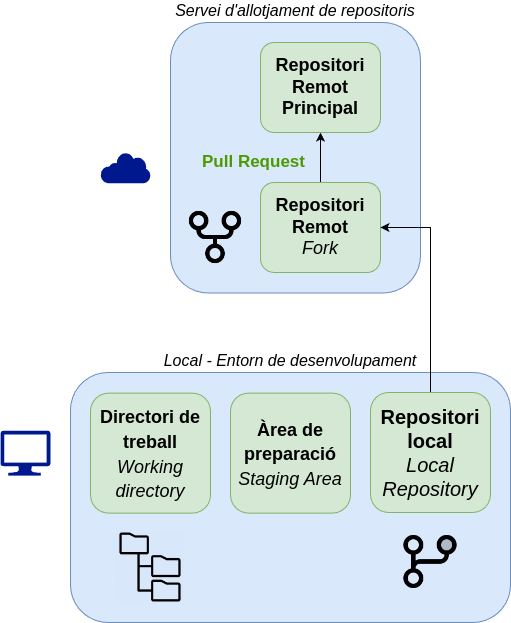
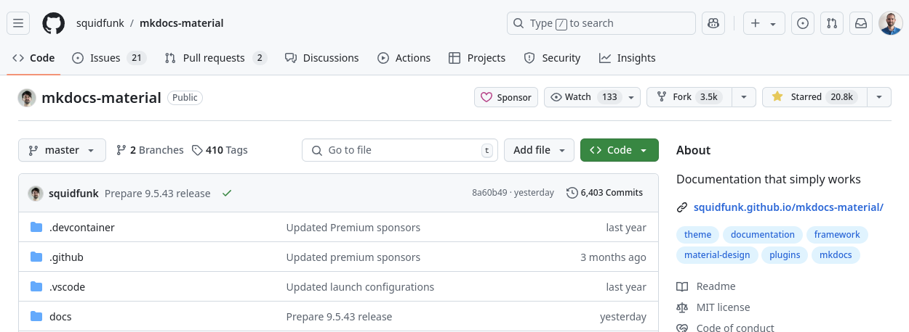
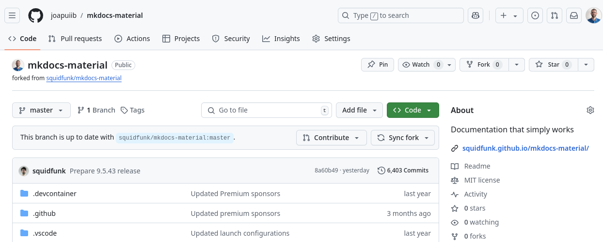
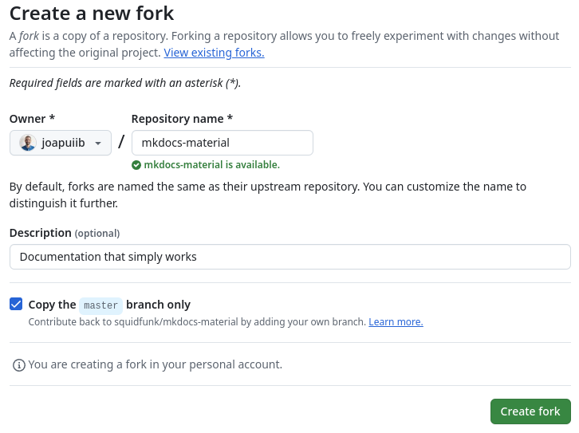
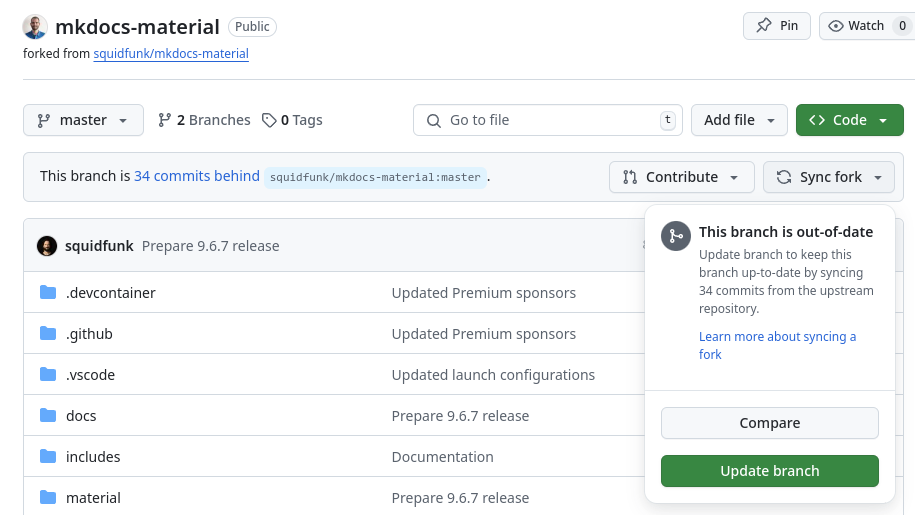

*[PR]: Pull Request

## Forks i Pull Requests
Entre les ferramentes de col·laboració que ofereixen els serveis d'allotjament de repositoris en línia,
com :simple-github: GitHub, :simple-gitlab: GitLab o :simple-codeberg: Codeberg, hi ha dues funcionalitats clau:

- __:material-source-fork: Forks__: permeten copiar com a propi un repositori d'una altra persona
    o organització. En aquesta còpia es poden fer canvis, afegir funcionalitats o corregir errors
    sense afectar el repositori original. El _fork_ queda enllaçat amb el repositori original,
    de manera que es pot mantindre sincronitzat si el repositori original canvia.

- __:material-source-pull: Pull Requests__: permeten sol·licitar la incorporació de canvis d'un repositori
    en un altre. Si una persona ha fet canvis en un _fork_ i vol que s'incorporen al repositori original,
    pot enviar una __pull request__. Les persones propietàries del repositori original la revisaran
    i podran acceptar-la o rebutjar-la.

Aquestes dues funcionalitats són essencials per a col·laborar de manera distribuïda en projectes
de desenvolupament de programari, sobretot en projectes de __:material-open-source-initiative: codi obert__.

## :material-source-fork: Forks
Una [__bifurcació__](https://docs.github.com/es/pull-requests/collaborating-with-pull-requests/working-with-forks/fork-a-repo)
(_fork_) és una còpia d'un repositori que passa a pertànyer a una persona o organització com a propi.
En el teu _fork_ pots fer qualsevol canvi, com ara:

- __Correccions__: corregir errors.
- __Funcionalitats__: afegir funcionalitats noves.
- __Documentació__: millorar la documentació.
- __Adaptacions__: adaptar el codi a les teues necessitats.

Un _fork_ sempre està enllaçat amb el repositori original. Per tant, si el repositori original canvia,
pots decidir incorporar-ne els canvis al teu _fork_.

/// shadow-figure-caption | #figure-fork
    attrs: {class: no-shadow}
Estructura de treball amb _forks_ i _pull requests_.
///

??? example "Exemple: Bifurcació de :simple-materialformkdocs: Material for MkDocs"
    La imatge següent mostra el repositori de [:simple-materialformkdocs: Material for MkDocs][mkdocs-material].

    
    /// shadow-figure-caption | #figure-fork-principal : [Repositori :simple-materialformkdocs: Material for MkDocs][mkdocs-material].

    Per a poder fer-hi contribucions, s'ha creat un [:material-source-fork: __fork__][mkdocs-material-fork]
    del repositori original.

    
    /// shadow-figure-caption | #figure-fork-forked : [Repositori :simple-materialformkdocs: Material for MkDocs bifurcat][mkdocs-material-fork].

[mkdocs-material]: https://github.com/squidfunk/mkdocs-material
[mkdocs-material-fork]: https://github.com/joapuiib/mkdocs-material

### Creació d'un _fork_
Per a crear un _fork_ d'un repositori, cal accedir a la pàgina del repositori i fer clic en el botó
__:material-source-fork: Fork__, que apareix en la part superior dreta.

??? example "Exemple: Creació d'un _fork_ de :simple-materialformkdocs: Material for MkDocs"
    La imatge següent mostra el menú de creació d'un _fork_ del repositori :simple-materialformkdocs: Material for MkDocs.

    
    /// shadow-figure-caption | #figure-fork-create : Creació d'un _fork_ del repositori :simple-materialformkdocs: Material for MkDocs.

### :octicons-sync-24: Sincronització amb el repositori original
Si el repositori original té canvis nous des que es va crear el _fork_, pots incorporar-los al teu _fork_
per a mantindre'l actualitzat amb el botó __:octicons-sync-24: Sync fork__.

??? example "Exemple: Sincronització amb el repositori original"
    El repositori original :simple-materialformkdocs: Material for MkDocs té canvis nous
    (concretament, 34 _commits_ nous), de manera que es pot sincronitzar el _fork_.

    
    /// shadow-figure-caption | #figure-sync : Sincronització d'un _fork_ amb el repositori original :simple-materialformkdocs: Material for MkDocs.

### :octicons-git-pull-request-24: Pull Request
Per a contribuir al repositori original, es pot crear una
[__sol·licitud d'incorporació de canvis__ o __:octicons-git-pull-request-24: Pull Request__][pr],
que es presenta en els apunts següents.

[pr]: pull_requests.md
