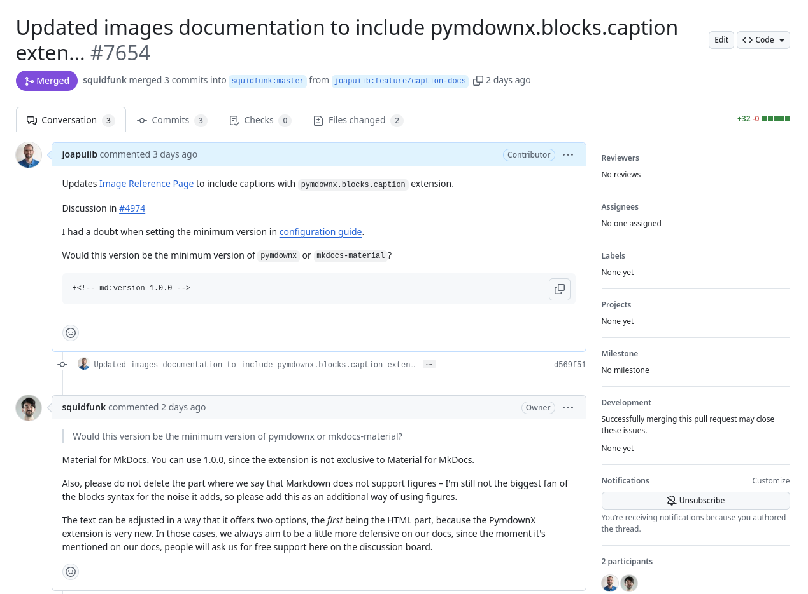
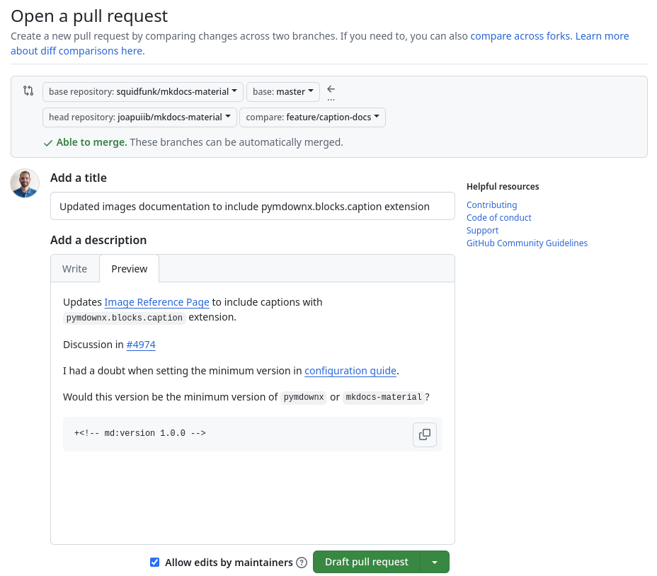
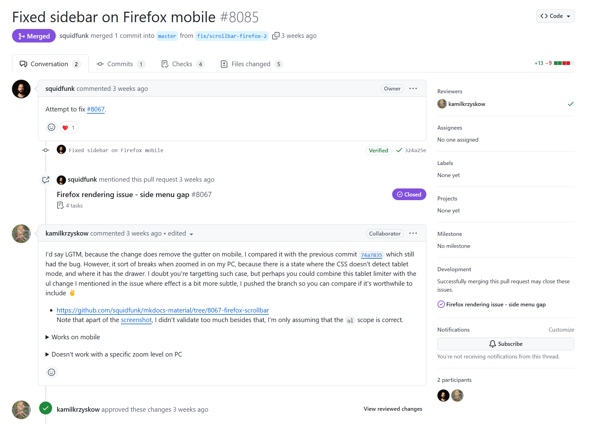
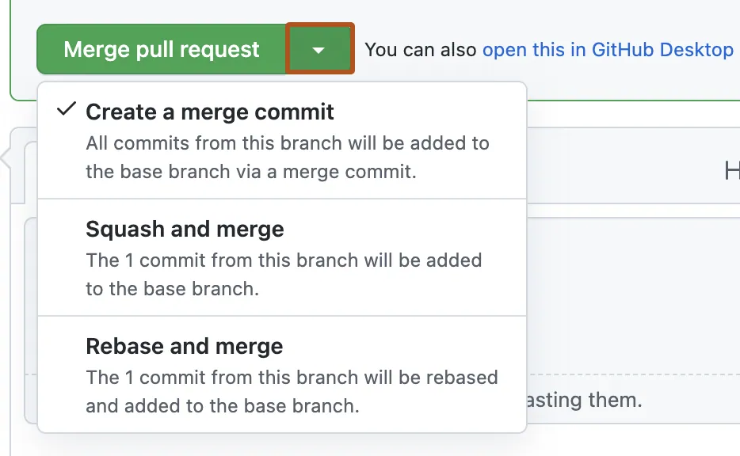
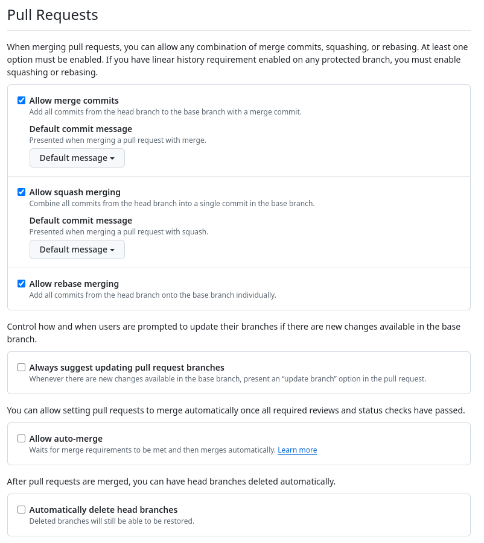
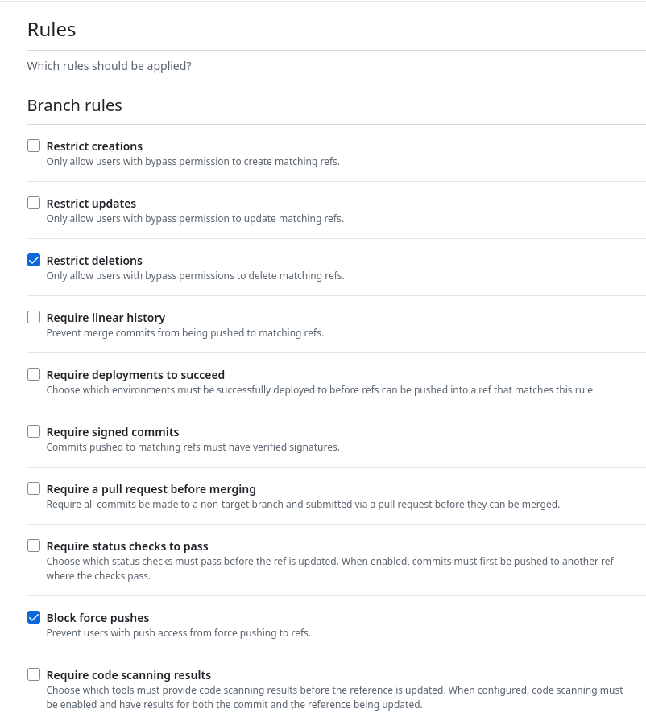

*[PR]: Pull Request

## :material-source-pull: Pull Requests
Una [__sol·licitud d'incorporació de canvis__](https://docs.github.com/es/pull-requests/collaborating-with-pull-requests)
(_Pull Request_ o PR) és una petició per a incorporar canvis en una branca d'un repositori.
Les PR es poden utilitzar per a:

- __Integrar branques__: incorporar els canvis d'una branca en una altra dins del mateix repositori.
- __Integrar bifurcacions__: incorporar els canvis d'una [:material-source-fork: __bifurcació__][fork] (_fork_)
    en el repositori principal.

[fork]: forks.md

Utilitzar PR aporta molts avantatges, com ara:

- __Revisió de canvis__: permet revisar els canvis abans d'integrar-los en el projecte.
- __Debat de canvis__: facilita el debat i la revisió conjunta dels canvis amb altres persones
    de l'equip o col·laboradores.
- __[Automatització de tasques][automatitzacio]__: permet executar tasques automàtiques abans d'incorporar
    els canvis, com ara les proves o la comprovació de la qualitat del codi.
- __[Estratègia de ramificació][estrategies]__: permet incorporar els canvis de manera ordenada i controlada.

[automatitzacio]: [[actions]]
[estrategies]: ../05_estrategies/estrategies.md

Aquesta funcionalitat és essencial per a la col·laboració en projectes, especialment en els de
__:material-open-source-initiative: codi obert__, on les persones que mantenen el projecte poden revisar
els canvis proposats per la comunitat.

??? example "Exemple: Pull Requests a :simple-materialformkdocs: Material for MkDocs"
    En el repositori :simple-materialformkdocs: Material for MkDocs hi ha moltes PR amb canvis
    per a millorar el tema o actualitzar la documentació.

    
    /// shadow-figure-caption | #figure-pull-request : Exemple de [Pull Requests en el repositori :simple-materialformkdocs: Material for MkDocs](https://github.com/squidfunk/mkdocs-material/pulls).

### Creació d'una Pull Request
Per a crear una PR, cal accedir al teu _fork_ o a la teua branca i fer clic en el botó
__:material-source-pull: Pull Request__. En el procés de creació, cal seleccionar els repositoris
i les branques associats a la PR:

- __Base repository__: repositori on s'incorporaran els canvis.
- __Base__: branca de destí on s'incorporaran els canvis.
- __Head repository__: repositori on es troba la branca amb els canvis.
- __Compare__: branca amb els canvis que es volen incorporar.

A més, es pot afegir informació addicional:

- __Títol__: descripció breu dels canvis realitzats.
- __Descripció__: informació addicional sobre els canvis realitzats.


??? example "Exemple: Creació d'una Pull Request"
    Es crea una PR per a incorporar canvis nous a la documentació de
    [:simple-materialformkdocs: Material for MkDocs][mkdocs-material], amb els valors següents:

    - __Base repository__: [`squidfunk/mkdocs-material`][mkdocs-material].
    - __Base__: branca `master`.
    - __Head repository__: el _fork_ [`joapuiib/mkdocs-material`][mkdocs-material-fork].
    - __Compare__: branca `feature/caption-docs`.

    
    /// shadow-figure-caption | #figure-pull-request-compare : Comparació de canvis en una Pull Request.

[mkdocs-material]: https://github.com/squidfunk/mkdocs-material
[mkdocs-material-fork]: https://github.com/joapuiib/mkdocs-material

Una vegada creada la PR, es pot sol·licitar a altres persones que revisen els canvis
i fer les modificacions necessàries fins que s'accepte. Les PR poden estar en quatre estats diferents:

- __:octicons-git-pull-request-draft-24:{ .pr-draft } Esborrany (_Draft_)__: creada, però no finalitzada.
- __:octicons-git-pull-request-24:{ .pr-open } Oberta (_Open_)__: en procés de revisió i a punt per a ser fusionada.
- __:material-source-merge:{ .pr-merged } Fusionada (_Merged_)__: acceptada i incorporada al repositori.
- __:octicons-git-pull-request-closed-24:{ .pr-closed } Tancada (_Closed_)__: rebutjada o tancada sense incorporar-la.


### Enllaçar incidències a una Pull Request
Quan es treballa en un projecte, les PR sovint estan relacionades amb
[:octicons-issue-opened-16: incidències][issues] específiques. GitHub permet enllaçar-les de manera que,
quan s'accepta la PR, les incidències es tanquen automàticament.
A més, això __millora la traçabilitat__ del desenvolupament i __facilita el seguiment dels canvis__
realitzats per a resoldre les incidències.

[issues]: eines_gestio.md#incidencies

Les incidències es poden enllaçar a una PR de dues maneres:

- __Apartat Development__: des de l'apartat __Development__ de la barra lateral de la pàgina.
- __Paraules clau__: escrivint en la descripció una paraula clau seguida del número de la incidència.
    Les paraules clau admeses són `close`, `closes`, `closed`, `fix`, `fixes`, `fixed`,
    `resolve`, `resolves` i `resolved`.

    ```text
    Closes #10
    ```

    > On `#10` és el número de la incidència que es vol enllaçar.

!!! docs "Documentació oficial: [:octicons-link-external-16: Linking a pull request to an issue](https://docs.github.com/en/issues/tracking-your-work-with-issues/using-issues/linking-a-pull-request-to-an-issue) – :simple-github: GitHub"


??? example "Exemple: Incidència enllaçada a una PR"
    La imatge següent mostra una [PR en el repositori :simple-materialformkdocs: Material for MkDocs][mkdocs-material-pr-issue]
    que referencia una incidència per a corregir la barra lateral en el navegador :simple-firefox: Firefox.

    
    /// shadow-figure-caption | #figure-reference-issue : Incidència enllaçada a una Pull Request.

[mkdocs-material-pr-issue]: https://github.com/squidfunk/mkdocs-material/pull/8085


### Incorporació d'una Pull Request
Quan s'accepta una PR, els canvis s'incorporen en la branca de destí i la PR es marca com a fusionada.
La incorporació es pot fer de tres maneres diferents:

- __Crear un _commit_ de fusió__: es crea un _commit_ nou que incorpora els canvis de la PR,
    com en una [[branques#fusio-de-branques-divergents]].
- __Fusió en un sol _commit_ (`squash`)__: es fusionen tots els canvis de la PR en un sol _commit_
    mitjançant [[squash]].
- __Canvi de base (`rebase`)__: es fa un [[branques#canvi-de-base-git-rebase]] de la branca de la PR
    respecte de la branca de destí i es fusiona mitjançant una [[branques#fusio-directa]].

!!! recommend "La fusió en un sol _commit_ (`squash`) és útil per a mantindre una història de _commits_ més clara, ordenada i concisa."
    Si cal consultar el procés de revisió de la branca, sempre es pot accedir a la PR,
    on es troben tots els canvis realitzats.

{: style="max-height: 300px;"}
/// shadow-figure-caption | #figure-merge-options : Tipus de fusió d'una Pull Request.


### Configuració de les Pull Requests
Les tècniques d'incorporació habilitades, entre altres opcions, es configuren en l'__apartat Pull Requests__
de la configuració del repositori (__:octicons-gear-16: Settings__).


/// shadow-figure-caption | #figure-pull-request-config : Configuració de les opcions de les Pull Requests.

## Flux de treball
El flux de treball amb les PR no és diferent del de les [[estrategies]]:
simplement proporciona un mecanisme addicional per a revisar i incorporar canvis.
El flux de treball pot ser el següent:

=== "En el mateix repositori"
    1. Crea una branca nova per a fer els canvis.
    1. Fes els canvis en la branca.
    1. Crea una PR per a incorporar els canvis en la branca principal o de desenvolupament.
    1. Revisa i debat els canvis amb les persones revisores.
    1. Actualitza la PR amb els canvis necessaris o amb l'estat més recent de la branca de destí.
    1. Incorpora els canvis al repositori original.

=== "En un _fork_ (:material-open-source-initiative: codi obert)"
    1. Crea un _fork_ del repositori principal.
    1. Clona el _fork_ en el teu entorn de desenvolupament.
    1. Crea una branca per a fer els canvis.
    1. Fes els canvis en la branca.
    1. Publica la branca en el _fork_.
    1. Crea una PR per a incorporar els canvis del _fork_ al repositori principal.
    1. Revisa i debat els canvis amb les persones revisores.
    1. Actualitza la PR amb els canvis necessaris o amb l'estat més recent de la branca de destí.
    1. Incorpora els canvis al repositori original.
    1. Sincronitza (:octicons-sync-24: _Sync_) el _fork_ amb els canvis nous del repositori original.

## Protecció de branques
Per a evitar canvis no desitjats en les branques principals i problemes deguts a una mala aplicació
de les [[estrategies]], les branques importants (com `main` o `develop`) es poden protegir mitjançant
[__conjunts de regles__](https://docs.github.com/es/github/administering-a-repository/defining-the-mergeability-of-pull-requests)
(_Rulesets_).

Per a configurar les regles de protecció de branques, cal accedir a la configuració del repositori,
__:octicons-gear-16: Settings__, i buscar l'apartat __:material-book-arrow-up-outline: Rules__.
Aquestes regles permeten definir les condicions per a modificar la branca especificada, com ara:

- __Protecció__: protegir la branca contra la creació, la modificació o l'eliminació.
- __Història lineal__: obligar a mantindre una història lineal.
- __Publicacions forçades__: no permetre publicacions forçades (`push --force`).
- __Comprovacions__: obligar que les [[actions|comprovacions automàtiques]] s'hagen completat satisfactòriament.
- __Pull Request obligatòria__: obligar que la fusió es faça mitjançant una PR.
    En aquest cas, es poden configurar altres opcions, com ara:

    - Que la branca estiga actualitzada amb la branca de destí.
    - Que la revise un nombre mínim de persones.
    - Que es resolguen els conflictes abans de la fusió.


/// shadow-figure-caption | #figure-ruleset : Protecció de branques.
