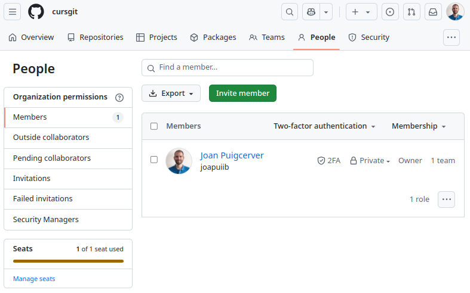

## GitHub com a plataforma educativa

:simple-github: GitHub és una plataforma que permet als estudiants i als docents allotjar el projectes de desenvolupament,
compartir-los i treballar de manera col·laborativa. A més, GitHub ofereix eines per a la gestió de projectes que poden
ser adaptades per a l'ús en l'entorn educatiu.

GitHub es pot convertir en una plataforma educativa molt potent, per les següents raons:

- **Control de versions**: Treballar amb un sistema de control de versions és essencial per a qualsevol projecte de
    desenvolupament, especialment en l'àmbit professional. Treballar d'aquesta manera des del primer moment permetrà
    als estudiants adquirir una habilitat i uns hàbits que els seran molt útils en el futur.
- **Allotjament centralitzat**: GitHub permet allotjar tots els projectes en un únic lloc, el que facilita la
    gestió i la revisió dels projectes per part dels docents.
- **Retroacció individualitzada**: Gràcies al control de versions, els docents poden revisar els canvis que han fet
    cadastral un dels estudiants i oferir retroacció individualitzada.
- **Treball col·laboratiu**: GitHub facilita la col·laboració entre els estudiants, ja que permet treballar en
    branques independents i fusionar els canvis de manera senzilla.
- **Gestió de projectes**: GitHub ofereix eines que faciliten la gestió de projectes, que poden ser
    adaptades per a l'entorn educatiu mitjançant l'ús de metodologies actives.

## Beneficis de GitHub en l'educació
[__GitHub Education__](https://github.com/education){:target="_blank"}
és una iniciativa de GitHub que ofereix beneficis especials per als estudiants i els docents.

Per a obtindre aquests beneficis, els estudiants i docents han de sol·licitar l'accés a
[GitHub Education application](https://education.github.com/discount_requests/application){:target="_blank"}.

##### Beneficis per als estudiants
Les eines i els recursos que ofereix GitHub Education es troben a
[**GitHub Student Developer Pack**](https://education.github.com/pack){:target="_blank"},
entre les quals podem destacar:

- GitHub Pro
- GitHub Copilot
- Llicències de JetBrains (PyCharm, IntelliJ IDEA, etc.)
- Molts més...

Tota aquesta informació es pot trobar a la pàgina de
[**GitHub Education Students**](https://github.com/education/students){:target="_blank"}.

##### Beneficis per als docents
A més dels beneficis que poden obtindre els estudiants,
els docents poden obtenir els següents beneficis:

- [GitHub Team](https://github.com/team){:target="_blank"} per a l'educació, que inclou la gestió d'organitzacions.
    
    Es pot sol·licitar la millora d'una organització a GitHub Team a la pàgina [GitHub Global Campus](https://education.github.com/globalcampus/teacher){:target="_blank"}.

- [GitHub Classroom](https://classroom.github.com/){:target="_blank"}: Plataforma educativa
  que permet als docents crear assignatures, allotjar els projectes i gestionar les tasques dels estudiants.

Tota aquesta informació es pot trobar a la pàgina de
[**GitHub Education Teachers**](https://github.com/education/teachers){:target="_blank"}.

## Organitzacions
Les [__organitzacions__](https://docs.github.com/en/organizations/collaborating-with-groups-in-organizations/about-organizations){target=_blank}
són comptes compartits que poden ser utilitzats per a allotjar projectes de manera centralitzada. Normalment, aquestes organitzacions
s'utilitzen per a allotjar projectes d'una empresa o d'un projecte de codi obert, però també es poden utilitzar per a allotjar
projectes educatius.

/// figure-caption
Organització [Softcatalà a GitHub](https://github.com/Softcatala){:target="_blank"}.
///

### Crear una organització
Pots crear una nova organització a l'apartat [__:material-office-building: Organitzacions__](https://github.com/settings/organizations){:target="_blank"}
del teu compte de GitHub.

Quan crees una organització, et demanarà quin pla vols utilitzar.

!!! important
    En l'àmbit educatiu, podem utilitzar el pla gratuït i després sol·licitar la millora a GitHub Team a través de
    [GitHub Global Campus](https://education.github.com/globalcampus/teacher){:target="_blank"}.

/// figure-caption
Crear una organització a GitHub.
///

### Millorar una organització a GitHub Team
Pot sol·licitar la millora d'una organització a GitHub Team a través de
[GitHub Global Campus](https://education.github.com/globalcampus/teacher){:target="_blank"}.

/// figure-caption
Millorar una organització a GitHub Team.
///

### Convidar membres a una organització
Per a convidar membres a una organització, cal anar a l'apartat __:material-account: People__
de la organització i afegir els membres manualment.

/// figure-caption
Convidar membres a una organització.
///

### Configuració de l'organització
A l'apartat __:octicons-gear-16: Settings__ de l'organització,
es poden configurar tots els paràmetres de l'organització.

Una de les opcions més importants és la configuració
dels permisos dels membres de l'organització a l'apartat __:material-account-multiple: Member privileges__.

!!! recommend
    En aquest apartat, es recomana configurar els permisos per defecte (_Base permissions_)
    com a _No permission_.

    D'aquesta manera, els estudiants no podran veure els repositoris privats
    d'altres companys de classe.

