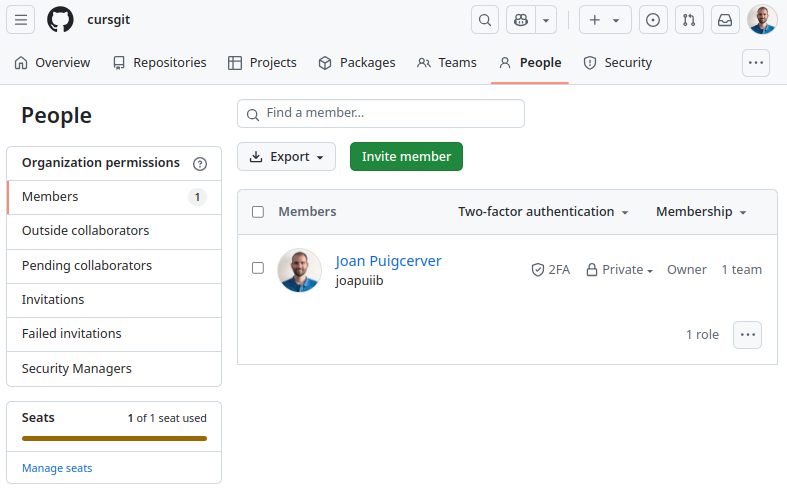

## GitHub com a plataforma educativa

:simple-github: GitHub és una plataforma que permet als estudiants i als docents allotjar el projectes de desenvolupament,
compartir-los i treballar de manera col·laborativa. A més, GitHub ofereix eines per a la gestió de projectes que poden
ser adaptades per a l'ús en l'entorn educatiu.

GitHub es pot convertir en una plataforma educativa molt potent, per les següents raons:

- **Control de versions**: Treballar amb un sistema de control de versions és essencial per a qualsevol projecte de
    desenvolupament, especialment en l'àmbit professional. Treballar d'aquesta manera des del primer moment permetrà
    als estudiants adquirir una habilitat i uns hàbits que els seran molt útils en el futur.
- **Allotjament centralitzat**: GitHub permet allotjar tots els projectes en un únic lloc, el que facilita la
    gestió i la revisió dels projectes per part dels docents.
- **Retroacció individualitzada**: Gràcies al control de versions, els docents poden revisar els canvis que han fet
    cadascun dels estudiants i oferir una retroacció individualitzada.
- **Treball col·laboratiu**: GitHub facilita la col·laboració entre els estudiants, ja que permet treballar en
    branques independents i fusionar els canvis de manera senzilla.
- **Gestió de projectes**: GitHub ofereix eines que faciliten la gestió de projectes, que poden ser
    adaptades per a l'entorn educatiu mitjançant l'ús de metodologies actives.

## :octicons-organization-16: Organitzacions
Les [__organitzacions__](https://docs.github.com/en/organizations/collaborating-with-groups-in-organizations/about-organizations)
són comptes compartits que permeten agrupar diversos repositoris i col·laboradors, gestionant els permisos d'accés
d'una manera més centralitzada.

Normalment, representen a alguna institució, empresa o projecte de codi obert.

/// shadow-figure-caption
Organització [:simple-softcatala: Softcatalà a GitHub](https://github.com/Softcatala).
///

### Crear una organització
Pots crear una nova organització a l'apartat [__:octicons-organization-16: Organitzacions__](https://github.com/settings/organizations)
del teu compte de GitHub.

Quan crees una organització, et demanarà quin pla vols utilitzar.

!!! important
    En l'àmbit educatiu, podem utilitzar el pla gratuït i després sol·licitar la millora a GitHub Team a través de
    [GitHub Global Campus](https://education.github.com/globalcampus/teacher).

Després, es demanarà especificar la següent informació:

- Nom per a la organització, que ha de ser únic a GitHub.
- Correu electrònic de contacte.
- A qui pertany la organització (personal, empresa o institució).

/// shadow-figure-caption
Crear una organització a GitHub.
///

### Millorar una organització a GitHub Team
Pot sol·licitar la millora d'una organització a GitHub Team a través de
[GitHub Global Campus](https://education.github.com/globalcampus/teacher).

/// shadow-figure-caption
Millorar una organització a GitHub Team.
///

### Convidar membres a una organització
Per a convidar membres a una organització, cal anar a l'apartat __:material-account: People__
de la organització i afegir els membres manualment amb el botó __Invite member__.

/// shadow-figure-caption
Membres d'una organització.
///

### Configuració de l'organització
A l'apartat __:octicons-gear-16: Settings__ de l'organització,
es poden configurar tots els paràmetres de l'organització.

Una de les opcions més importants és la configuració
dels permisos dels membres de l'organització a l'apartat __:material-account-multiple: Member privileges__.

!!! recommend
    En aquest apartat, es recomana configurar els permisos per defecte (_Base permissions_)
    com a _No permission_.

    D'aquesta manera, els estudiants no podran veure els repositoris privats
    d'altres companys de classe.

/// shadow-figure-caption
Configuració dels permisos de l'organització.
///

## Proposta d'ús de les organitzacions en l'àmbit educatiu
En aquest apartat es proposa una metodologia de treball per tal d'aprofitar les eines
de :simple-github: GitHub: i facilitar la gestió del treball de l'alumnat
i la revisió dels projectes per part del professorat.

Aquesta metodologia es basa en la __creació d'una organització__,
on s'allotjaran els repositoris dels estudiants de manera centralitzada
i on el docent tindrà accés a tots els projectes.

> Els __estudiants es crearan els seus propis :octicons-repo-locked-16: repositoris privats__
> i el __docent pot crear :octicons-repo-16: repositoris públics__ amb solucions o exemples.
>
> D'aquesta manera, el professorat tindrà accés a tots els repositoris dels estudiants
> i els estudiants tindran accés a tots els repositoris públics creats pel professorat
> i als seus propis repositoris privats.

No obstant això, aquesta metodologia es complementària i __no substitueix
la plataforma educativa__ amb la qual es treballa habitualment (Aules, Moodle, etc.).

Es proposen dues opcions, depenent si el treball de l'alumnat és __individual__ o en __grup__.

### Treball individual
Aquest cas pot ser el més habitual, on cada estudiant treballa en el seu projecte i
va realitzant les seues tasques de manera individual.

1. __Crear una :octicons-organization-16: organització__ a :simple-github: GitHub.

    > Personalment, m'agrada crear una organització per cada grup i mòdul professional
    > amb la nomenclatura `{centre}-{grup}-{modul}`.
    >
    > - `fpmislata-daw1-ed`
    > - `fpmislata-dams2-psp`

1. __Configurar els permisos de l'organització com a *No permission*__.

    > D'aquesta manera, els estudiants no podran veure els repositoris privats
    > d'altres companys de classe.

1. __Convidar els estudiants a la :octicons-organization-16: organització__.

    > Els estudiants han d'acceptar la invitació, que rebran per correu electrònic,
    > per tal de poder accedir a la organització.

1. Indicar a __cada estudiant que s'ha de crear un :octicons-repo-locked-16: repositori privat__.

    > Hem de decidir quants repositoris privats han de crear els estudiants al llarg
    > del curs acadèmic.
    >
    > Personalement, jo els demane que creen __un únic repositori__ que utilitzaran durant tot
    > el curs, amb la nomenclatura `{Cognom}{Nom}-{modul}`.
    >
    > - `PuigcerverJoan-ED`
    > - `PuigcerverJoan-PSP`
    >
    > No obstant això, també pot ser interessant crear diferents repositoris (un per cada tasca o projecte).
    > En aquest cas, cal tindre en compte que el volum de repositoris en l'organització augmentarà considerablement.

1. Com a docent, __crear els :octicons-repo-16: repositoris públics__ amb solucions o exemples
    que es consideren necessaris.

    > Personalment, m'agrada crear un repositori equivalent al que tenen els estudiants, sobre
    > el qual vaig resolent els exercicis que fem a classe i on vaig publicant les solucions
    > al llarg del curs.

### Treball en grup

1. __Crear una :octicons-organization-16: organització__ a :simple-github: GitHub.

    > Personalment, m'agrada crear una organització per cada grup i mòdul professional
    > amb la nomenclatura `{centre}-{grup}-{modul}`.
    >
    > - `fpmislata-daw1-projecte`

1. __Configurar els permisos de l'organització com a *No permission*__.

    > D'aquesta manera, els estudiants no podran veure els repositoris privats
    > d'altres companys de classe.

1. __Convidar els estudiants a la :octicons-organization-16: organització__.

    > Els estudiants han d'acceptar la invitació, que rebran per correu electrònic,
    > per tal de poder accedir a la organització.

1. __Crear un :octicons-people-16: equip__ per a cada grup d'estudiants
    i afegir els estudiants a l'equip.

1. __Crear un :octicons-repo-locked-16: repositori privat__ per a cada grup d'estudiants
    i __afegir :octicons-people-16: l'equip creat anteriorment__ com a col·laborador.

1. __Crear un :octicons-table-16: Projecte__ per cada grup, on poden __organitzar les tasques
    com a :octicons-issue-opened-16: incidències__.

    > La creació de :octicons-people-16: l'equip, el :octicons-repo-locked-16: repositori privat
    > i el :octicons-table-16: projecte pot ser realitzada per part del professorat
    > o per part d'un dels estudiants del grup.

1. Com a docent, __crear els :octicons-repo-16: repositoris públics__ amb solucions, exemples
    o plantilles que es consideren necessaris.

A partir d'aquest punt, els equips de treball poden treballar de manera autònoma
i gestionar les seues tasques i projectes de manera col·laborativa.

Per poder treballar de manera col·laborativa sobre el mateix repositori,
és important que facen un bon ús d'una de les [[estrategies]].

*[DAW]: Desenvolupament d'Aplicacions Web

> En 1r de DAW, obtingut bons resultats amb:
>
> - Utilitzar les __:octicons-git-branch-16:__ branques `develop` i `main`.
> - Utilitzar les __:octicons-git-branch-16:__ branques `feature` per a cada tasca.
> - Utilitzar __:octicons-git-pull-request-16:__ _Pull Requests_ per a incorporar
>   les __:octicons-git-branch-16:__ branques `feature` a la branca `develop`.
>
>     -  `merge --squash` per fusionar les :octicons-git-pull-request-16: _Pull Requests_.
>     -  Habilitar les __:octicons-eye-16: revisions__ per part dels companys.
>     -  Configurar __:octicons-play-16: Actions__ per executar les proves automàticament
>       abans de fusionar.

### Lliurament de tasques
