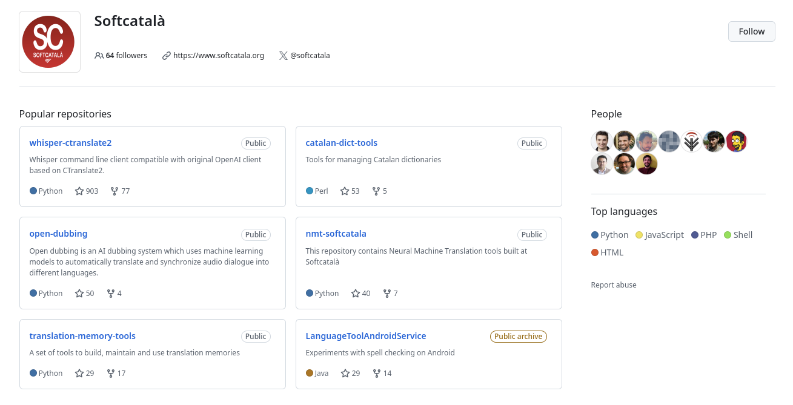
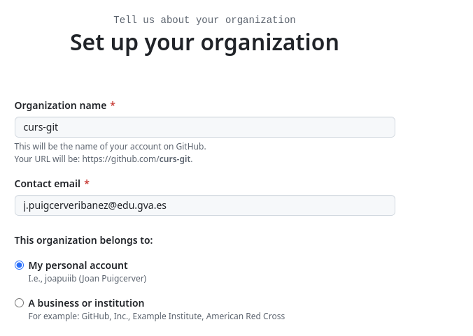
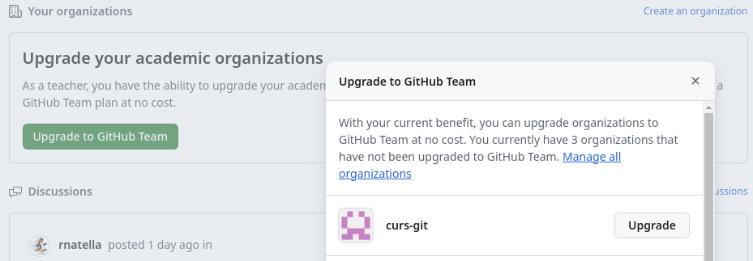
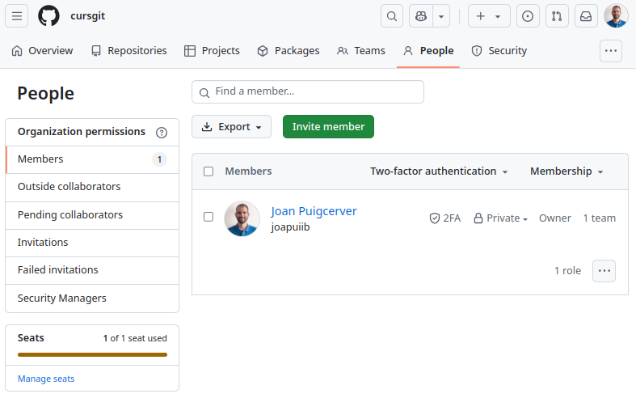
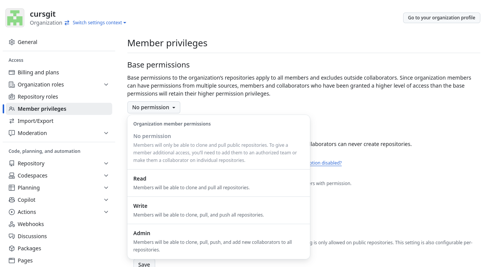
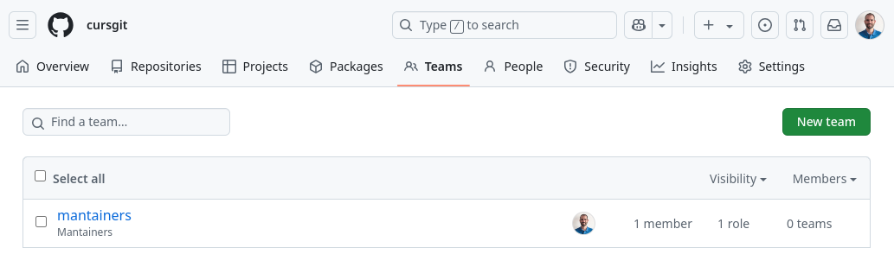
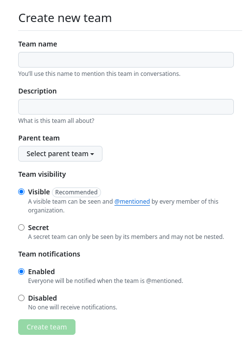
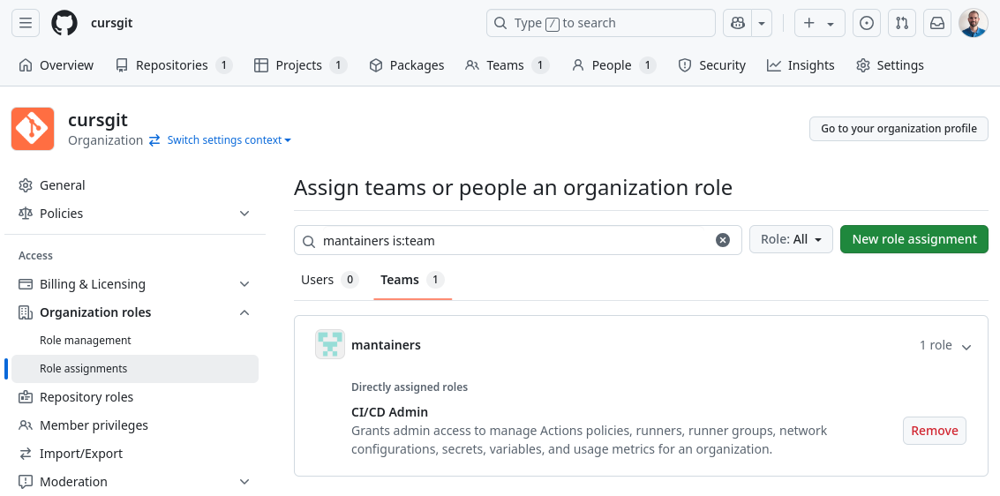

## GitHub com a plataforma educativa
:simple-github: GitHub és una plataforma que permet a l'alumnat i al professorat allotjar projectes
de desenvolupament, compartir-los i treballar de manera col·laborativa. A més, GitHub ofereix ferramentes
de gestió de projectes que es poden adaptar a l'entorn educatiu.

Per tot això, GitHub es pot convertir en una plataforma educativa molt potent, per les raons següents:

- __Control de versions__: treballar amb un sistema de control de versions és essencial en qualsevol projecte
    de desenvolupament, especialment en l'àmbit professional. Treballar així des del primer moment permet
    a l'alumnat adquirir habilitats i hàbits que li seran molt útils en el futur.
- __Allotjament centralitzat__: GitHub permet allotjar tots els projectes en un únic lloc,
    la qual cosa en facilita la gestió i la revisió per part del professorat.
- __Retroacció individualitzada__: gràcies al control de versions, el professorat pot revisar els canvis
    que ha fet cada alumne o alumna i oferir-li una retroacció individualitzada.
- __Treball col·laboratiu__: GitHub facilita la col·laboració entre l'alumnat, ja que permet treballar
    en branques independents i fusionar els canvis de manera senzilla.
- __Gestió de projectes__: GitHub ofereix ferramentes de gestió de projectes que es poden adaptar
    a l'entorn educatiu mitjançant metodologies actives.

## :octicons-organization-16: Organitzacions
Les [__organitzacions__](https://docs.github.com/en/organizations/collaborating-with-groups-in-organizations/about-organizations)
són comptes compartits que permeten agrupar diversos repositoris i persones col·laboradores,
i gestionar els permisos d'accés de manera centralitzada.
Normalment, representen una institució, una empresa o un projecte de codi obert.

??? picture "Organització Softcatalà"
    
    /// shadow-figure-caption | #figure-softcatala : Organització [:simple-softcatala: Softcatalà a GitHub](https://github.com/Softcatala).

### Crear una organització
Es pot crear una organització nova en l'apartat
[__:octicons-organization-16: Organitzacions__](https://github.com/settings/organizations) del teu compte de GitHub.
En crear-la, GitHub demana quin pla es vol utilitzar.

!!! important "En l'àmbit educatiu, es pot utilitzar el pla gratuït i després sol·licitar la millora a GitHub Team mitjançant [GitHub Global Campus](https://education.github.com/globalcampus/teacher)."

A continuació, cal especificar la informació següent:

- __Nom__: nom de l'organització, que ha de ser únic a GitHub.
- __Correu electrònic__: adreça de contacte.
- __Propietat__: a qui pertany l'organització (persona, empresa o institució).

??? picture "Formulari per a crear una organització"
    
    /// shadow-figure-caption | #figure-create-org : Formulari per a crear una organització.

### Millorar una organització a GitHub Team
La millora d'una organització a GitHub Team es pot sol·licitar mitjançant
[GitHub Global Campus](https://education.github.com/globalcampus/teacher).

??? picture "Millorar una organització a GitHub Team"
    
    /// shadow-figure-caption | #figure-upgrade-org : Millorar una organització a GitHub Team.

### Convidar membres a una organització
Per a convidar membres a una organització, cal anar a l'apartat __:material-account: People__
de l'organització i afegir-los manualment amb el botó __Invite member__.

??? picture "Convidar membres a una organització"
    
    /// shadow-figure-caption | #figure-invite-members : Convidar membres a una organització.

### Configuració de l'organització
En l'apartat __:octicons-gear-16: Settings__ de l'organització es poden configurar tots els seus paràmetres.
Una de les opcions més importants és la configuració dels permisos dels membres,
en l'apartat __:material-account-multiple: Member privileges__.

!!! recommend "En aquest apartat, es recomana configurar els permisos per defecte (_Base permissions_) com a _No permission_."
    D'aquesta manera, l'alumnat no pot vore els repositoris privats de la resta de la classe.

??? picture "Configuració dels permisos de l'organització"
    
    /// shadow-figure-caption | #figure-base-permissions : Configuració dels permisos de l'organització.

## :octicons-people-16: Equips
Els [__equips__][equips] són una funcionalitat de les organitzacions que permet agrupar membres
per a centralitzar la gestió dels permisos d'accés als repositoris.
A més, permeten crear canals de comunicació entre els membres d'un equip
o mencionar un equip sencer en un comentari.

[equips]: https://docs.github.com/es/organizations/organizing-members-into-teams/about-teams

??? picture "Equip d'una organització"
    
    /// shadow-figure-caption | #figure-team : Equip [`@mantainers`][mantainers] de l'organització [`cursgit`][cursgit].

[cursgit]: https://github.com/cursgit
[mantainers]: https://github.com/orgs/cursgit/teams/mantainers

### Crear un equip
Per a crear un equip nou, cal anar a l'apartat __:octicons-people-16: Teams__ de l'organització
i fer clic en el botó __New team__. Es poden definir els paràmetres següents:

- __Nom__: nom de l'equip.
- __Descripció__: descripció de l'equip.
- __Equip superior__: equip del qual depén, per a crear una jerarquia d'equips.
- __Visibilitat__: visible o privat.
- __Notificacions__: habilita o deshabilita les notificacions de l'equip.

??? picture "Formulari per a crear un equip nou"
    
    /// shadow-figure-caption | #figure-new-team : Formulari per a crear un equip nou.

### Permisos d'un equip
En l'apartat __:octicons-organization-16: Organization roles__ de la configuració
(__:octicons-gear-16: Settings__) de l'organització es poden definir els permisos dels seus membres i equips.

??? picture "Permisos d'un equip"
    
    /// shadow-figure-caption | #figure-permisos : Permisos d'un equip.
