*[DAW]: Desenvolupament d'Aplicacions Web

## Proposta d'ús de les organitzacions en l'àmbit educatiu
En aquest apartat es proposa una metodologia de treball per a aprofitar les ferramentes
de :simple-github: GitHub, facilitar la gestió del treball de l'alumnat i la revisió dels projectes
per part del professorat.

Aquesta metodologia es basa en la __creació d'una [:octicons-organization-16: organització][organitzacio]__,
on s'allotgen de manera centralitzada els repositoris de l'alumnat i on el professorat té accés
a tots els projectes.

[organitzacio]: organitzacions.md

L'__alumnat treballa en els seus propis :octicons-repo-locked-16: repositoris privats__
i el __professorat pot crear :octicons-repo-16: repositoris públics__ amb solucions o exemples.
D'aquesta manera:

- __Professorat__: té accés a tots els repositoris de l'alumnat.
- __Alumnat__: té accés a tots els repositoris públics creats pel professorat,
    però només als seus propis repositoris privats.

No obstant això, aquesta metodologia és complementària i __no substitueix la plataforma educativa__
amb què es treballa habitualment (Aules, :simple-moodle: Moodle, etc.).


## Objectius d'aquesta proposta
L'objectiu __principal__ d'aquesta proposta és que __l'alumnat tinga normalitzat l'ús d'un sistema
de control de versions__ com :simple-git: Git, __d'ús generalitzat en el món professional__.

A partir d'aquest objectiu, la proposta també pretén:

- __Revisió__: facilitar la revisió del treball de l'alumnat amb el sistema de control de versions :simple-git: Git.

- __Normalització__: familiaritzar l'alumnat i el professorat amb l'ús de :simple-git: Git a l'aula.

    > Si el professorat l'utilitza de manera habitual, és més fàcil que l'alumnat comence a utilitzar-lo.

- __Gestió de projectes__: aprofitar les ferramentes de :simple-github: GitHub per a facilitar la gestió
    de projectes en grup, el seguiment de tasques i la revisió del treball.

- __Col·laboració__: facilitar i incentivar la col·laboració entre l'alumnat.


## Propostes
Es proposen dues opcions, segons si el treball de l'alumnat és __individual__ o en __grup__.

### Treball individual
Aquest és el cas més habitual: cada alumne o alumna treballa en el seu projecte i fa les tasques
de manera individual. Els passos per a preparar l'organització són:

1. __Crea una :octicons-organization-16: organització__ a :simple-github: GitHub.

    > Personalment, m'agrada crear una organització per a cada grup i mòdul professional
    > amb la nomenclatura `{centre}-{grup}-{modul}`. Per exemple, `fpmislata-daw1-ed`
    > o `fpmislata-dams2-psp`.

    ??? tip "Perfil de l'organització"
        Pots afegir el repositori públic `.github` i configurar el fitxer `profile/README.md`
        per a definir el perfil de l'organització
        ([:octicons-link-external-16: Adding a public organization profile README](https://docs.github.com/en/organizations/collaborating-with-groups-in-organizations/customizing-your-organizations-profile#adding-a-public-organization-profile-readme)
        – :simple-github: GitHub Docs).

    ??? picture "Organització `fpmislata-dams2-psp` a GitHub"
        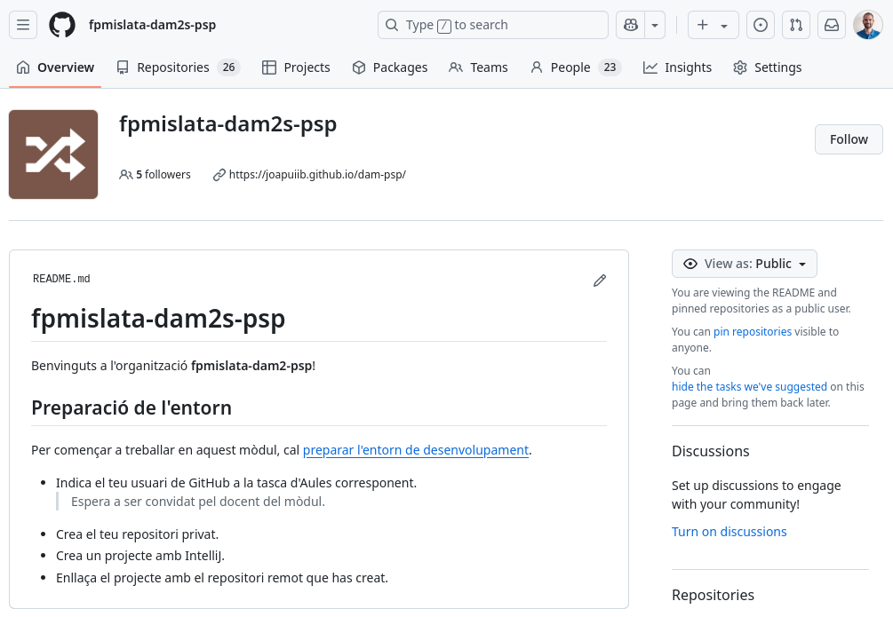
        /// shadow-figure-caption | #figure-psp-org : Organització [`fpmislata-dams2-psp`](https://github.com/fpmislata-dams2-psp) a GitHub.

1. __Configura com a _No permission_ els permisos dels :octicons-people-16: membres de l'organització__.

    > D'aquesta manera, l'alumnat no pot vore els repositoris privats de la resta de la classe.

    ??? picture "Permisos de l'organització"
        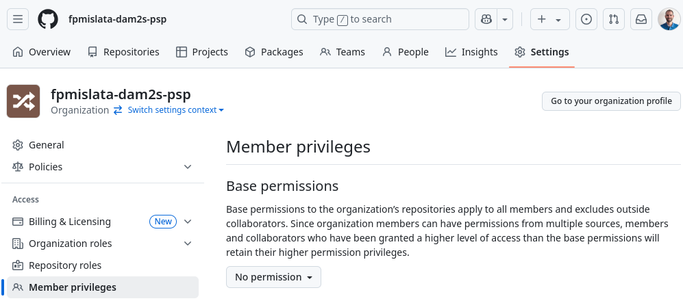
        /// shadow-figure-caption | #figure-psp-permisos : Permisos de l'organització.

1. __Convida l'alumnat a l'organització :octicons-organization-16:__.

    > L'alumnat ha d'acceptar la invitació, que rep per correu electrònic, per a poder accedir a l'organització.

    ??? picture "Alumnat com a membre de l'organització"
        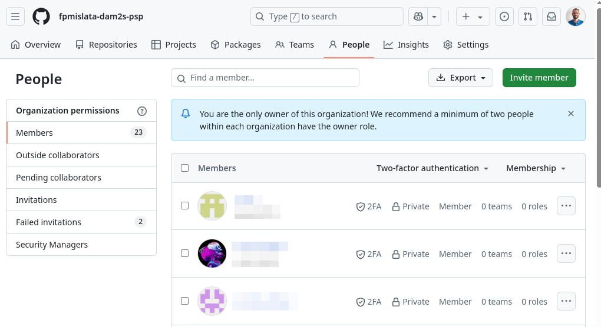
        /// shadow-figure-caption | #figure-psp-membres : Alumnat com a membre de l'organització.

1. __Indica a cada alumne o alumna que cree un :octicons-repo-locked-16: repositori privat__.

    > Cal decidir quants repositoris privats ha de crear l'alumnat al llarg del curs acadèmic.
    >
    > Personalment, demane que creen __un únic repositori__ per a tot el curs,
    > amb la nomenclatura `{Cognom}{Nom}-{modul}`. Per exemple, `PuigcerverJoan-ED` o `PuigcerverJoan-PSP`.
    >
    > No obstant això, també pot ser interessant crear diferents repositoris, un per a cada tasca o projecte.
    > En aquest cas, cal tindre en compte que el nombre de repositoris de l'organització augmentarà considerablement.

    ??? picture "Repositoris de l'alumnat en l'organització"
        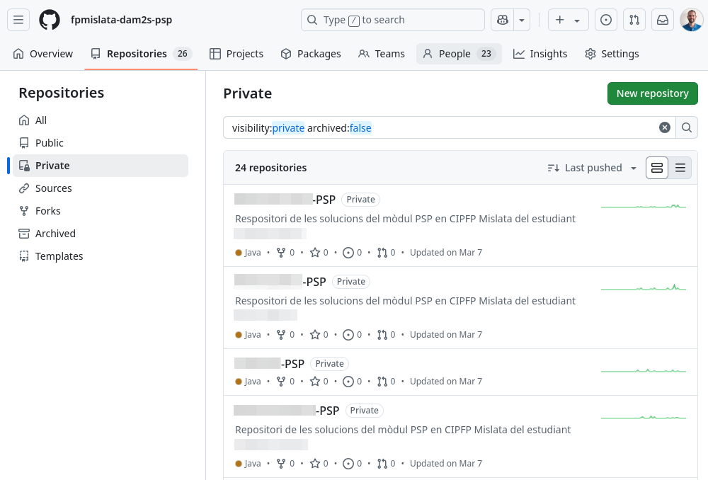
        /// shadow-figure-caption | #figure-psp-private-repos : Repositoris de l'alumnat en l'organització.

1. Com a docent, __crea els :octicons-repo-16: repositoris públics__ amb les solucions o exemples
    que consideres necessaris.

    > Personalment, m'agrada crear un repositori equivalent al de l'alumnat, on resolc els exercicis
    > que fem a classe i on publique les solucions al llarg del curs.

    > El repositori `.github` és un repositori especial que s'utilitza per a definir el `profile/README.md`
    > que apareix en la pàgina principal de l'organització.

    ??? picture "Repositoris públics del professorat en l'organització"
        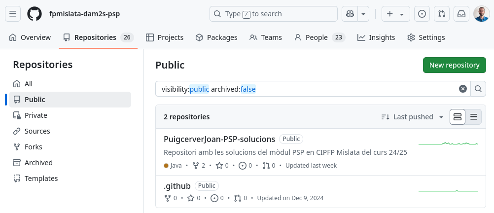
        /// shadow-figure-caption | #figure-psp-public-repos : Repositoris públics del professorat en l'organització.


### Treball en grup
En aquest cas, cada grup d'alumnes treballa en un mateix projecte i fa les tasques sobre el mateix repositori.
Els passos per a preparar l'organització són:

1. __Crea una :octicons-organization-16: organització__ a :simple-github: GitHub.

    > Personalment, m'agrada crear una organització per a cada grup i mòdul professional
    > amb la nomenclatura `{centre}-{grup}-{modul}`. Per exemple, `fpmislata-daw1-projecte`.

    ??? tip "Perfil de l'organització"
        Pots afegir el repositori públic `.github` i configurar el fitxer `profile/README.md`
        per a definir el perfil de l'organització
        ([:octicons-link-external-16: Adding a public organization profile README](https://docs.github.com/en/organizations/collaborating-with-groups-in-organizations/customizing-your-organizations-profile#adding-a-public-organization-profile-readme)
        – :simple-github: GitHub Docs).

    ??? picture "Organització `fpmislata-daw1-projecte` a GitHub"
        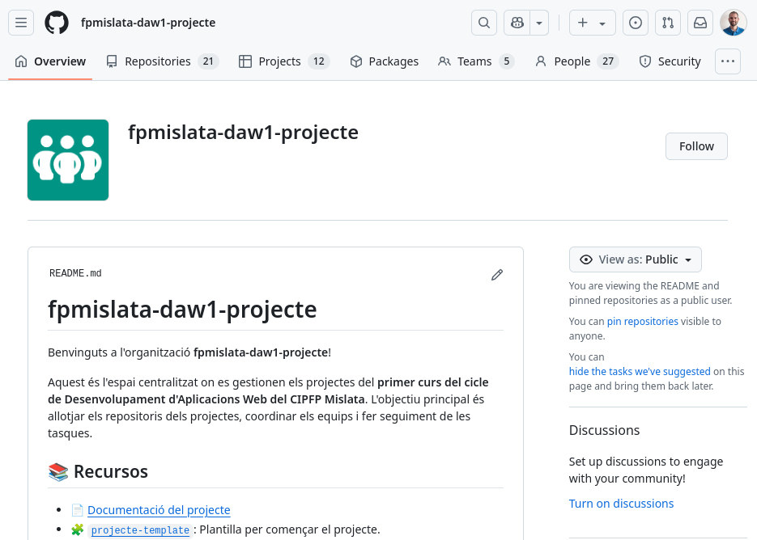
        /// shadow-figure-caption | #figure-projecte-org : Organització [`fpmislata-daw1-projecte`](https://github.com/fpmislata-daw1-projecte) a GitHub.

1. __Configura com a _No permission_ els permisos dels :octicons-people-16: membres de l'organització__.

    > D'aquesta manera, l'alumnat no pot vore els repositoris privats de la resta de la classe.

    ??? picture "Permisos de l'organització"
        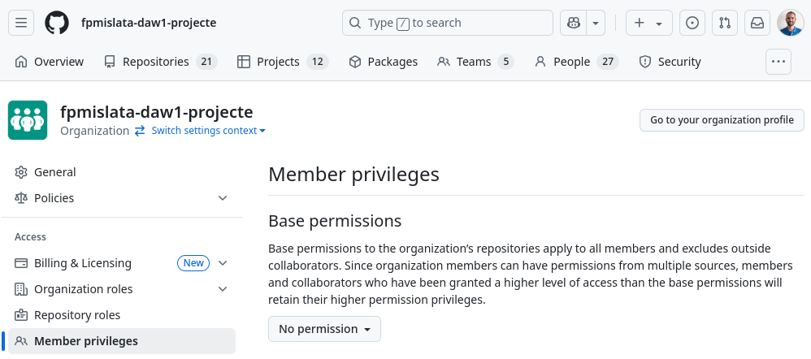
        /// shadow-figure-caption | #figure-projecte-permisos : Permisos de l'organització.

1. __Convida l'alumnat a l'organització :octicons-organization-16:__.

    > L'alumnat ha d'acceptar la invitació, que rep per correu electrònic, per a poder accedir a l'organització.

    ??? picture "Alumnat com a membre de l'organització"
        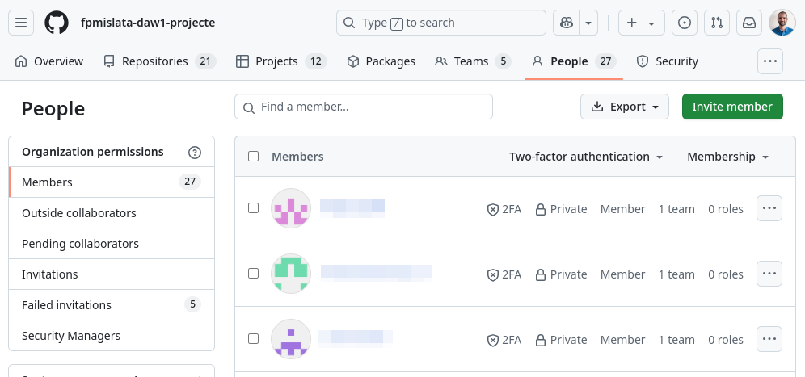
        /// shadow-figure-caption | #figure-projecte-membres : Alumnat com a membre de l'organització.

1. __Convida la resta del professorat a l'organització :octicons-organization-16:__ amb el rol __*Owner*__.

    > El professorat ha d'acceptar la invitació, que rep per correu electrònic.
    > Amb aquest rol, també té accés a tots els repositoris privats de l'alumnat.

    ??? picture "Professorat com a propietari de l'organització"
        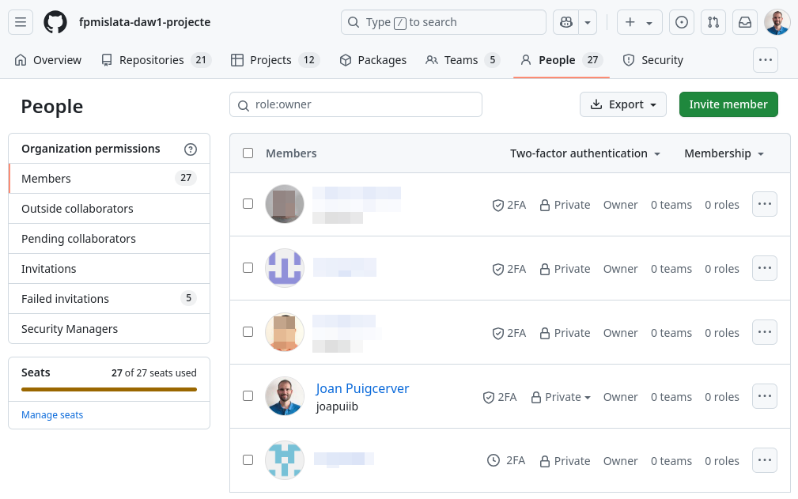
        /// shadow-figure-caption | #figure-projecte-owners : Professorat com a propietari de l'organització.


1. __Crea un :octicons-people-16: equip__ per a cada grup d'alumnes i afig-hi els seus membres.

    !!! info "L'equip :octicons-people-16:, el repositori privat :octicons-repo-locked-16: i el projecte :octicons-table-16: els pot crear el professorat o un dels membres del grup."

    ??? picture "Equips de l'alumnat dins de l'organització"
        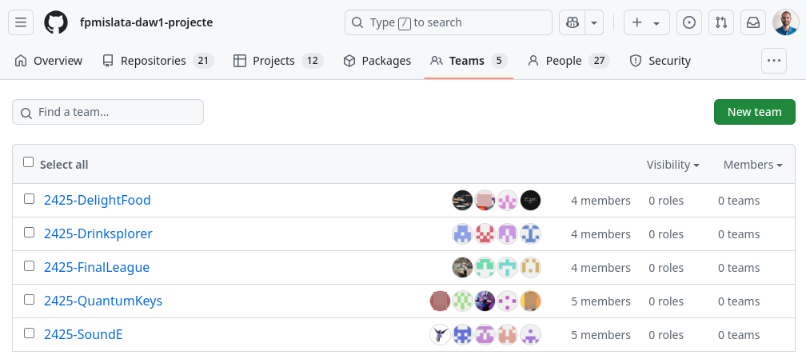
        /// shadow-figure-caption | #figure-projecte-teams : Equips de l'alumnat dins de l'organització.

1. __Crea un :octicons-repo-locked-16: repositori privat__ per a cada grup
    i __afig-hi com a col·laborador l':octicons-people-16: equip creat anteriorment__.

    ??? picture "Repositoris dels projectes en l'organització"
        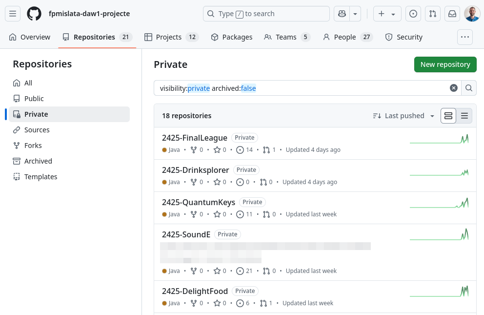
        /// shadow-figure-caption | #figure-projecte-private-repos : Repositoris dels projectes en l'organització.

        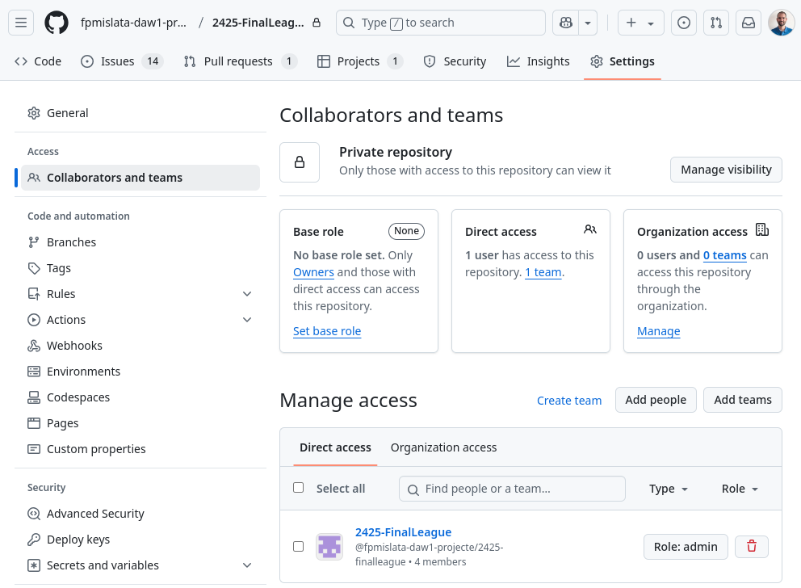
        /// shadow-figure-caption | #figure-projecte-repo-team : Assignació de l'equip com a col·laborador del repositori.

1. __Crea un :octicons-table-16: projecte__ per a cada grup, on el grup pot __organitzar les tasques
    com a :octicons-issue-opened-16: incidències__.

    ??? picture "Projectes per a gestionar les tasques"
        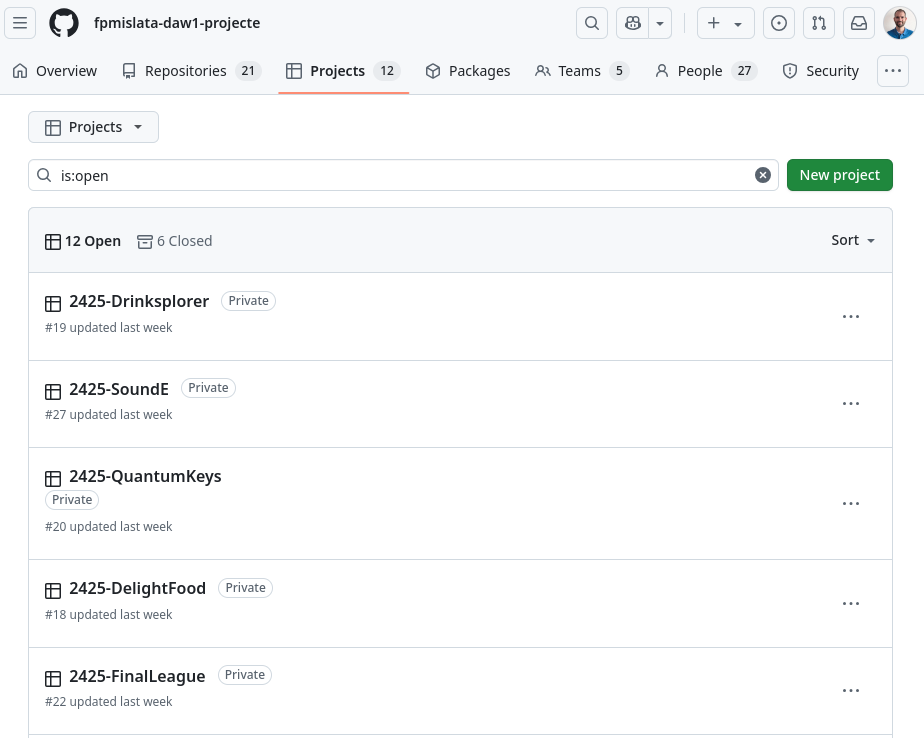
        /// shadow-figure-caption | #figure-projecte-projectes : Projectes per a gestionar les tasques.

        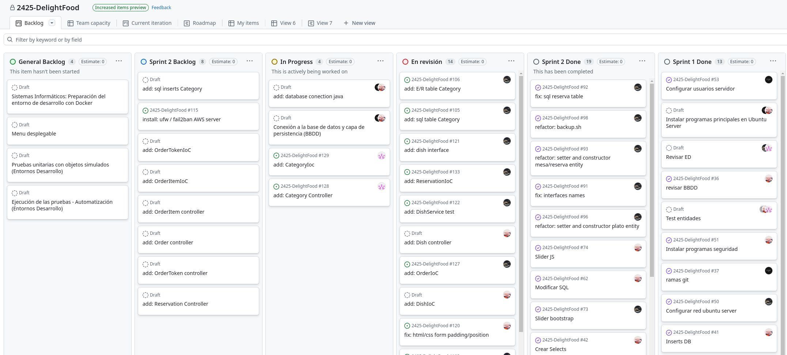
        /// shadow-figure-caption | #figure-projecte-planificacio : Projecte amb la planificació de tasques.

1. Com a docent, __crea els :octicons-repo-16: repositoris públics__ amb les solucions, exemples
    o plantilles que consideres necessaris.

    > En aquest cas, s'han creat els repositoris públics següents:
    >
    > - __`.github`__: repositori especial per a configurar el perfil de l'organització.
    > - __`projecte-daw1`__: documentació del projecte.
    > - __`projecte-template`__: plantilla del projecte.

    ??? picture "Repositoris públics de l'organització"
        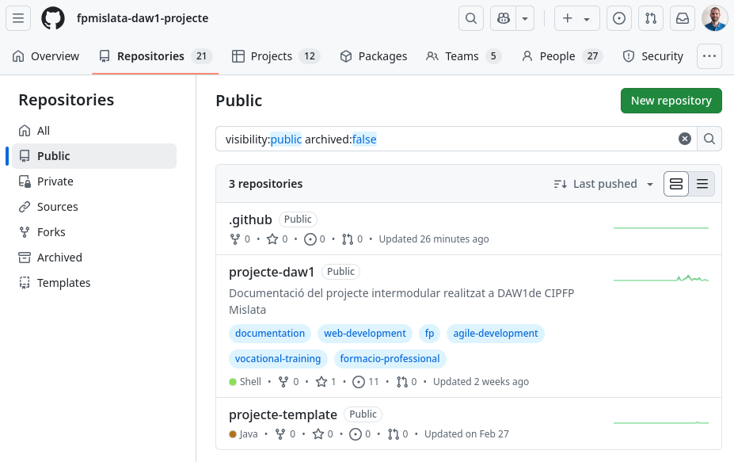
        /// shadow-figure-caption | #figure-projecte-public-repos : Repositoris públics de l'organització.

A partir d'aquest punt, els equips poden treballar de manera autònoma i gestionar les seues tasques
dins d'un únic projecte. Per a treballar de manera col·laborativa sobre el mateix repositori,
és important que facen un bon ús d'una de les [[estrategies]].

A més, l'ús de :simple-github: GitHub és independent de la metodologia de treball que s'aplique a l'aula,
com ara metodologies àgils com __Scrum__ o __Kanban__.

!!! example "Exemple real: projecte intermodular de 1r de DAW amb Scrum"
    Amb l'alumnat de 1r curs de __Desenvolupament d'Aplicacions Web (DAW)__, hem treballat en un
    __projecte intermodular__ en què es desenvolupa una __aplicació web__ de temàtica lliure.
    El projecte es fa en grups de 4 o 5 persones i es treballa amb la metodologia àgil __Scrum__.

    Cada __:octicons-people-16: equip__ gestiona les tasques amb un __:octicons-table-16: projecte__,
    enllaçat a un __:octicons-repo-locked-16: repositori privat__. Se segueix l'__estratègia de ramificació__ següent:

    - __Branques principals__: s'utilitzen les branques :octicons-git-branch-16: `develop` i `main`.
    - __Branques de funcionalitat__: s'utilitza una branca :octicons-git-branch-16: `feature` per a cada tasca.
    - __:octicons-git-pull-request-16: Pull Requests__: s'utilitzen per a incorporar
        les branques :octicons-git-branch-16: `feature` en la branca `develop`. En cada PR:

        - S'enllacen les __:octicons-issue-opened-16: incidències__ relacionades.
        - S'habiliten les __:octicons-eye-16: revisions__ per part de la resta de l'equip.
        - Es configuren __:octicons-play-16: Actions__ per a executar les proves automàticament
            abans de tancar la :octicons-git-pull-request-16: _Pull Request_.
        - S'utilitza `merge --squash` per a fusionar les :octicons-git-pull-request-16: _Pull Requests_.

    > Pots trobar més informació en [:fontawesome-solid-people-group: Projecte Intermodular DAW1](https://fpmislata-daw1-projecte.github.io/projecte-daw1/) – CIPFP Mislata.


### Lliurament de tasques
En qualsevol dels dos casos, l'alumnat és propietari dels seus repositoris i en pot modificar
el contingut en qualsevol moment, fins i tot després del termini de lliurament de la tasca.

Per tant, és important establir un __mecanisme de lliurament de tasques__ que permeta revisar
el __treball que l'alumnat ha lliurat, independentment que l'haja modificat després__.

L'opció més senzilla és crear una __:octicons-tag-16: etiqueta__ o un
__:material-tray-arrow-up: llançament__ (_release_) que identifique el __:octicons-git-commit-16: *commit*__
on es troba la versió del treball que es vol lliurar.

??? picture "Etiquetes amb els lliuraments"
    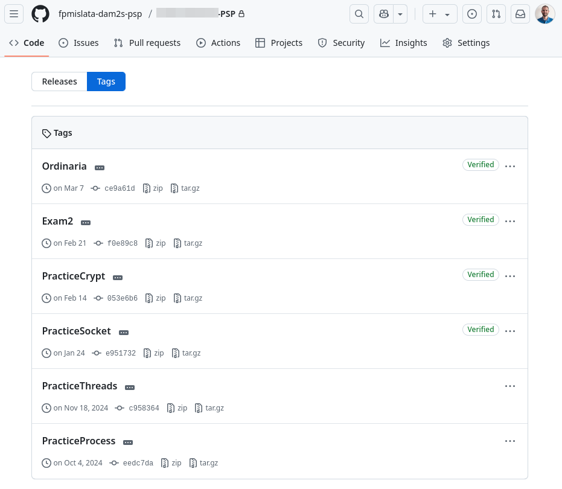
    /// shadow-figure-caption | #figure-psp-tags : Etiquetes amb els lliuraments.

Així, el professorat pot accedir al repositori privat de l'alumne o alumna i situar-se en aquesta versió
per a revisar el treball lliurat.

!!! tip "Es recomana utilitzar __una :octicons-tag-16: etiqueta anotada__ per a poder comprovar la data en què s'ha creat."

Un altre aspecte que cal tindre en compte és que, si es delega en l'alumnat la creació dels repositoris
privats, l'alumnat els pot esborrar i perdre tot el treball, la qual cosa dificultaria la revisió
del treball lliurat en una reclamació posterior.

Per aquest motiu, personalment m'agrada demanar que lliuren el codi de la tasca comprimit
en la __plataforma educativa oficial (Aules)__, amb l'enllaç al seu repositori.

??? picture "Lliurament d'una tasca a Aules"
    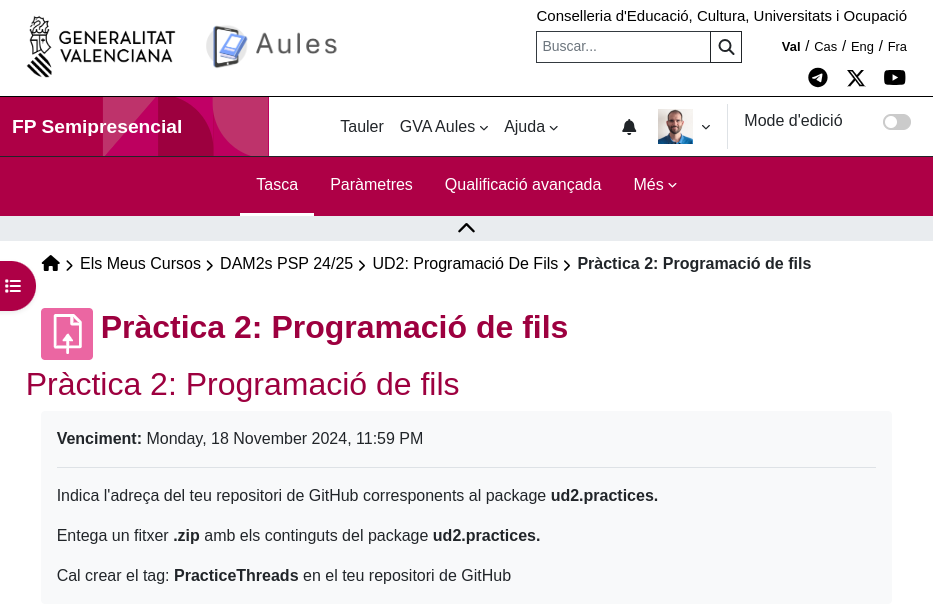
    /// shadow-figure-caption | #figure-aules-tasca : Definició de la tasca a Aules.

    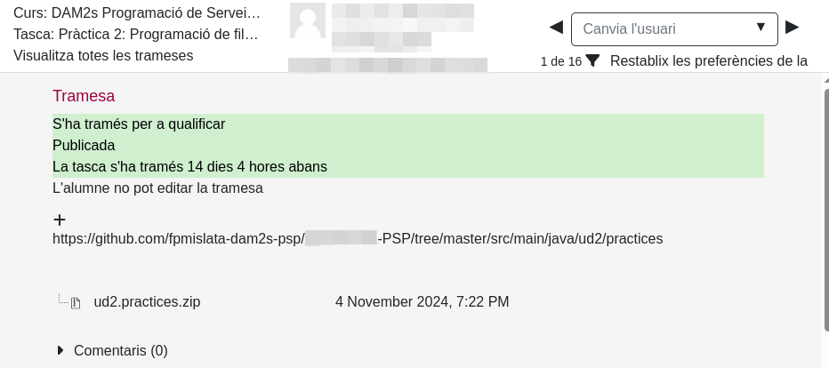
    /// shadow-figure-caption | #figure-aules-lliurament : Lliurament d'una tasca a Aules.

!!! note "En la pràctica, no revise el codi lliurat a Aules, sinó que el consulte directament en el :octicons-repo-locked-16: repositori privat."
    No obstant això, de vegades l'alumnat ha tingut algun problema amb :simple-git: Git
    i, gràcies a aquesta còpia de seguretat, l'he pogut avaluar.

## Gestió de l'organització
Un dels principals reptes d'aquesta proposta és la gestió dels membres i dels repositoris de l'organització:

- __Gestió dels membres__: :simple-github: GitHub no proporciona una manera senzilla de convidar
    i gestionar en massa els membres de l'organització.

- __Gestió dels repositoris de l'alumnat__: el nombre de repositoris de l'alumnat pot ser molt elevat,
    i gestionar-los individualment pot ser complicat.

Per aquesta raó, he desenvolupat __[`ghot`][ghot] (GitHub Organization Tools)__, una ferramenta de línia
d'ordres que permet gestionar de manera senzilla i ràpida els membres i els repositoris d'una organització.
Aquesta ferramenta permet fer les accions següents de manera massiva:

- __Membres__: convidar i eliminar membres de l'organització.
- __Repositoris__: crear, eliminar, clonar i actualitzar (`pull`) repositoris.
- __Incidències__: crear incidències en els repositoris.

!!! docs "Documentació: [:octicons-link-external-16: GitHub Organization Tools][ghot-docs] – `ghot`"

!!! warning "`ghot` és una ferramenta en __estat experimental__. Et recomane executar primer les ordres amb l'opció `--dry` per a comprovar que tot funciona correctament."
    A més, si trobes algun error o tens alguna proposta de millora, pots indicar-ho en la secció
    [:octicons-issue-opened-16: Issues del repositori de `ghot`][ghot-issues].

[ghot-issues]: https://github.com/joapuiib/github-organization-tools/issues

!!! important "No cal utilitzar `ghot` per a aplicar aquesta proposta: totes les accions es poden fer manualment."


[ghot]: https://github.com/joapuiib/github-organization-tools
[ghot-docs]: https://joapuiib.github.io/github-organization-tools/

??? example "Exemple: Convidar l'alumnat a l'organització mitjançant `ghot`"
    El primer pas és crear un fitxer `estudiants.csv` a partir de les dades exportades
    de la plataforma educativa Aules.

    ```csv
    Nom,Cognoms,username
    ADA,LOVELACE,adalovelace,
    "ALAN MATHISON",TURING,alanturing,
    ```

    > S'han eliminat les columnes amb el correu electrònic i el grup, i s'ha afegit la columna `username`,
    > amb el nom d'usuari de cada alumne o alumna.

    A continuació, es configura `ghot` per a definir les dades de cada alumne o alumna:

    - __`id`__: identificador amb el format `{nom}.{cognom}`, en minúscules i sense accents.
    - __`username`__: nom d'usuari de GitHub.
    - __`repo`__: nom del repositori, amb el format `{Nom}{Cognom}-ED`, sense accents,
        on `ED` és el mòdul professional.

    En tots els casos, `words(0)` només agafa la primera paraula del nom i del cognom,
    i `remove_accents()` elimina els accents.

    ```bash
    ghot config csv.pattern.id "{f0.words(0).lower().remove_accents()}.{f1.words(0).lower().remove_accents()}"
    ghot config csv.pattern.username "{f2}"
    ghot config csv.pattern.repo "{f0.words(0).title().remove_accents()}{f1.words(0).title().remove_accents()}-ED"
    ```

    Aquestes ordres guarden la configuració en el fitxer `.ghot` del directori actual:

    ```ini title=".ghot"
    [csv]
    pattern.id = {f0.words(0).lower().remove_accents()}.{f1.words(0).lower().remove_accents()}
    pattern.username = {f2}
    pattern.repo = {f0.words(0).title().remove_accents()}{f1.words(0).title().remove_accents()}-ED
    ```

    Finalment, ja es pot:

    1. Convidar l'alumnat a l'organització amb `ghot user invite`.
    2. Crear els repositoris privats amb `ghot repo create`.
    3. Convidar cada alumne o alumna al seu repositori amb `ghot repo invite`.

    ```shellconsole
    joapuiib@fp:~ $ ghot user invite --dry fpmislata-daw1-ed estudiants.csv
    Total members: 1
    Pending invitations: 0
    ada.lovelace: Invitation sent to 'adalovelace' (dry).
    alan.turing: Invitation sent to 'alanturing' (dry).

    joapuiib@fp:~ $ ghot repo create --dry --private fpmislata-daw1-ed estudiants.csv
    ada.lovelace: Repository 'fpmislata-daw1-ed/AdaLovelace-ED' created (private) (dry).
    alan.turing: Repository 'fpmislata-daw1-ed/AlanTuring-ED' created (private) (dry).

    joapuiib@fp:~ $ ghot repo invite --dry fpmislata-daw1-ed estudiants.csv
    ada.lovelace: User 'adalovelace' is not a member of the organization.
    alan.turing: User 'alanturing' is not a member of the organization.
    ```

    S'observa que `ghot repo invite` no funciona en aquest cas: com que les ordres anteriors
    s'han executat amb `--dry`, l'alumnat encara no és membre de l'organització.
