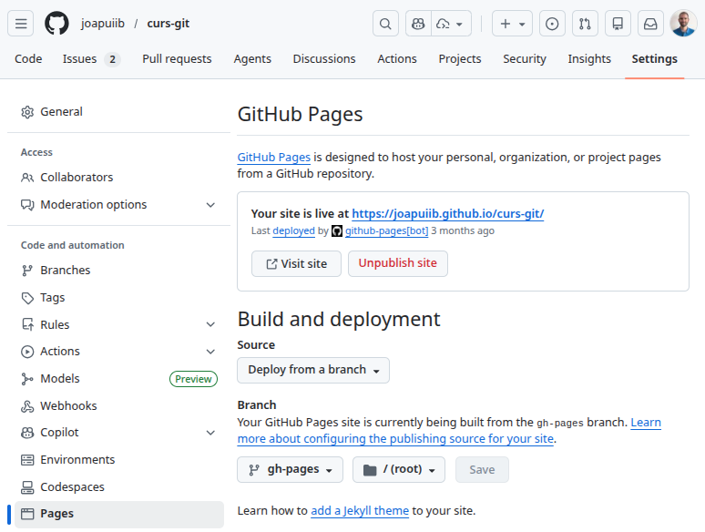

*[CI/CD]: Continuous Integration/Continuous Deployment
*[CI]: Continuous Integration
*[CD]: Continuous Deployment

## Automatització en CI/CD
El concepte d'__Integració Contínua__ (_Continuous Integration_ o CI) i
__Desplegament Continu__ (_Continuous Deployment_ o CD) és una pràctica
que permet als equips de desenvolupament integrar els canvis en el codi
de manera regular i distribuir-los de manera automàtica.

Aquesta pràctica és essencial en el desenvolupament modern de software,
ja que accelera el procés de lliurament de noves funcionalitats,
redueix el temps de parada i millora la qualitat del projecte mitjançant
__l'automatització__ de tasques repetitives, sense necessitat d'intervenció manual.

Les tasques més comunes que es poden automatitzar són:

- __Compilació i empaquetatge de l'aplicació__
- __Proves i validacions__
- __Anàlisi de la qualitat del codi__: _linters_, anàlisi estàtica, etc.
- __Desplegament de l'aplicació__ i gestió de llançaments
- __Generació i publicació de documentació__


### Què és la integració contínua (CI)?
La __Integració Contínua__ (_Continuous Integration_ o CI) consisteix en integrar
de manera contínua i freqüent els canvis a la branca principal del projecte,
provant de manera automàtica cada canvi quan s'integra al repositori.

Això permet detectar i solucionar errors o vulnerabilitats de manera més senzilla
i ràpida, ja que els canvis són més xicotets i fàcils de revisar.

A més, la integració contínua facilita la col·laboració entre els membres de l'equip,
ja que minimitza la possibilitat de conflictes entre diferents branques encara que
es treballa de manera paral·lela.

Un flux de treball típic de CI inclou els següents passos:

- __Anàlisi estàtica del codi__, que verifique la qualitat del codi font
    i assegure que compleix amb els estàndards establerts.

- __Compilació del projecte i execució de proves automatitzades__,
    que assegure que el projecte es pot compilar correctament
    i que les funcionalitats implementades funcionen com s'espera.


### Què és el desplegament continu (CD)?
El __Desplegament Continu__ (_Continuous Deployment_ o CD) és el procés
d'automatitzar les tasques necessàries per desplegar una aplicació.
El CD pot incloure des de preparar la infraestructura fins a desplegar
l'aplicació a un entorn de proves o producció.

Un flux de treball típic de CD inclou els següents passos:

- __Desplegament automàtic a un entorn de proves__,
    on es poden realitzar proves addicionals i validacions.

- __Desplegament automàtic a l'entorn de producció__,
    que permet lliurar noves funcionalitats als usuaris de manera ràpida
    i segura.


### Fluxos de treball
Els **fluxos de treball a CI/CD** o, també coneguts com a **CI/CD _pipelines_**, són
processos automatitzats que s'encarreguen de la compilació, la prova i el desplegament
de les aplicacions.
Es componen de diferents tasques que s'executaran automàticament sense necessitat d'intervenció
humana.


/// attribution: https://katalon.com/
/// figure-caption: Exemple d'un flux de treball


Pot ser que cadascuna d'aquestes tasques necessiten portar a terme múltiples accions, que podran ser configurades
en l'entorn que s'utilitze.


### Entorns i eines de CI/CD
Existeixen diferents entorns i eines de CI/CD que permeten configurar i gestionar els fluxos de treball
automatitzats. Algunes de les més comunes són:

- __[:simple-github: GitHub Actions][actions]__: Permet configurar fluxos de treball automatitzats sobre repositoris de Git allotjats a GitHub.
- __[:simple-gitlab: GitLab CI/CD][gitlab-cicd]__: Permet configurar fluxos de treball automatitzats sobre repositoris de Git allotjats a GitLab.
- __[:simple-jenkins: Jenkins][jenkins]__: Servidor d'automatització de codi obert. Necessita ser instal·lat i configurat.
- __[:simple-travisci: Travis CI][travis-ci]__: Servei d'automatització de codi allotjat al núvol. Es codi privatiu i requereix d'un compte de pagament.
- __[:material-microsoft-azure: Azure Pipelines][azure-pipelines]__: Servei d'automatització de Microsoft Azure.
- __[:material-aws: AWS CodePipeline][aws-codepipeline]__: Servei d'automatització de Amazon Web Services.
    

[actions]: https://docs.github.com/en/actions
[gitlab-cicd]: https://docs.gitlab.com/ee/ci/
[jenkins]: https://www.jenkins.io/
[travis-ci]: https://travis-ci.com/
[azure-pipelines]: https://azure.microsoft.com/en-us/services/devops/pipelines/
[aws-codepipeline]: https://aws.amazon.com/codepipeline/

## :octicons-play-24: GitHub Actions

[__:octicons-play-24: GitHub Actions__](https://github.com/features/actions)
és una funcionalitat de :simple-github: GitHub que permet crear
fluxos de treball sobre un repositori. Es gestionen des de l'apartat __:material-arrow-right-drop-circle-outline: Actions__,
on es poden consultar les tasques d'automatització configurades i les execucions d'aquestes.

!!! important "Cada projecte té unes característiques i necessitats pròpies i, per tant, caldrà adaptar els processos de la naturalesa del projecte."

!!! notice "Consulteu els [[actions-exemples]] per trobar exemples de fluxos de treball més complexos i adaptats a diferents tipus de projectes."


### Configuració d'un flux de treball
Les tasques d'automatització es defineixen en fitxers de configuració `YAML`,
que s'han de situar dins del directori `.github/workflows/`.

!!! docs "[:octicons-link-external-16: Quickstart for GitHub Actions](https://docs.github.com/en/actions/writing-workflows/quickstart) – :simple-github: GitHub Docs"

!!! example "Repositori d'exemple: [:octicons-link-external-16: `exemple-actions`](https://github.com/cursgit/exemple-actions)"


```yaml title=".github/workflows/demo.yml"
name: GitHub Actions Demo
run-name: ${{ github.actor }} is testing out GitHub Actions 🚀
on:
  push:
  workflow_dispatch:
jobs:
  Explore-GitHub-Actions:
    runs-on: ubuntu-latest
    steps:
      - run: echo "🎉 The job was automatically triggered by a ${{ github.event_name }} event."
      - run: echo "🐧 This job is now running on a ${{ runner.os }} server hosted by GitHub!"
      - run: echo "🔎 The name of your branch is ${{ github.ref }} and your repository is ${{ github.repository }}."
      - name: Check out repository code
        uses: actions/checkout@v5
      - run: echo "💡 The ${{ github.repository }} repository has been cloned to the runner."
      - run: echo "🖥️ The workflow is now ready to test your code on the runner."
      - name: List files in the repository
        run: |
          ls ${{ github.workspace }}
      - run: echo "🍏 This job's status is ${{ job.status }}."
```

/// attribution: :simple-github: GitHub Docs

La configuració bàsica d'una tasca d'automatització es fa amb els següents camps:

- `name`: Nom de la tasca
- `on`: [Esdeveniments][events]
    que faran que s'execute la tasca.
- `jobs`: Llista de tasques a executar.

Cada tasca té les següents seccions:

- `runs-on`: Tipus de màquina on s'executarà la tasca.
- `if`: (_Opcional_) [Condició][if] que ha de complir-se per a executar la tasca.
- `steps`: Llista de passos a executar.
    
    Cada pas ha de ser una comanda de shell (`run`) o una acció de GitHub predefinida (`uses`).

    - `name`: Nom del pas
    - `run`: Comanda de shell que s'executarà.
    - `uses`: [Acció de GitHub predefinida][uses] que s'executarà.

        Cada acció pot tenir els seus propis paràmetres de configuració, que s'estableixen dins de la
        secció `with`.

[events]: https://docs.github.com/es/actions/reference/workflows-and-actions/events-that-trigger-workflows
[if]: https://docs.github.com/en/actions/writing-workflows/choosing-when-your-workflow-runs/using-conditions-to-control-job-execution
[uses]: https://github.com/marketplace?type=actions


### Execució d'una automatització
Les tasques d'automatització s'executen automàticament
quan es compleixen les condicions definides en la secció `on`
de la configuració.

A la secció :octicons-play-24: Actions es poden consultar les execucions de les tasques d'automatització
definides en el repositori.

A més, és possible configurar una tasca perquè es puga executar manualment si s'especifica
`workflow_dispatch` en la secció `on` de la configuració.

```yaml
on:
  workflow_dispatch:
```

Això permet llançar l'automatització manualment des de la secció :material-arrow-right-drop-circle-outline: Actions.


/// figure-caption
    attrs: {'class': 'shadow'}
Execució manual d'una automatització des de :material-arrow-right-drop-circle-outline: Actions.
///

En cas de necessitar provar una tasca d'automatització localment
sense haver de publicar canvis al repositori,
es pot fer ús d'eines com [__`act`__](https://nektosact.com/).

Aquesta eina utilitza [:simple-docker: Docker](https://www.docker.com/)
per simular l'entorn d'execució semblant a l'entorn de GitHub Actions,
que permet provar les tasques sense haver de publicar els canvis al repositori remot.

```shellconsole
jpuigcerver@fp:~/exemple-actions (main) $ act
INFO[0000] Using docker host 'unix:///var/run/docker.sock', and daemon socket 'unix:///var/run/docker.sock' 
[GitHub Actions Demo/Explore-GitHub-Actions] ⭐ Run Set up job
[GitHub Actions Demo/Explore-GitHub-Actions] 🚀  Start image=catthehacker/ubuntu:act-latest
[GitHub Actions Demo/Explore-GitHub-Actions]   🐳  docker pull image=catthehacker/ubuntu:act-latest platform= username= forcePull=true
[GitHub Actions Demo/Explore-GitHub-Actions]   🐳  docker create image=catthehacker/ubuntu:act-latest platform= entrypoint=["tail" "-f" "/dev/null"] cmd=[] network="host"
[GitHub Actions Demo/Explore-GitHub-Actions]   🐳  docker run image=catthehacker/ubuntu:act-latest platform= entrypoint=["tail" "-f" "/dev/null"] cmd=[] network="host"
[GitHub Actions Demo/Explore-GitHub-Actions]   🐳  docker exec cmd=[node --no-warnings -e console.log(process.execPath)] user= workdir=
[GitHub Actions Demo/Explore-GitHub-Actions]   ✅  Success - Set up job
[GitHub Actions Demo/Explore-GitHub-Actions] ⭐ Run Main echo "🎉 The job was automatically triggered by a push event."
[GitHub Actions Demo/Explore-GitHub-Actions]   🐳  docker exec cmd=[bash -e /var/run/act/workflow/0] user= workdir=
| 🎉 The job was automatically triggered by a push event.
[GitHub Actions Demo/Explore-GitHub-Actions]   ✅  Success - Main echo "🎉 The job was automatically triggered by a push event." [68.068069ms]
[GitHub Actions Demo/Explore-GitHub-Actions] ⭐ Run Main echo "🐧 This job is now running on a Linux server hosted by GitHub!"
[GitHub Actions Demo/Explore-GitHub-Actions]   🐳  docker exec cmd=[bash -e /var/run/act/workflow/1] user= workdir=
| 🐧 This job is now running on a Linux server hosted by GitHub!
[GitHub Actions Demo/Explore-GitHub-Actions]   ✅  Success - Main echo "🐧 This job is now running on a Linux server hosted by GitHub!" [66.309582ms]
[GitHub Actions Demo/Explore-GitHub-Actions] ⭐ Run Main echo "🔎 The name of your branch is refs/heads/main and your repository is cursgit/exemple-actions."
[GitHub Actions Demo/Explore-GitHub-Actions]   🐳  docker exec cmd=[bash -e /var/run/act/workflow/2] user= workdir=
| 🔎 The name of your branch is refs/heads/main and your repository is cursgit/exemple-actions.
[GitHub Actions Demo/Explore-GitHub-Actions]   ✅  Success - Main echo "🔎 The name of your branch is refs/heads/main and your repository is cursgit/exemple-actions." [65.540094ms]
[GitHub Actions Demo/Explore-GitHub-Actions] ⭐ Run Main Check out repository code
[GitHub Actions Demo/Explore-GitHub-Actions]   🐳  docker cp src=/home/jpuigcerver/exemple-actions/. dst=/home/jpuigcerver/exemple-actions
[GitHub Actions Demo/Explore-GitHub-Actions]   ✅  Success - Main Check out repository code [15.128121ms]
[GitHub Actions Demo/Explore-GitHub-Actions] ⭐ Run Main echo "💡 The cursgit/exemple-actions repository has been cloned to the runner."
[GitHub Actions Demo/Explore-GitHub-Actions]   🐳  docker exec cmd=[bash -e /var/run/act/workflow/4] user= workdir=
| 💡 The cursgit/exemple-actions repository has been cloned to the runner.
[GitHub Actions Demo/Explore-GitHub-Actions]   ✅  Success - Main echo "💡 The cursgit/exemple-actions repository has been cloned to the runner." [65.674574ms]
[GitHub Actions Demo/Explore-GitHub-Actions] ⭐ Run Main echo "🖥 The workflow is now ready to test your code on the runner."
[GitHub Actions Demo/Explore-GitHub-Actions]   🐳  docker exec cmd=[bash -e /var/run/act/workflow/5] user= workdir=
| 🖥 The workflow is now ready to test your code on the runner.
[GitHub Actions Demo/Explore-GitHub-Actions]   ✅  Success - Main echo "🖥 The workflow is now ready to test your code on the runner." [75.593933ms]
[GitHub Actions Demo/Explore-GitHub-Actions] ⭐ Run Main List files in the repository
[GitHub Actions Demo/Explore-GitHub-Actions]   🐳  docker exec cmd=[bash -e /var/run/act/workflow/6] user= workdir=
| README.md
[GitHub Actions Demo/Explore-GitHub-Actions]   ✅  Success - Main List files in the repository [85.435409ms]
[GitHub Actions Demo/Explore-GitHub-Actions] ⭐ Run Main echo "🍏 This job's status is success."
[GitHub Actions Demo/Explore-GitHub-Actions]   🐳  docker exec cmd=[bash -e /var/run/act/workflow/7] user= workdir=
| 🍏 This job's status is success.
[GitHub Actions Demo/Explore-GitHub-Actions]   ✅  Success - Main echo "🍏 This job's status is success." [67.346446ms]
[GitHub Actions Demo/Explore-GitHub-Actions] ⭐ Run Complete job
[GitHub Actions Demo/Explore-GitHub-Actions] Cleaning up container for job Explore-GitHub-Actions
[GitHub Actions Demo/Explore-GitHub-Actions]   ✅  Success - Complete job
[GitHub Actions Demo/Explore-GitHub-Actions] 🏁  Job succeeded
```


### Secrets
De vegades, les tasques d'automatització necessiten informació sensible per a executar-se,
com ara credencials d'accés a serveis externs, claus d'API, etc.

En aquests casos, és important no incloure aquesta informació directament en els fitxers de configuració, ja que aquests fitxers són públics
i poden ser accedits per qualsevol persona que tinga accés al repositori.

GitHub Actions permet gestionar aquesta informació sensible d'una manera segura mitjançant els __:octicons-key-asterisk-16: Secrets__.
Són variables d'entorn que es poden utilitzar en les tasques d'automatització, però que no són visibles ni accessibles des dels fitxers de configuració.

Per a configurar un secret, cal anar a la secció __:octicons-gear-24: Settings__ del repositori, a l'apartat __:octicons-key-asterisk-16: Secrets and variables > Actions__.

!!! docs "[:octicons-link-external-16: Using secrets in GitHub Actions](https://docs.github.com/en/actions/how-tos/write-workflows/choose-what-workflows-do/use-secrets) – :simple-github: GitHub Docs"

## :octicons-browser-24: GitHub Pages
__[:octicons-browser-24: GitHub Pages][pages]__ és un servei de GitHub que permet publicar llocs web
estàtics[^1] directament des d'un repositori de GitHub.

[pages]: https://pages.github.com/

!!! info "En comptes de :simple-github: GitHub gratuïts, es permet configurar GitHub Pages en repositoris públics."
    En canvi, en els repositoris privats, [es requereix d'un compte de pagament](https://docs.github.com/en/pages/getting-started-with-github-pages/about-github-pages).

    No obstant això, GitHub proporciona llicències gratuïtes per a estudiants i professors
    des de [:fontawesome-solid-graduation-cap: GitHub Education](https://education.github.com/).

Aquest servei és útil per a publicar:

- La documentació d'un projecte.
- Portafolis personals o de projectes.
- Llocs web estàtics generats per eines com [:simple-jekyll: Jekyll](https://jekyllrb.com/) o [MkDocs](https://www.mkdocs.org/).
    
!!! success "Per exemple, aquest lloc web està publicat amb __:octicons-browser-24: GitHub Pages__."
    


### Configuració de GitHub Pages
GitHub Pages pot ser habilitat i configurat en la secció __:octicons-gear-24: Settings__ del repositori,
dins de l'apartat __:octicons-browser-24: Pages__.



/// figure-caption
    attrs: {'class': 'shadow'}
Configuració de GitHub Pages en aquest repositori
///

GitHub Pages pot ser configurat per publicar-se de dues maneres diferents:

- :octicons-thumbsup-16:{ .text-success title="Opció recomanada" } Mitjançant una __automatització__:
    Un flux de treball que construeix, carrega i desplega els continguts del lloc web.

- A partir del __contingut d'una branca__ i directori concrets del repositori.

    Es pot triar qualsevol branca, però sols els directoris `/` (arrel del repositori)
    o `/docs`.

!!! docs "Documentació"
    - [:octicons-link-external-16: Publishing from a branch - Configuring a publishing source for your GitHub Pages site](https://docs.github.com/en/pages/getting-started-with-github-pages/configuring-a-publishing-source-for-your-github-pages-site#publishing-from-a-branch) - :simple-github: GitHub Docs
    - [:octicons-link-external-16: Publishing with a custom GitHub Actions workflow - Configuring a publishing source for your GitHub Pages site](https://docs.github.com/en/pages/getting-started-with-github-pages/configuring-a-publishing-source-for-your-github-pages-site#publishing-with-a-custom-github-actions-workflow) - :simple-github: GitHub Docs

[^1]: Un lloc web estàtic és un lloc web que no requereix d'un servidor web
    per generar les pàgines HTML, sinó que les pàgines ja estan generades
    i són servides directament.

## Bibliografia
- [:octicons-link-external-16: What is CI/CD](https://about.gitlab.com/topics/ci-cd/) – :simple-gitlab: GitLab
