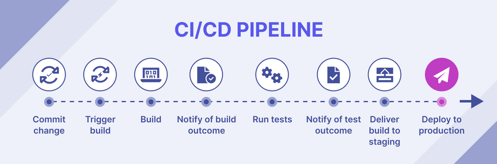
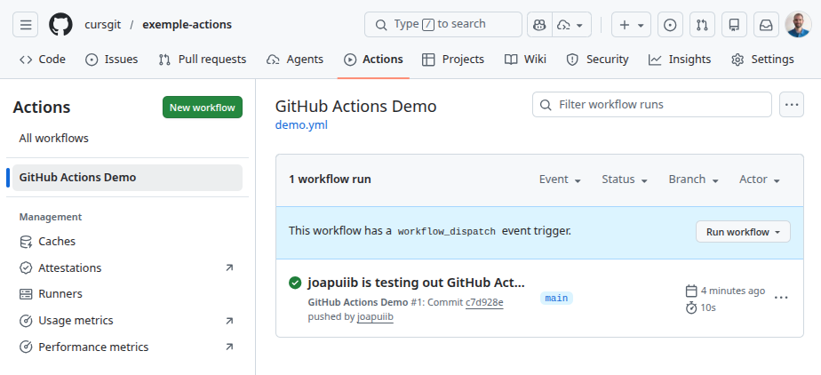
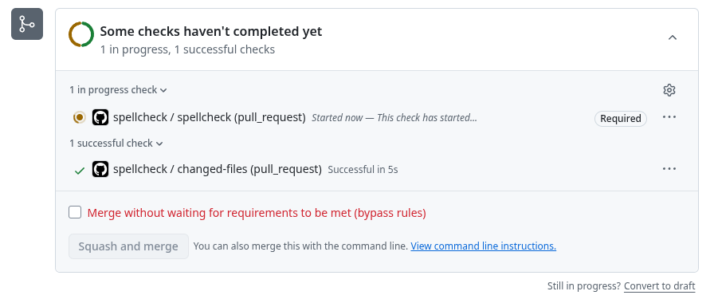
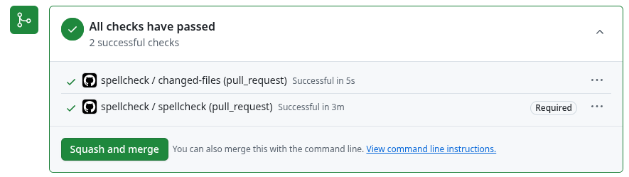
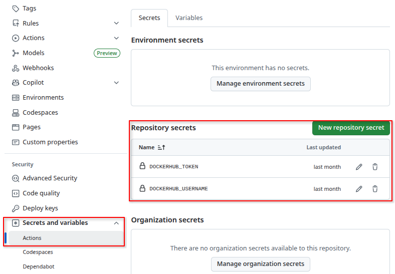
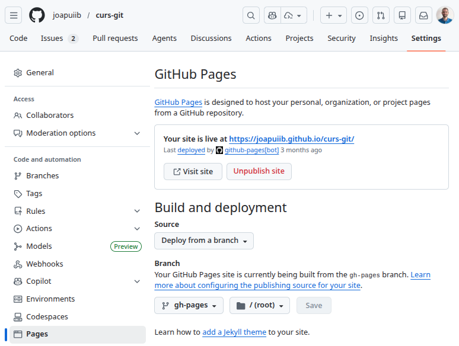

*[CI/CD]: Continuous Integration/Continuous Deployment
*[CI]: Continuous Integration
*[CD]: Continuous Deployment

## Automatització en CI/CD
La __integració contínua__ (_Continuous Integration_ o CI) i el __desplegament continu__
(_Continuous Deployment_ o CD) són pràctiques que permeten als equips de desenvolupament
integrar els canvis en el codi de manera regular i distribuir-los automàticament.

Aquestes pràctiques són essencials en el desenvolupament de programari actual, ja que acceleren
el lliurament de funcionalitats noves, redueixen el temps d'aturada i milloren la qualitat del projecte
mitjançant l'__automatització__ de tasques repetitives, sense necessitat d'intervenció manual.
Les tasques que s'automatitzen més habitualment són:

- __Compilació__: compilació i empaquetatge de l'aplicació.
- __Proves__: execució de proves i validacions.
- __Qualitat del codi__: anàlisi amb _linters_, anàlisi estàtica, etc.
- __Desplegament__: desplegament de l'aplicació i gestió de llançaments.
- __Documentació__: generació i publicació de la documentació.


### Què és la integració contínua (CI)?
La __integració contínua__ (_Continuous Integration_ o CI) consisteix a integrar de manera contínua
i freqüent els canvis en la branca principal del projecte i a provar automàticament cada canvi
quan s'integra en el repositori.

Això permet detectar i solucionar errors o vulnerabilitats de manera més senzilla i ràpida,
ja que els canvis són més xicotets i fàcils de revisar. A més, la integració contínua facilita
la col·laboració de l'equip, ja que redueix la possibilitat de conflictes entre branques
encara que es treballe en paral·lel.

Un flux de treball típic de CI inclou els passos següents:

- __Anàlisi estàtica del codi__: verifica la qualitat del codi font i assegura que compleix
    els estàndards establerts.
- __Compilació i proves automatitzades__: asseguren que el projecte es compila correctament
    i que les funcionalitats implementades funcionen com s'espera.


### Què és el desplegament continu (CD)?
El __desplegament continu__ (_Continuous Deployment_ o CD) és el procés d'automatitzar les tasques
necessàries per a desplegar una aplicació. Pot incloure des de la preparació de la infraestructura
fins al desplegament de l'aplicació en un entorn de proves o de producció.

Un flux de treball típic de CD inclou els passos següents:

- __Desplegament automàtic en un entorn de proves__: permet fer proves i validacions addicionals.
- __Desplegament automàtic en l'entorn de producció__: permet lliurar funcionalitats noves
    a les persones usuàries de manera ràpida i segura.


### Fluxos de treball
Els __fluxos de treball de CI/CD__, també coneguts com a __CI/CD _pipelines___, són processos automatitzats
que s'encarreguen de la compilació, les proves i el desplegament de les aplicacions.
Es componen de diferents tasques que s'executen automàticament, sense intervenció humana.


/// attribution: https://katalon.com/
/// figure-caption | #figure-pipeline : Exemple d'un flux de treball.

Cadascuna d'aquestes tasques pot incloure diverses accions, que es configuren
en l'entorn de CI/CD que s'utilitze.


### Entorns i ferramentes de CI/CD
Hi ha diferents entorns i ferramentes de CI/CD que permeten configurar i gestionar fluxos de treball
automatitzats. Alguns dels més habituals són:

- __[:simple-github: GitHub Actions][actions]__: fluxos de treball automatitzats sobre repositoris
    de Git allotjats a GitHub.
- __[:simple-gitlab: GitLab CI/CD][gitlab-cicd]__: fluxos de treball automatitzats sobre repositoris
    de Git allotjats a GitLab.
- __[:simple-codeberg: Forgejo Actions][forgejo-actions]__: fluxos de treball automatitzats sobre repositoris
    de Git allotjats a Codeberg (o en qualsevol altra instància de [Forgejo](https://forgejo.org/)).
    La seua sintaxi és pràcticament compatible amb la de GitHub Actions.
- __[:simple-jenkins: Jenkins][jenkins]__: servidor d'automatització de codi obert,
    que cal instal·lar i configurar.
- __[:simple-travisci: Travis CI][travis-ci]__: servei d'automatització allotjat en el núvol.
    És programari privatiu i requereix un compte de pagament.
- __[:material-microsoft-azure: Azure Pipelines][azure-pipelines]__: servei d'automatització de Microsoft Azure.
- __[:material-aws: AWS CodePipeline][aws-codepipeline]__: servei d'automatització d'Amazon Web Services.


[actions]: https://docs.github.com/en/actions
[gitlab-cicd]: https://docs.gitlab.com/ee/ci/
[forgejo-actions]: https://forgejo.org/docs/latest/user/actions/
[jenkins]: https://www.jenkins.io/
[travis-ci]: https://travis-ci.com/
[azure-pipelines]: https://azure.microsoft.com/en-us/services/devops/pipelines/
[aws-codepipeline]: https://aws.amazon.com/codepipeline/


## :octicons-play-24: GitHub Actions
[__:octicons-play-24: GitHub Actions__](https://github.com/features/actions) és una funcionalitat
de :simple-github: GitHub que permet crear fluxos de treball sobre un repositori.
Es gestionen des de l'apartat __:material-arrow-right-drop-circle-outline: Actions__, on es poden consultar
les tasques d'automatització configurades i les seues execucions.

!!! important "Cada projecte té característiques i necessitats pròpies; per tant, cal adaptar els processos a la naturalesa del projecte."

!!! notice "Consulta els [[actions-exemples]] per a trobar exemples de fluxos de treball més complexos i adaptats a diferents tipus de projectes."


### Configuració d'un flux de treball
Les tasques d'automatització es defineixen en fitxers de configuració `YAML`,
que s'han de situar dins del directori `.github/workflows/`.

!!! docs "Documentació oficial: [:octicons-link-external-16: Quickstart for GitHub Actions](https://docs.github.com/en/actions/writing-workflows/quickstart) – :simple-github: GitHub"

!!! example "Repositori d'exemple: [:octicons-link-external-16: `exemple-actions`](https://github.com/cursgit/exemple-actions)"


```yaml title=".github/workflows/demo.yml"
name: GitHub Actions Demo
run-name: ${{ github.actor }} is testing out GitHub Actions 🚀
on:
  push:
  workflow_dispatch:
jobs:
  Explore-GitHub-Actions:
    runs-on: ubuntu-latest
    steps:
      - run: echo "🎉 The job was automatically triggered by a ${{ github.event_name }} event."
      - run: echo "🐧 This job is now running on a ${{ runner.os }} server hosted by GitHub!"
      - run: echo "🔎 The name of your branch is ${{ github.ref }} and your repository is ${{ github.repository }}."
      - name: Check out repository code
        uses: actions/checkout@v5
      - run: echo "💡 The ${{ github.repository }} repository has been cloned to the runner."
      - run: echo "🖥️ The workflow is now ready to test your code on the runner."
      - name: List files in the repository
        run: |
          ls ${{ github.workspace }}
      - run: echo "🍏 This job's status is ${{ job.status }}."
```

/// attribution: :simple-github: GitHub Docs

La configuració bàsica d'un flux de treball es fa amb els camps següents:

- __`name`__: nom del flux de treball.
- __`on`__: [esdeveniments][events] que fan que s'execute.
- __`jobs`__: llista de tasques que cal executar.

Cada tasca té les seccions següents:

- __`runs-on`__: tipus de màquina on s'executa la tasca.
- __`if`__: (opcional) [condició][if] que s'ha de complir per a executar la tasca.
- __`steps`__: llista de passos que cal executar. Cada pas és una ordre de la terminal (`run`)
    o una acció de GitHub predefinida (`uses`):

    - __`name`__: nom del pas.
    - __`run`__: ordre de la terminal que s'executa.
    - __`uses`__: [acció de GitHub predefinida][uses] que s'executa. Cada acció pot tindre
        els seus propis paràmetres de configuració, que s'estableixen dins de la secció `with`.

[events]: https://docs.github.com/es/actions/reference/workflows-and-actions/events-that-trigger-workflows
[if]: https://docs.github.com/en/actions/writing-workflows/choosing-when-your-workflow-runs/using-conditions-to-control-job-execution
[uses]: https://github.com/marketplace?type=actions


### Execució d'una automatització
Les tasques d'automatització s'executen automàticament quan es compleixen les condicions
definides en la secció `on` de la configuració.

```yaml
on:
  push:
    branches:
      - main
```

!!! docs "Documentació oficial: [:octicons-link-external-16: Events that trigger workflows](https://docs.github.com/en/actions/reference/workflows-and-actions/events-that-trigger-workflows) – :simple-github: GitHub"

En la secció :octicons-play-24: Actions es poden consultar les execucions de les tasques d'automatització
definides en el repositori.

A més, una tasca es pot configurar perquè també es puga executar manualment,
especificant `workflow_dispatch` en la secció `on` de la configuració:

```yaml
on:
  workflow_dispatch:
```

Així, l'automatització es pot llançar manualment des de la secció
:material-arrow-right-drop-circle-outline: Actions.


/// shadow-figure-caption | #figure-workflow-dispatch : Execució manual d'una automatització des de :material-arrow-right-drop-circle-outline: Actions.

Per a provar una tasca d'automatització localment sense haver de publicar canvis en el repositori,
es poden utilitzar ferramentes com [__`act`__](https://nektosact.com/). Aquesta ferramenta utilitza
[:simple-docker: Docker](https://www.docker.com/) per a simular un entorn d'execució semblant
al de GitHub Actions.

Per exemple, aquesta és l'eixida d'`act` en executar el flux de treball del repositori d'exemple:

```shellconsole
jpuigcerver@fp:~/exemple-actions (main) $ act
INFO[0000] Using docker host 'unix:///var/run/docker.sock', and daemon socket 'unix:///var/run/docker.sock' 
[GitHub Actions Demo/Explore-GitHub-Actions] ⭐ Run Set up job
[GitHub Actions Demo/Explore-GitHub-Actions] 🚀  Start image=catthehacker/ubuntu:act-latest
[GitHub Actions Demo/Explore-GitHub-Actions]   🐳  docker pull image=catthehacker/ubuntu:act-latest platform= username= forcePull=true
[GitHub Actions Demo/Explore-GitHub-Actions]   🐳  docker create image=catthehacker/ubuntu:act-latest platform= entrypoint=["tail" "-f" "/dev/null"] cmd=[] network="host"
[GitHub Actions Demo/Explore-GitHub-Actions]   🐳  docker run image=catthehacker/ubuntu:act-latest platform= entrypoint=["tail" "-f" "/dev/null"] cmd=[] network="host"
[GitHub Actions Demo/Explore-GitHub-Actions]   🐳  docker exec cmd=[node --no-warnings -e console.log(process.execPath)] user= workdir=
[GitHub Actions Demo/Explore-GitHub-Actions]   ✅  Success - Set up job
[GitHub Actions Demo/Explore-GitHub-Actions] ⭐ Run Main echo "🎉 The job was automatically triggered by a push event."
[GitHub Actions Demo/Explore-GitHub-Actions]   🐳  docker exec cmd=[bash -e /var/run/act/workflow/0] user= workdir=
| 🎉 The job was automatically triggered by a push event.
[GitHub Actions Demo/Explore-GitHub-Actions]   ✅  Success - Main echo "🎉 The job was automatically triggered by a push event." [68.068069ms]
[GitHub Actions Demo/Explore-GitHub-Actions] ⭐ Run Main echo "🐧 This job is now running on a Linux server hosted by GitHub!"
[GitHub Actions Demo/Explore-GitHub-Actions]   🐳  docker exec cmd=[bash -e /var/run/act/workflow/1] user= workdir=
| 🐧 This job is now running on a Linux server hosted by GitHub!
[GitHub Actions Demo/Explore-GitHub-Actions]   ✅  Success - Main echo "🐧 This job is now running on a Linux server hosted by GitHub!" [66.309582ms]
[GitHub Actions Demo/Explore-GitHub-Actions] ⭐ Run Main echo "🔎 The name of your branch is refs/heads/main and your repository is cursgit/exemple-actions."
[GitHub Actions Demo/Explore-GitHub-Actions]   🐳  docker exec cmd=[bash -e /var/run/act/workflow/2] user= workdir=
| 🔎 The name of your branch is refs/heads/main and your repository is cursgit/exemple-actions.
[GitHub Actions Demo/Explore-GitHub-Actions]   ✅  Success - Main echo "🔎 The name of your branch is refs/heads/main and your repository is cursgit/exemple-actions." [65.540094ms]
[GitHub Actions Demo/Explore-GitHub-Actions] ⭐ Run Main Check out repository code
[GitHub Actions Demo/Explore-GitHub-Actions]   🐳  docker cp src=/home/jpuigcerver/exemple-actions/. dst=/home/jpuigcerver/exemple-actions
[GitHub Actions Demo/Explore-GitHub-Actions]   ✅  Success - Main Check out repository code [15.128121ms]
[GitHub Actions Demo/Explore-GitHub-Actions] ⭐ Run Main echo "💡 The cursgit/exemple-actions repository has been cloned to the runner."
[GitHub Actions Demo/Explore-GitHub-Actions]   🐳  docker exec cmd=[bash -e /var/run/act/workflow/4] user= workdir=
| 💡 The cursgit/exemple-actions repository has been cloned to the runner.
[GitHub Actions Demo/Explore-GitHub-Actions]   ✅  Success - Main echo "💡 The cursgit/exemple-actions repository has been cloned to the runner." [65.674574ms]
[GitHub Actions Demo/Explore-GitHub-Actions] ⭐ Run Main echo "🖥 The workflow is now ready to test your code on the runner."
[GitHub Actions Demo/Explore-GitHub-Actions]   🐳  docker exec cmd=[bash -e /var/run/act/workflow/5] user= workdir=
| 🖥 The workflow is now ready to test your code on the runner.
[GitHub Actions Demo/Explore-GitHub-Actions]   ✅  Success - Main echo "🖥 The workflow is now ready to test your code on the runner." [75.593933ms]
[GitHub Actions Demo/Explore-GitHub-Actions] ⭐ Run Main List files in the repository
[GitHub Actions Demo/Explore-GitHub-Actions]   🐳  docker exec cmd=[bash -e /var/run/act/workflow/6] user= workdir=
| README.md
[GitHub Actions Demo/Explore-GitHub-Actions]   ✅  Success - Main List files in the repository [85.435409ms]
[GitHub Actions Demo/Explore-GitHub-Actions] ⭐ Run Main echo "🍏 This job's status is success."
[GitHub Actions Demo/Explore-GitHub-Actions]   🐳  docker exec cmd=[bash -e /var/run/act/workflow/7] user= workdir=
| 🍏 This job's status is success.
[GitHub Actions Demo/Explore-GitHub-Actions]   ✅  Success - Main echo "🍏 This job's status is success." [67.346446ms]
[GitHub Actions Demo/Explore-GitHub-Actions] ⭐ Run Complete job
[GitHub Actions Demo/Explore-GitHub-Actions] Cleaning up container for job Explore-GitHub-Actions
[GitHub Actions Demo/Explore-GitHub-Actions]   ✅  Success - Complete job
[GitHub Actions Demo/Explore-GitHub-Actions] 🏁  Job succeeded
```


### Execució d'una automatització en una Pull Request
Les tasques d'automatització també es poden combinar amb les [[pull-requests]] per a comprovar
que els canvis proposats compleixen els estàndards de qualitat del projecte abans d'integrar-los
en la branca principal. D'aquesta manera, es facilita la __integració contínua (CI)__.
Les tasques més habituals en aquest cas són:

- __Proves__: execució de proves automatitzades.
- __Estil__: anàlisi de l'estil del codi.
- __Qualitat__: anàlisi de la qualitat del codi.



/// shadow-figure-caption | #figure-pr-pending : Exemple d'una tasca d'automatització que s'executa en una Pull Request.


/// shadow-figure-caption | #figure-pr-success : Exemple d'una tasca d'automatització que s'ha executat correctament en una Pull Request.


### Secrets
De vegades, les tasques d'automatització necessiten informació sensible per a executar-se,
com ara credencials d'accés a serveis externs, claus d'API, etc.

En aquests casos, és important no incloure aquesta informació directament en els fitxers de configuració,
ja que formen part del repositori i qualsevol persona amb accés al repositori els pot llegir.

GitHub Actions permet gestionar aquesta informació de manera segura mitjançant els __:octicons-key-asterisk-16: secrets__:
variables d'entorn que es poden utilitzar en les tasques d'automatització, però que no són visibles
ni accessibles des dels fitxers de configuració.

Per a configurar un secret, cal anar a la secció __:octicons-gear-24: Settings__ del repositori,
a l'apartat __:octicons-key-asterisk-16: Secrets and variables > Actions__.


/// shadow-figure-caption | #figure-secrets : Configuració de secrets en GitHub Actions.

Els secrets es poden utilitzar com a variables en els fitxers de configuració dels fluxos de treball,
i el seu valor se substitueix de manera segura durant l'execució.


```yaml
steps:
  - name: Login a Docker Hub
    uses: docker/login-action@v3
    with:
      username: ${{ secrets.DOCKERHUB_USERNAME }}
      password: ${{ secrets.DOCKERHUB_TOKEN }}
```



!!! docs "Documentació oficial: [:octicons-link-external-16: Using secrets in GitHub Actions](https://docs.github.com/en/actions/how-tos/write-workflows/choose-what-workflows-do/use-secrets) – :simple-github: GitHub"

!!! example "Exemple: [[actions-exemples#creacio-duna-imatge-de-docker]]"

## :octicons-browser-24: GitHub Pages
__[:octicons-browser-24: GitHub Pages][pages]__ és un servei de GitHub que permet publicar llocs web
estàtics[^1] directament des d'un repositori de GitHub.

[pages]: https://pages.github.com/

!!! info "Amb un compte gratuït de :simple-github: GitHub, només es pot configurar GitHub Pages en repositoris públics."
    En els repositoris privats, [cal un compte de pagament](https://docs.github.com/en/pages/getting-started-with-github-pages/about-github-pages).
    No obstant això, GitHub proporciona llicències gratuïtes per a l'alumnat i el professorat
    mitjançant [:fontawesome-solid-graduation-cap: GitHub Education](https://education.github.com/).

Aquest servei és útil per a publicar:

- __Documentació__: la documentació d'un projecte.
- __Portafolis__: portafolis personals o de projectes.
- __Llocs web estàtics__: llocs generats amb ferramentes com [:simple-jekyll: Jekyll](https://jekyllrb.com/)
    o [MkDocs](https://www.mkdocs.org/).

!!! success "Per exemple, aquest lloc web està publicat amb __:octicons-browser-24: GitHub Pages__."


### Configuració de GitHub Pages
GitHub Pages s'habilita i es configura en la secció __:octicons-gear-24: Settings__ del repositori,
dins de l'apartat __:octicons-browser-24: Pages__.


/// shadow-figure-caption | #figure-github-pages : Configuració de GitHub Pages en aquest repositori.

GitHub Pages es pot configurar per a publicar el lloc web de dues maneres diferents:

- :octicons-thumbsup-16:{ .text-success title="Opció recomanada" } __Automatització__:
    un flux de treball construeix, carrega i desplega els continguts del lloc web.

- __Contingut d'una branca__: es publica el contingut d'una branca i d'un directori concrets del repositori.
    Es pot triar qualsevol branca, però només els directoris `/` (arrel del repositori) o `/docs`.

!!! docs "Documentació oficial de :simple-github: GitHub"
    - [:octicons-link-external-16: Publishing from a branch - Configuring a publishing source for your GitHub Pages site](https://docs.github.com/en/pages/getting-started-with-github-pages/configuring-a-publishing-source-for-your-github-pages-site#publishing-from-a-branch)
    - [:octicons-link-external-16: Publishing with a custom GitHub Actions workflow - Configuring a publishing source for your GitHub Pages site](https://docs.github.com/en/pages/getting-started-with-github-pages/configuring-a-publishing-source-for-your-github-pages-site#publishing-with-a-custom-github-actions-workflow)

[^1]: Un lloc web estàtic és un lloc web que no necessita un servidor que genere les pàgines HTML,
    sinó que les pàgines ja estan generades i se serveixen directament.

!!! example "Exemple: [[actions-exemples#publicacio-dun-lloc-web-estatic-generat-amb-properdocs-a-github-pages]]"

## Bibliografia
- [:octicons-link-external-16: What is CI/CD](https://about.gitlab.com/topics/ci-cd/) – :simple-gitlab: GitLab
