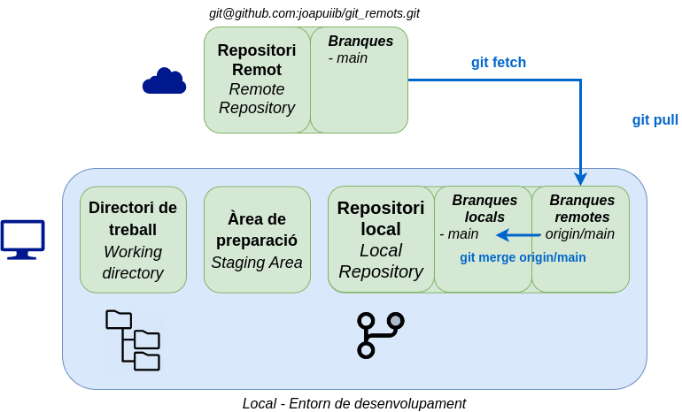

## Remots

#### Introducció a Git i la seua aplicació a l’aula

---

## Repositori remot


---

## Desenvolupament distribuït


---

## Afegir un repositori remot

```bash
git remote add origin <url>
```

- (_HTTPS_) Personal Access Token (PAT)
- (_SSH_) Clau SSH


---

## Associació branques locals i remotes

```bash
git push [-u | --set-upstream] origin <branca>
```


---

## Clonar un repositori

```bash
git clone <url> [<directori>]
```


---

## Sincronització

```bash
git fetch
```


---

## Integració de canvis

```bash
git pull [--rebase]
```


